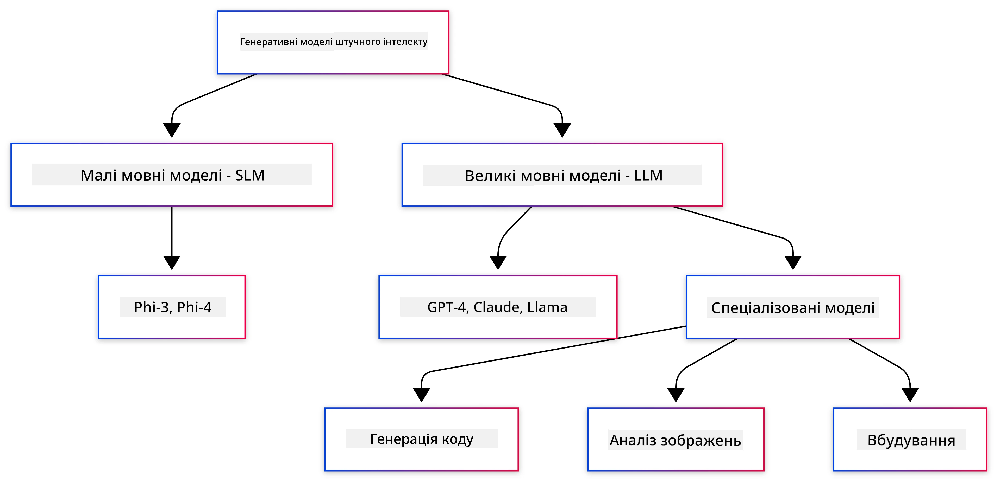
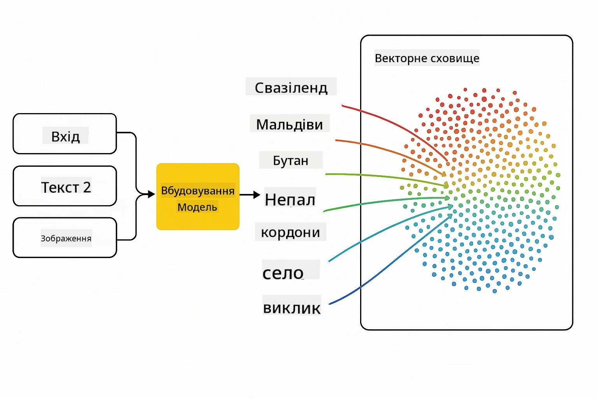
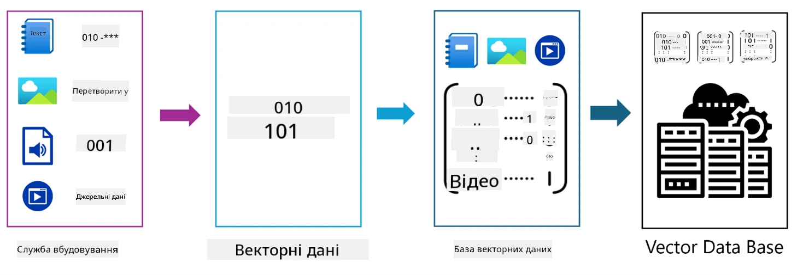
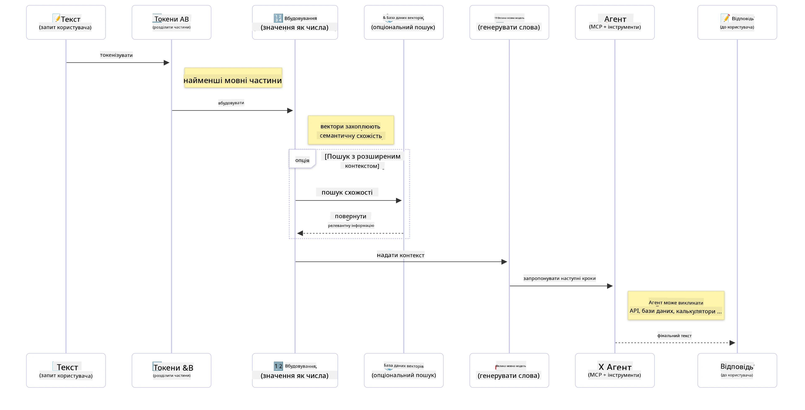

# Вступ до генеративного ШІ - версія для Java

> **Відео**: [Перегляньте оглядове відео цього уроку на YouTube.](https://www.youtube.com/watch?v=XH46tGp_eSw) Також можна натиснути на мініатюрне зображення вище.

## Чому ви навчитеся

- **Основам генеративного ШІ**, включно з LLM, інженерією підказок, токенами, embeddings та векторними базами даних
- **Порівнянню інструментів розробки AI на Java**, включно з Azure OpenAI SDK, Spring AI та OpenAI Java SDK
- **Відкриттю Model Context Protocol** та його ролі у комунікації AI агентів

## Зміст

- [Вступ](#вступ)
- [Короткий огляд концепцій генеративного ШІ](#короткий-огляд-концепцій-генеративного-ші)
- [Огляд інженерії підказок](#огляд-інженерії-підказок)
- [Токени, embeddings та агенти](#токени-embeddings-та-агенти)
- [Інструменти та бібліотеки для розробки AI на Java](#інструменти-та-бібліотеки-для-розробки-ai-на-java)
  - [OpenAI Java SDK](#openai-java-sdk)
  - [Spring AI](#spring-ai)
  - [Azure OpenAI Java SDK](#azure-openai-java-sdk)
- [Підсумок](#підсумок)
- [Наступні кроки](#наступні-кроки)

## Вступ

Ласкаво просимо до першої глави курсу "Генеративний ШІ для початківців - версія для Java"! Цей базовий урок знайомить вас з основними поняттями генеративного ШІ та тим, як працювати з ними за допомогою Java. Ви дізнаєтесь про ключові складові AI-застосунків, включно з великими мовними моделями (LLM), токенами, embeddings та AI агентами. Також ми розглянемо основні Java інструменти, які ви будете використовувати протягом курсу.

### Короткий огляд концепцій генеративного ШІ

Генеративний ШІ — це тип штучного інтелекту, який створює новий контент, такий як текст, зображення або код, на основі закономірностей і зв’язків, вивчених із даних. Моделі генеративного ШІ можуть генерувати відповіді, схожі на людські, розуміти контекст і іноді навіть створювати контент, що здається людським.

Створюючи ваші AI-застосунки на Java, ви працюватимете з **генеративними AI моделями** для створення контенту. Деякі можливості генеративних моделей включають:

- **Генерація тексту**: створення текстів, схожих на людські, для чатботів, контенту та доповнення тексту.
- **Генерація та аналіз зображень**: створення реалістичних зображень, покращення фото та виявлення об’єктів.
- **Генерація коду**: написання шматків коду або скриптів.

Існують різні типи моделей, оптимізованих для різних завдань. Наприклад, як **малі мовні моделі (SLM)**, так і **великі мовні моделі (LLM)** можуть обробляти генерацію тексту, але LLM зазвичай пропонують кращу продуктивність для складних завдань. Для завдань, пов’язаних із зображеннями, ви використаєте спеціалізовані візуальні моделі або мультимодальні моделі.

Звичайно, відповіді цих моделей не завжди ідеальні. Ви, напевно, чули про “галюцинації” моделей або генерування неправдивої інформації з авторитетним тоном. Але ви можете допомогти моделі створювати кращі відповіді, надаючи їй чіткі інструкції та контекст. Саме тут допомагає **інженерія підказок**.

#### Огляд інженерії підказок

Інженерія підказок — це практика створення ефективних вводів, щоб направити AI моделі до бажаних результатів. Вона включає:

- **Чіткість**: формулювання інструкцій чітко та однозначно.
- **Контекст**: надання необхідної додаткової інформації.
- **Обмеження**: вказівка будь-яких обмежень або форматів.

Кращими практиками інженерії підказок є дизайн підказок, чіткі інструкції, розбивка завдань, навчання з одним або кількома прикладами, а також тонке налаштування підказок. Важливо тестувати різні підказки, щоб знайти найкращі для вашого конкретного випадку.

Під час розробки застосунків ви працюватимете з різними типами підказок:
- **Системні підказки**: встановлюють базові правила та контекст поведінки моделі
- **Підказки користувача**: вхідні дані від користувачів вашого застосунку
- **Підказки асистента**: відповіді моделі на основі системних та користувацьких підказок

> **Дізнайтесь більше**: Детальніше про інженерію підказок у [главі про інженерію підказок курсу ГенІ для початківців](https://github.com/microsoft/generative-ai-for-beginners/tree/main/04-prompt-engineering-fundamentals)

#### Токени, embeddings та агенти

Працюючи з генеративними AI моделями, ви зустрінетесь з термінами **токени**, **embeddings**, **агенти** та **Model Context Protocol (MCP)**. Ось детальний огляд цих понять:

- **Токени**: Токени — найменша одиниця тексту в моделі. Це можуть бути слова, символи або підслова. Токени використовують для представлення текстових даних у форматі, зрозумілому для моделі. Наприклад, речення "The quick brown fox jumped over the lazy dog" може бути токенізоване як ["The", " quick", " brown", " fox", " jumped", " over", " the", " lazy", " dog"] або ["The", " qu", "ick", " br", "own", " fox", " jump", "ed", " over", " the", " la", "zy", " dog"] залежно від стратегії токенізації.

Токенізація — це процес розбиття тексту на ці менші одиниці. Це важливо, бо моделі працюють із токенами, а не з сирим текстом. Кількість токенів у підказці впливає на довжину та якість відповіді моделі, оскільки моделі мають обмеження за максимальною кількістю токенів у контексті (наприклад, 128К токенів для загального контексту GPT-4o, враховуючи і вхідні, і вихідні дані).

  У Java ви можете використовувати бібліотеки, наприклад OpenAI SDK, щоб автоматично обробляти токенізацію під час відправки запитів до AI моделей.

- **Embeddings**: Embeddings — це векторні представлення токенів, які відображають семантичне значення. Це числові представлення (зазвичай масиви чисел з плаваючою точкою), які дозволяють моделям розуміти зв’язки між словами і створювати контекстуально релевантні відповіді. Схожі слова мають схожі embeddings, що дає змогу моделі розуміти синоніми та семантичні відношення.

  У Java ви можете генерувати embeddings за допомогою OpenAI SDK або інших бібліотек, що підтримують генерацію embeddings. Вони важливі для таких завдань, як семантичний пошук, коли потрібно знаходити схожий контент за змістом, а не точним текстом.

- **Векторні бази даних**: Векторні бази даних — спеціалізовані системи зберігання, оптимізовані для embeddings. Вони забезпечують ефективний пошук за схожістю і є ключовими для патернів Retrieval-Augmented Generation (RAG), де потрібно знаходити релевантну інформацію із великих наборів даних на основі семантичної схожості, а не точних співпадінь.

> **Примітка**: У цьому курсі ми не розглядатимемо векторні бази даних, але варто про них згадати, оскільки їх часто використовують у реальних застосунках.

- **Агенти і MCP**: Компоненти AI, які автономно взаємодіють із моделями, інструментами та зовнішніми системами. Model Context Protocol (MCP) забезпечує стандартизований спосіб для агентів безпечно отримувати доступ до зовнішніх джерел даних і інструментів. Детальніше можна дізнатись у нашому курсі [MCP для початківців](https://github.com/microsoft/mcp-for-beginners).

У Java AI-застосунках ви будете використовувати токени для обробки тексту, embeddings для семантичного пошуку та RAG, векторні бази даних для отримання даних і агентів з MCP для створення розумних систем із підтримкою інструментів.

### Інструменти та бібліотеки для розробки AI на Java

Java пропонує чудові інструменти для розробки AI. Існує три основні бібліотеки, які ми розглянемо у цьому курсі - OpenAI Java SDK, Azure OpenAI SDK та Spring AI.

Нижче наведена таблиця-шпаргалка з прикладами використання SDK у кожній главі:

| Глава | Приклад | SDK |
|---------|--------|-----|
| 02-SetupDevEnvironment | github-models | OpenAI Java SDK |
| 02-SetupDevEnvironment | basic-chat-azure | Spring AI Azure OpenAI |
| 03-CoreGenerativeAITechniques | examples | Azure OpenAI SDK |
| 04-PracticalSamples | petstory | OpenAI Java SDK |
| 04-PracticalSamples | foundrylocal | OpenAI Java SDK |
| 04-PracticalSamples | calculator | Spring AI MCP SDK + LangChain4j |

**Посилання на документацію SDK:**
- [Azure OpenAI Java SDK](https://github.com/Azure/azure-sdk-for-java/tree/azure-ai-openai_1.0.0-beta.16/sdk/openai/azure-ai-openai)
- [Spring AI](https://docs.spring.io/spring-ai/reference/)
- [OpenAI Java SDK](https://github.com/openai/openai-java)
- [LangChain4j](https://docs.langchain4j.dev/)

#### OpenAI Java SDK

OpenAI SDK — офіційна Java бібліотека для API OpenAI. Вона забезпечує простий і послідовний інтерфейс для взаємодії з моделями OpenAI, що полегшує інтеграцію AI можливостей у Java-застосунки. Приклади GitHub Models у главі 2, додаток Pet Story та приклад Foundry Local у главі 4 демонструють підхід з використанням OpenAI SDK.

#### Spring AI

Spring AI — це комплексний фреймворк, який додає AI можливості у Spring-застосунки, надаючи уніфікований рівень абстракції для різних AI провайдерів. Він ідеально інтегрується з екосистемою Spring, роблячи його найкращим вибором для корпоративних Java-застосунків, яким потрібен AI.

Сила Spring AI полягає в його безшовній інтеграції з екосистемою Spring, що дозволяє легко будувати промислові AI застосунки з використанням знайомих Spring патернів, таких як ін’єкція залежностей, управління конфігурацією та фреймворки для тестування. Ви використовуватимете Spring AI у главах 2 і 4 для створення застосунків із OpenAI та Model Context Protocol (MCP) Spring AI бібліотеками.

##### Model Context Protocol (MCP)

[Model Context Protocol (MCP)](https://modelcontextprotocol.io/) — це новий стандарт, який дає змогу AI-застосункам безпечно взаємодіяти з зовнішніми джерелами даних та інструментами. MCP надає уніфікований спосіб, як AI моделі можуть отримувати контекстну інформацію та виконувати дії у ваших застосунках.

У главі 4 ви створите простий сервіс калькулятора MCP, який демонструє основи Model Context Protocol з Spring AI, показуючи, як створювати базові інтеграції інструментів і архітектури сервісів.

#### Azure OpenAI Java SDK

Клієнтська бібліотека Azure OpenAI для Java — це адаптація REST API OpenAI, що забезпечує ідіоматичний інтерфейс та інтеграцію з рештою екосистеми Azure SDK. У главі 3 ви створите застосунки з використанням Azure OpenAI SDK, включно з чат-застосунками, викликами функцій та патернами RAG (Retrieval-Augmented Generation).

> Примітка: Azure OpenAI SDK відстає від OpenAI Java SDK за функціональністю, тому для майбутніх проєктів розглядайте використання OpenAI Java SDK.

## Підсумок

Отже, ми підвели підсумок основ! Тепер ви розумієте:

- Основні концепції генеративного ШІ — від LLM і інженерії підказок до токенів, embeddings та векторних баз даних
- Варіанти інструментів для розробки AI на Java: Azure OpenAI SDK, Spring AI і OpenAI Java SDK
- Що таке Model Context Protocol і як він дозволяє AI агентам працювати із зовнішніми інструментами

## Наступні кроки

[Глава 2: Налаштування середовища розробки](../02-SetupDevEnvironment/README.md)

---

<!-- CO-OP TRANSLATOR DISCLAIMER START -->
**Застереження**:  
Цей документ був перекладений за допомогою сервісу автоматичного перекладу [Co-op Translator](https://github.com/Azure/co-op-translator). Хоча ми прагнемо до точності, будь ласка, майте на увазі, що автоматичні переклади можуть містити помилки або неточності. Оригінальний документ на його рідній мові слід вважати авторитетним джерелом. Для критично важливої інформації рекомендується звертатися до професійного людського перекладу. Ми не несемо відповідальності за будь-які непорозуміння або неправильні тлумачення, що виникли через використання цього перекладу.
<!-- CO-OP TRANSLATOR DISCLAIMER END -->