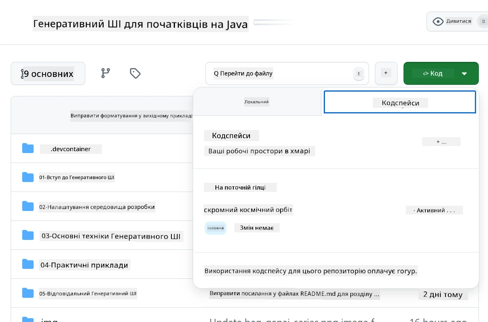
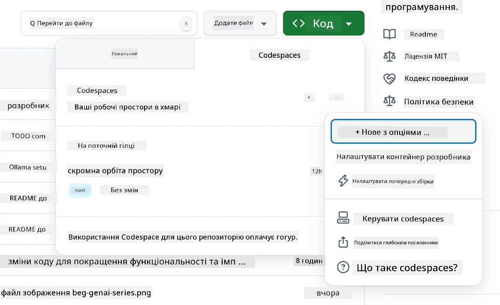
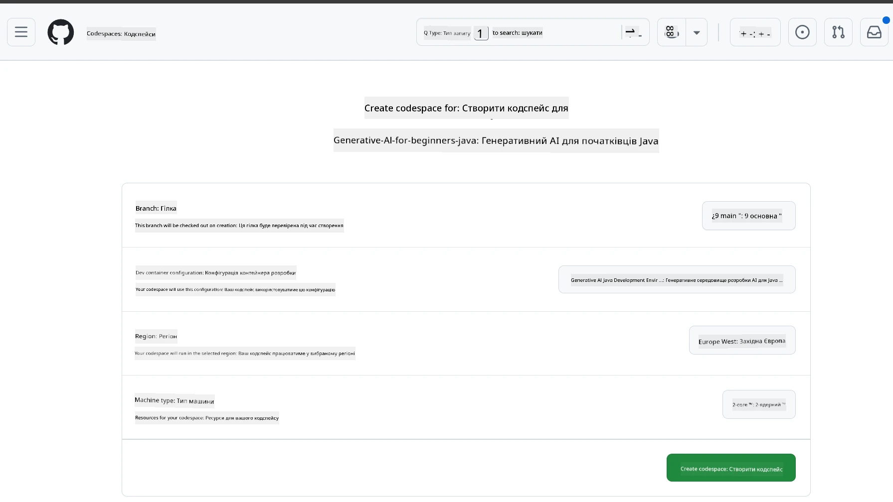
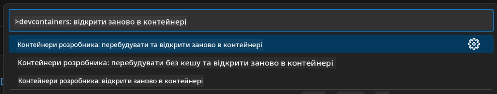
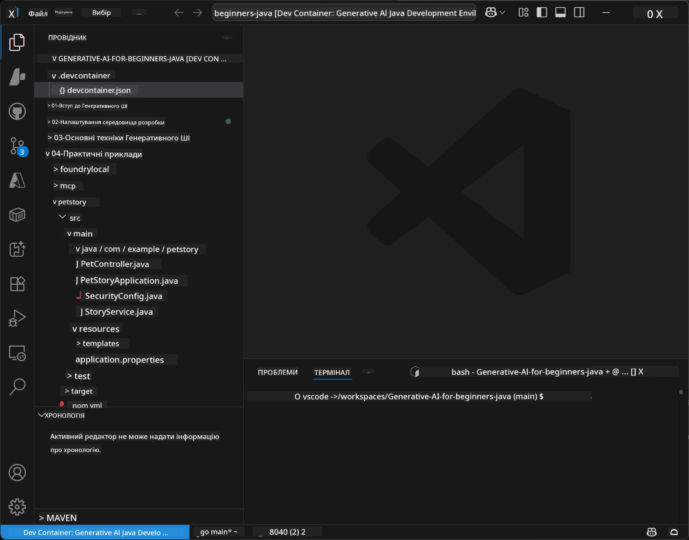
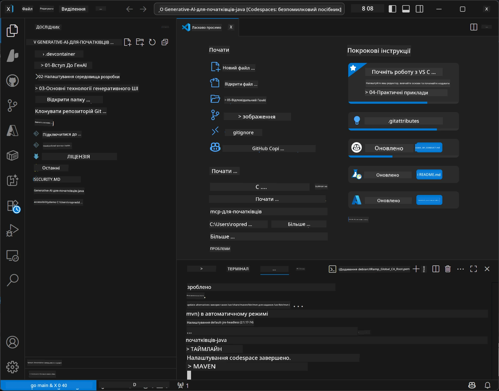

# Налаштування середовища розробки для генеративного ШІ для Java

> **Швидкий старт**: Програмуйте у хмарі за 2 хвилини – Перейдіть до [GitHub Codespaces Setup](../../../02-SetupDevEnvironment) – локальна інсталяція не потрібна та використовує моделі GitHub!

> **Зацікавлені в Azure OpenAI?**, перегляньте наш [Посібник з налаштування Azure OpenAI](getting-started-azure-openai.md) з кроками створення нового ресурсу Azure OpenAI.

## Чого ви навчитеся

- Налаштувати середовище розробки Java для AI-додатків
- Вибрати та налаштувати потрібне середовище розробки (перш за все хмарне з Codespaces, локальний контейнер розробника або повне локальне налаштування)
- Перевірити налаштування, підключившись до GitHub Models

## Зміст

- [Чого ви навчитеся](../../../02-SetupDevEnvironment)
- [Вступ](../../../02-SetupDevEnvironment)
- [Крок 1: Налаштуйте середовище розробки](../../../02-SetupDevEnvironment)
  - [Варіант A: GitHub Codespaces (Рекомендовано)](../../../02-SetupDevEnvironment)
  - [Варіант B: Локальний контейнер розробника](../../../02-SetupDevEnvironment)
  - [Варіант C: Використання існуючої локальної інсталяції](../../../02-SetupDevEnvironment)
- [Крок 2: Створення особистого токена доступу GitHub](../../../02-SetupDevEnvironment)
- [Крок 3: Перевірте налаштування](../../../02-SetupDevEnvironment)
- [Усунення несправностей](../../../02-SetupDevEnvironment)
- [Підсумок](../../../02-SetupDevEnvironment)
- [Наступні кроки](../../../02-SetupDevEnvironment)

## Вступ

Цей розділ проведе вас через налаштування середовища розробки. Ми використаємо **GitHub Models** як основний приклад, оскільки це безкоштовно, легко налаштовується лише з обліковим записом GitHub, без необхідності кредитної картки та забезпечує доступ до кількох моделей для експериментів.

**Локальна інсталяція не потрібна!** Ви можете почати програмувати відразу, використовуючи GitHub Codespaces, яке надає повне середовище розробки у вашому браузері.


Ми рекомендуємо використовувати [**GitHub Models**](https://github.com/marketplace?type=models) для цього курсу, тому що це:
- **Безкоштовно** для початку
- **Просто** налаштувати лише з обліковим записом GitHub
- **Без кредитної картки**
- **Кілька моделей** доступні для експериментів

> **Примітка**: GitHub Models, які використовуються у цьому навчанні, мають такі безкоштовні обмеження:
> - 15 запитів на хвилину (150 на день)
> - ~8000 слів на вхід, ~4000 слів на вихід за запит
> - 5 одночасних запитів
> 
> Для використання у виробництві оновіться до Azure AI Foundry Models з вашим обліковим записом Azure. Ваш код змінювати не потрібно. Див. [документацію Azure AI Foundry](https://learn.microsoft.com/azure/ai-foundry/foundry-models/how-to/quickstart-github-models).

## Крок 1: Налаштуйте середовище розробки

<a name="quick-start-cloud"></a>

Ми створили попередньо налаштований контейнер розробника, щоб мінімізувати час налаштування та забезпечити наявність усіх необхідних інструментів для цього курсу Generative AI for Java. Виберіть зручний для вас спосіб розробки:

### Варіанти налаштування оточення:

#### Варіант A: GitHub Codespaces (Рекомендовано)

**Почніть програмувати за 2 хвилини – локальна інсталяція не потрібна!**

1. Форкніть цей репозиторій у свій обліковий запис GitHub
   > **Примітка**: Якщо хочете редагувати базову конфігурацію, будь ласка, перегляньте [Dev Container Configuration](../../../.devcontainer/devcontainer.json)
2. Натисніть **Code** → вкладка **Codespaces** → **...** → **New with options...**
3. Використайте налаштування за замовчуванням – це вибере **Dev container configuration**: **Generative AI Java Development Environment**, створений спеціально для цього курсу
4. Натисніть **Create codespace**
5. Зачекайте ~2 хвилини, поки середовище стане готовим
6. Перейдіть до [Крок 2: Створення токена GitHub](../../../02-SetupDevEnvironment)







> **Переваги Codespaces**:
> - Локальна інсталяція не потрібна
> - Працює на будь-якому пристрої з браузером
> - Попередньо налаштоване з усіма інструментами та залежностями
> - Безкоштовно 60 годин на місяць для персональних акаунтів
> - Однорідне середовище для всіх учасників

#### Варіант B: Локальний контейнер розробника

**Для розробників, які віддають перевагу локальній розробці з Docker**

1. Форкніть і клонують цей репозиторій на свій локальний комп’ютер
   > **Примітка**: Якщо хочете редагувати базову конфігурацію, будь ласка, перегляньте [Dev Container Configuration](../../../.devcontainer/devcontainer.json)
2. Встановіть [Docker Desktop](https://www.docker.com/products/docker-desktop/) та [VS Code](https://code.visualstudio.com/)
3. Встановіть розширення [Dev Containers](https://marketplace.visualstudio.com/items?itemName=ms-vscode-remote.remote-containers) у VS Code
4. Відкрийте папку репозиторію у VS Code
5. Коли буде запит, натисніть **Reopen in Container** (або використайте `Ctrl+Shift+P` → "Dev Containers: Reopen in Container")
6. Зачекайте, поки контейнер збудується і запуститься
7. Перейдіть до [Крок 2: Створення токена GitHub](../../../02-SetupDevEnvironment)





#### Варіант C: Використання існуючої локальної інсталяції

**Для розробників з уже існуючим Java середовищем**

Вимоги:
- [Java 21+](https://www.oracle.com/java/technologies/javase/jdk21-archive-downloads.html)
- [Maven 3.9+](https://maven.apache.org/download.cgi)
- [VS Code](https://code.visualstudio.com) або улюблений IDE

Кроки:
1. Клонуйте цей репозиторій на свій локальний комп’ютер
2. Відкрийте проект у вашому IDE
3. Перейдіть до [Крок 2: Створення токена GitHub](../../../02-SetupDevEnvironment)

> **Професійна порада**: Якщо у вас слабкий комп’ютер, але ви хочете VS Code локально, використовуйте GitHub Codespaces! Ви можете підключити локальний VS Code до Codespace у хмарі й отримати найкраще поєднання.



## Крок 2: Створення особистого токена доступу GitHub

1. Перейдіть до [Налаштувань GitHub](https://github.com/settings/profile) і виберіть **Settings** у вашому меню профілю.
2. У лівій панелі натисніть **Developer settings** (зазвичай внизу).
3. У розділі **Personal access tokens** натисніть **Fine-grained tokens** (або перейдіть за цим прямим [посиланням](https://github.com/settings/personal-access-tokens)).
4. Натисніть **Generate new token**.
5. В полі "Token name" вкажіть описову назву (наприклад, `GenAI-Java-Course-Token`).
6. Встановіть дату закінчення строку дії (рекомендовано: 7 днів для кращої безпеки).
7. В розділі "Resource owner" виберіть свій користувацький акаунт.
8. В розділі "Repository access" оберіть репозиторії, з якими ви хочете працювати через GitHub Models (або "All repositories", якщо потрібно).
9. В розділі "Account permissions" знайдіть **Models** і встановіть доступ **Read-only**.
10. Натисніть **Generate token**.
11. **Скопіюйте та збережіть токен зараз** — ви не зможете побачити його знову!

> **Порада з безпеки**: Використовуйте мінімально необхідні права доступу і найкоротший практичний термін дії токена.

## Крок 3: Перевірте налаштування з прикладом GitHub Models

Коли середовище розробки готове, давайте перевіримо інтеграцію GitHub Models з нашим прикладом у [`02-SetupDevEnvironment/examples/github-models`](../../../02-SetupDevEnvironment/examples/github-models).

1. Відкрийте термінал у вашому середовищі розробки.
2. Перейдіть до прикладу GitHub Models:
   ```bash
   cd 02-SetupDevEnvironment/examples/github-models
   ```
3. Встановіть ваш GitHub токен як змінну середовища:
   ```bash
   # macOS/Linux
   export GITHUB_TOKEN=your_token_here
   
   # Windows (Командний рядок)
   set GITHUB_TOKEN=your_token_here
   
   # Windows (PowerShell)
   $env:GITHUB_TOKEN="your_token_here"
   ```

4. Запустіть додаток:
   ```bash
   mvn compile exec:java -Dexec.mainClass="com.example.githubmodels.App"
   ```

Ви повинні побачити вивід, схожий на:
```text
Using model: gpt-4.1-nano
Sending request to GitHub Models...
Response: Hello World!
```

### Розуміння прикладного коду

Спершу зрозуміємо, що ми лише що запустили. Приклад у папці `examples/github-models` використовує OpenAI Java SDK для підключення до GitHub Models:

**Що виконує цей код:**
- **Підключається** до GitHub Models, використовуючи ваш персональний токен доступу
- **Відправляє** просте повідомлення "Say Hello World!" AI-моделі
- **Отримує** й відображає відповідь ШІ
- **Перевіряє**, що ваше налаштування працює коректно

**Ключова залежність** (з `pom.xml`):
```xml
<dependency>
    <groupId>com.openai</groupId>
    <artifactId>openai-java</artifactId>
    <version>2.12.0</version>
</dependency>
```

**Основний код** (`App.java`):
```java
// Підключитися до моделей GitHub за допомогою OpenAI Java SDK
OpenAIClient client = OpenAIOkHttpClient.builder()
    .apiKey(pat)
    .baseUrl("https://models.inference.ai.azure.com")
    .build();

// Створити запит на завершення чату
ChatCompletionCreateParams params = ChatCompletionCreateParams.builder()
    .model(modelId)
    .addSystemMessage("You are a concise assistant.")
    .addUserMessage("Say Hello World!")
    .build();

// Отримати відповідь ШІ
ChatCompletion response = client.chat().completions().create(params);
System.out.println("Response: " + response.choices().get(0).message().content().orElse("No response content"));
```

## Підсумок

Чудово! Тепер у вас є все необхідне:

- Створено особистий токен доступу GitHub з потрібними правами для доступу до AI моделей
- Налаштоване середовище розробки Java (Codespaces, контейнер розробника або локальне)
- Підключено до GitHub Models за допомогою OpenAI Java SDK для безкоштовної розробки AI
- Перевірено роботу за допомогою простого прикладу, який спілкується з AI моделями

## Наступні кроки

[Розділ 3: Основні техніки генеративного ШІ](../03-CoreGenerativeAITechniques/README.md)

## Усунення несправностей

Маєте проблеми? Ось розповсюджені проблеми і їх рішення:

- **Токен не працює?** 
  - Переконайтеся, що ви скопіювали увесь токен без додаткових пробілів
  - Перевірте, що токен встановлено правильно як змінну середовища
  - Переконайтеся, що токен має правильні дозволи (Models: Read-only)

- **Maven не знайдено?** 
  - Якщо використовуєте контейнери розробника чи Codespaces, Maven має бути встановлено заздалегідь
  - Для локального налаштування переконайтеся, що встановлені Java 21+ та Maven 3.9+
  - Спробуйте `mvn --version` для перевірки інсталяції

- **Проблеми з підключенням?** 
  - Перевірте інтернет-з'єднання
  - Переконайтеся, що GitHub доступний з вашої мережі
  - Переконайтеся, що ви не за файрволом, який блокує точку доступу GitHub Models

- **Контейнер розробника не запускається?** 
  - Переконайтеся, що Docker Desktop запущено (для локальної розробки)
  - Спробуйте перебудувати контейнер: `Ctrl+Shift+P` → "Dev Containers: Rebuild Container"

- **Помилки компіляції додатку?**
  - Переконайтеся, що ви у правильній папці: `02-SetupDevEnvironment/examples/github-models`
  - Спробуйте почистити і перебудувати: `mvn clean compile`

> **Потрібна допомога?**: Якщо проблеми залишаються, відкрийте issue у репозиторії, і ми вам допоможемо.

---

<!-- CO-OP TRANSLATOR DISCLAIMER START -->
**Застереження**:  
Цей документ було перекладено за допомогою сервісу автоматичного перекладу [Co-op Translator](https://github.com/Azure/co-op-translator). Хоча ми прагнемо до точності, будь ласка, майте на увазі, що автоматичні переклади можуть містити помилки або неточності. Оригінальний документ рідною мовою слід розглядати як авторитетне джерело. Для критичної інформації рекомендується звертатися до професійного людського перекладу. Ми не несемо відповідальності за будь-які непорозуміння чи неправильні тлумачення, що виникли внаслідок використання цього перекладу.
<!-- CO-OP TRANSLATOR DISCLAIMER END -->