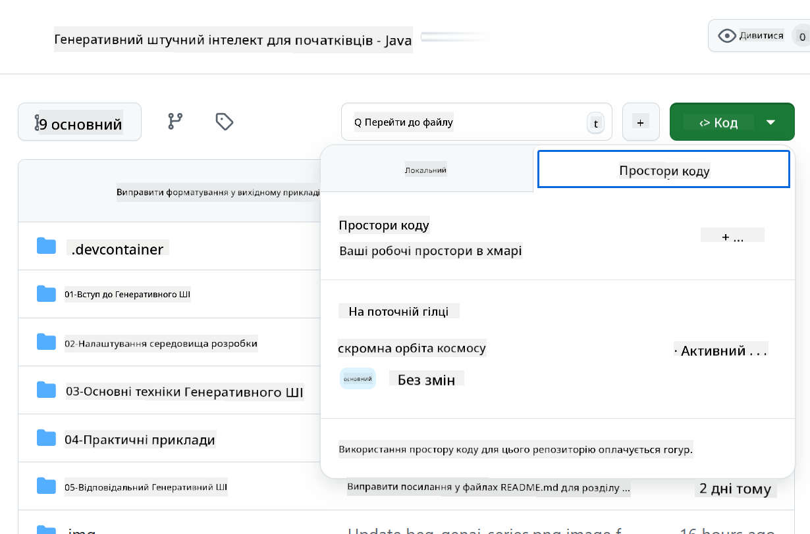

<!--
CO_OP_TRANSLATOR_METADATA:
{
  "original_hash": "e00bbea0f95c611aa3bec676d23e8b43",
  "translation_date": "2025-07-21T21:07:23+00:00",
  "source_file": "02-SetupDevEnvironment/getting-started-azure-openai.md",
  "language_code": "uk"
}
-->
# Налаштування середовища розробки для Azure OpenAI

> **Швидкий старт**: Цей посібник призначений для налаштування Azure OpenAI. Для швидкого старту з безкоштовними моделями скористайтеся [GitHub Models with Codespaces](./README.md#quick-start-cloud).

Цей посібник допоможе вам налаштувати моделі Azure AI Foundry для ваших Java AI додатків у цьому курсі.

## Зміст

- [Огляд швидкого налаштування](../../../02-SetupDevEnvironment)
- [Крок 1: Створення ресурсів Azure AI Foundry](../../../02-SetupDevEnvironment)
  - [Створення хабу та проєкту](../../../02-SetupDevEnvironment)
  - [Розгортання моделі GPT-4o-mini](../../../02-SetupDevEnvironment)
- [Крок 2: Створення Codespace](../../../02-SetupDevEnvironment)
- [Крок 3: Налаштування середовища](../../../02-SetupDevEnvironment)
- [Крок 4: Тестування налаштувань](../../../02-SetupDevEnvironment)
- [Що далі?](../../../02-SetupDevEnvironment)
- [Ресурси](../../../02-SetupDevEnvironment)
- [Додаткові ресурси](../../../02-SetupDevEnvironment)

## Огляд швидкого налаштування

1. Створіть ресурси Azure AI Foundry (хаб, проєкт, модель)
2. Створіть Codespace з контейнером для розробки на Java
3. Налаштуйте файл .env з обліковими даними Azure OpenAI
4. Перевірте налаштування за допомогою прикладного проєкту

## Крок 1: Створення ресурсів Azure AI Foundry

### Створення хабу та проєкту

1. Перейдіть на [портал Azure AI Foundry](https://ai.azure.com/) і увійдіть у свій обліковий запис.
2. Натисніть **+ Create** → **New hub** (або перейдіть до **Management** → **All hubs** → **+ New hub**).
3. Налаштуйте ваш хаб:
   - **Hub name**: наприклад, "MyAIHub"
   - **Subscription**: виберіть вашу підписку Azure
   - **Resource group**: створіть нову або виберіть існуючу
   - **Location**: виберіть найближче до вас розташування
   - **Storage account**: використовуйте стандартний або налаштуйте власний
   - **Key vault**: використовуйте стандартний або налаштуйте власний
   - Натисніть **Next** → **Review + create** → **Create**
4. Після створення натисніть **+ New project** (або **Create project** з огляду хабу):
   - **Project name**: наприклад, "GenAIJava"
   - Натисніть **Create**

### Розгортання моделі GPT-4o-mini

1. У вашому проєкті перейдіть до **Model catalog** і знайдіть **gpt-4o-mini**.
   - *Альтернатива: Перейдіть до **Deployments** → **+ Create deployment***
2. Натисніть **Deploy** на картці моделі gpt-4o-mini.
3. Налаштуйте розгортання:
   - **Deployment name**: "gpt-4o-mini"
   - **Model version**: використовуйте останню
   - **Deployment type**: Standard
4. Натисніть **Deploy**.
5. Після розгортання перейдіть до вкладки **Deployments** і скопіюйте ці значення:
   - **Deployment name** (наприклад, "gpt-4o-mini")
   - **Target URI** (наприклад, `https://your-hub-name.openai.azure.com/`)  
      > **Важливо**: Скопіюйте лише базовий URL (наприклад, `https://myhub.openai.azure.com/`), а не повний шлях до кінцевої точки.
   - **Key** (з розділу Keys and Endpoint)

> **Все ще виникають труднощі?** Відвідайте офіційну [документацію Azure AI Foundry](https://learn.microsoft.com/azure/ai-foundry/how-to/create-projects?tabs=ai-foundry&pivots=hub-project).

## Крок 2: Створення Codespace

1. Форкніть цей репозиторій у свій обліковий запис GitHub.
   > **Примітка**: Якщо ви хочете змінити базову конфігурацію, перегляньте [Dev Container Configuration](../../../.devcontainer/devcontainer.json).
2. У вашому форкнутому репозиторії натисніть **Code** → вкладка **Codespaces**.
3. Натисніть **...** → **New with options...**  

4. Виберіть **Dev container configuration**: 
   - **Generative AI Java Development Environment**
5. Натисніть **Create codespace**.

## Крок 3: Налаштування середовища

Коли ваш Codespace буде готовий, налаштуйте облікові дані Azure OpenAI:

1. **Перейдіть до прикладного проєкту з кореня репозиторію:**
   ```bash
   cd 02-SetupDevEnvironment/src/basic-chat-azure
   ```

2. **Створіть файл .env:**
   ```bash
   cp .env.example .env
   ```

3. **Відредагуйте файл .env, додавши облікові дані Azure OpenAI:**
   ```bash
   # Your Azure OpenAI API key (from Azure AI Foundry portal)
   AZURE_AI_KEY=your-actual-api-key-here
   
   # Your Azure OpenAI endpoint URL (e.g., https://myhub.openai.azure.com/)
   AZURE_AI_ENDPOINT=https://your-hub-name.openai.azure.com/
   ```

   > **Примітка щодо безпеки**: 
   > - Ніколи не додавайте файл `.env` до системи контролю версій.
   > - Файл `.env` вже включено до `.gitignore`.
   > - Зберігайте ваші API-ключі в безпеці та регулярно змінюйте їх.

## Крок 4: Тестування налаштувань

Запустіть прикладний додаток, щоб перевірити підключення до Azure OpenAI:

```bash
mvn clean spring-boot:run
```

Ви повинні побачити відповідь від моделі GPT-4o-mini!

> **Користувачі VS Code**: Ви також можете натиснути `F5` у VS Code, щоб запустити додаток. Конфігурація запуску вже налаштована для автоматичного завантаження вашого файлу `.env`.

> **Повний приклад**: Дивіться [End-to-End Azure OpenAI Example](./src/basic-chat-azure/README.md) для детальних інструкцій та усунення несправностей.

## Що далі?

**Налаштування завершено!** Тепер у вас є:
- Azure OpenAI з розгорнутою gpt-4o-mini
- Локальна конфігурація файлу .env
- Готове середовище розробки на Java

**Продовжуйте до** [Розділу 3: Основні техніки генеративного AI](../03-CoreGenerativeAITechniques/README.md), щоб почати створювати AI-додатки!

## Ресурси

- [Документація Azure AI Foundry](https://learn.microsoft.com/azure/ai-services/)
- [Документація Spring AI Azure OpenAI](https://docs.spring.io/spring-ai/reference/api/clients/azure-openai-chat.html)
- [Azure OpenAI Java SDK](https://learn.microsoft.com/java/api/overview/azure/ai-openai-readme)

## Додаткові ресурси

- [Завантажити VS Code](https://code.visualstudio.com/Download)
- [Отримати Docker Desktop](https://www.docker.com/products/docker-desktop)
- [Конфігурація Dev Container](../../../.devcontainer/devcontainer.json)

**Відмова від відповідальності**:  
Цей документ було перекладено за допомогою сервісу автоматичного перекладу [Co-op Translator](https://github.com/Azure/co-op-translator). Хоча ми прагнемо до точності, звертаємо вашу увагу, що автоматичні переклади можуть містити помилки або неточності. Оригінальний документ мовою оригіналу слід вважати авторитетним джерелом. Для критично важливої інформації рекомендується професійний людський переклад. Ми не несемо відповідальності за будь-які непорозуміння або неправильні тлумачення, що виникли внаслідок використання цього перекладу.