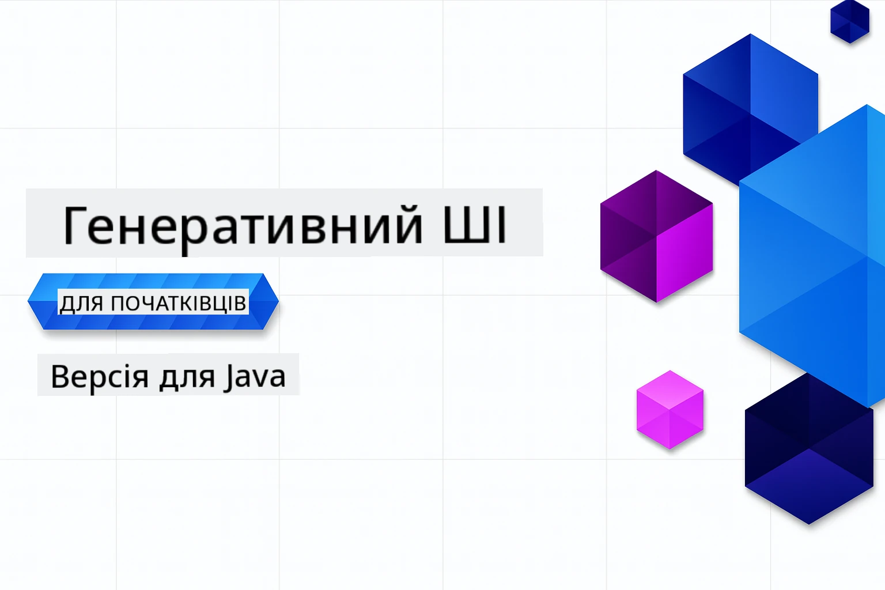

# Генеративний Штучний Інтелект для Початківців – Java-версія
[](https://discord.gg/nTYy5BXMWG)



**Часові Витрати**: Весь майстер-клас можна пройти онлайн без локального налаштування. Налаштування середовища займає 2 хвилини, дослідження зразків – від 1 до 3 годин залежно від глибини вивчення.

> **Швидкий Старт**

1. Форкніть цей репозиторій на свій обліковий запис GitHub
2. Натисніть **Code** → вкладка **Codespaces** → **...** → **New with options...**
3. Використовуйте параметри за замовчуванням – це вибере контейнер для розробки, створений для цього курсу
4. Натисніть **Create codespace**
5. Зачекайте приблизно 2 хвилини, поки середовище буде готове
6. Перейдіть безпосередньо до [Перший приклад](./02-SetupDevEnvironment/README.md#step-2-create-a-github-personal-access-token)

## Підтримка Багатьох Мов

### Підтримується через GitHub Action (Автоматизовано і Завжди Актуально)

<!-- CO-OP TRANSLATOR LANGUAGES TABLE START -->
[Арабська](../ar/README.md) | [Бенгальська](../bn/README.md) | [Болгарська](../bg/README.md) | [Бирманська (М’янма)](../my/README.md) | [Китайська (спрощена)](../zh-CN/README.md) | [Китайська (традиційна, Гонконг)](../zh-HK/README.md) | [Китайська (традиційна, Макао)](../zh-MO/README.md) | [Китайська (традиційна, Тайвань)](../zh-TW/README.md) | [Хорватська](../hr/README.md) | [Чеська](../cs/README.md) | [Данська](../da/README.md) | [Голландська](../nl/README.md) | [Естонська](../et/README.md) | [Фінська](../fi/README.md) | [Французька](../fr/README.md) | [Німецька](../de/README.md) | [Грецька](../el/README.md) | [Іврит](../he/README.md) | [Хінді](../hi/README.md) | [Угорська](../hu/README.md) | [Індонезійська](../id/README.md) | [Італійська](../it/README.md) | [Японська](../ja/README.md) | [Каннада](../kn/README.md) | [Корейська](../ko/README.md) | [Литовська](../lt/README.md) | [Малайська](../ms/README.md) | [Малаялам](../ml/README.md) | [Маратхі](../mr/README.md) | [Непальська](../ne/README.md) | [Нігерійський Піджин](../pcm/README.md) | [Норвезька](../no/README.md) | [Персидська (фарсі)](../fa/README.md) | [Польська](../pl/README.md) | [Португальська (Бразилія)](../pt-BR/README.md) | [Португальська (Португалія)](../pt-PT/README.md) | [Пенджабі (гурмукхі)](../pa/README.md) | [Румунська](../ro/README.md) | [Російська](../ru/README.md) | [Сербська (кирилиця)](../sr/README.md) | [Словацька](../sk/README.md) | [Словенська](../sl/README.md) | [Іспанська](../es/README.md) | [Свахілі](../sw/README.md) | [Шведська](../sv/README.md) | [Тагалог (філіппінська)](../tl/README.md) | [Тамільська](../ta/README.md) | [Телюгу](../te/README.md) | [Тайська](../th/README.md) | [Турецька](../tr/README.md) | [Українська](./README.md) | [Урду](../ur/README.md) | [В’єтнамська](../vi/README.md)

> **Віддаєте перевагу клонувати локально?**
>
> Цей репозиторій включає понад 50 мовних перекладів, що значно збільшує розмір завантаження. Щоб клонувати без перекладів, використовуйте розріджений клон:
>
> **Bash / macOS / Linux:**
> ```bash
> git clone --filter=blob:none --sparse https://github.com/microsoft/Generative-AI-for-beginners-java.git
> cd Generative-AI-for-beginners-java
> git sparse-checkout set --no-cone '/*' '!translations' '!translated_images'
> ```
>
> **CMD (Windows):**
> ```cmd
> git clone --filter=blob:none --sparse https://github.com/microsoft/Generative-AI-for-beginners-java.git
> cd Generative-AI-for-beginners-java
> git sparse-checkout set --no-cone "/*" "!translations" "!translated_images"
> ```
>
> Це дає вам усе необхідне для проходження курсу з набагато швидшим завантаженням.
<!-- CO-OP TRANSLATOR LANGUAGES TABLE END -->

## Структура Курсу та План Навчання

### **Розділ 1: Вступ до Генеративного ШІ**
- **Основні Концепції**: Розуміння великих мовних моделей, токенів, векторних уявлень та можливостей ШІ
- **Екосистема Java AI**: Огляд Spring AI та OpenAI SDK
- **Протокол Контексту Моделі**: Введення MCP та його роль у комунікації агентів ШІ
- **Практичні Застосування**: Реальні сценарії, включаючи чат-ботів та генерацію контенту
- **[→ Почати Розділ 1](./01-IntroToGenAI/README.md)**

### **Розділ 2: Налаштування Середовища Розробки**
- **Налаштування для Кількох Провайдерів**: Інтеграція GitHub Models, Azure OpenAI та OpenAI Java SDK
- **Spring Boot + Spring AI**: Найкращі практики розробки корпоративних AI-застосунків
- **GitHub Models**: Безкоштовний доступ до AI-моделей для прототипування та навчання (без кредитної карти)
- **Інструменти Розробника**: Конфігурація Docker контейнерів, VS Code та GitHub Codespaces
- **[→ Почати Розділ 2](./02-SetupDevEnvironment/README.md)**

### **Розділ 3: Основні Техніки Генеративного ШІ**
- **Інженерія Запитів**: Техніки для оптимальних відповідей моделей ШІ
- **Вбудування та Операції з Векторами**: Реалізація семантичного пошуку та пошуку схожості
- **Відновлення з Підтримкою Генерації (RAG)**: Поєднання ШІ з власними джерелами даних
- **Виклики Функцій**: Розширення можливостей ШІ за допомогою власних інструментів і плагінів
- **[→ Почати Розділ 3](./03-CoreGenerativeAITechniques/README.md)**

### **Розділ 4: Практичні Застосування та Проєкти**
- **Генератор Історій про Домашніх Улюбленців** (`petstory/`): Креативна генерація контенту з GitHub Models
- **Локальна Демонстрація Foundry** (`foundrylocal/`): Локальна інтеграція AI-моделі з OpenAI Java SDK
- **Сервіс Калькулятора MCP** (`calculator/`): Базова реалізація протоколу Model Context Protocol із Spring AI
- **[→ Почати Розділ 4](./04-PracticalSamples/README.md)**

### **Розділ 5: Відповідальна Розробка ШІ**
- **Безпека GitHub Models**: Тестування вбудованого фільтрування контенту та механізмів безпеки (жорсткі блокування та м’які відмови)
- **Демонстрація Відповідального ШІ**: Практичний приклад роботи сучасних систем безпеки ШІ
- **Найкращі Практики**: Основні рекомендації для етичної розробки та розгортання ШІ
- **[→ Почати Розділ 5](./05-ResponsibleGenAI/README.md)**

## Додаткові Ресурси

<!-- CO-OP TRANSLATOR OTHER COURSES START -->
### LangChain
[](https://aka.ms/langchain4j-for-beginners)
[](https://aka.ms/langchainjs-for-beginners?WT.mc_id=m365-94501-dwahlin)
[](https://github.com/microsoft/langchain-for-beginners?WT.mc_id=m365-94501-dwahlin)
---

### Azure / Edge / MCP / Агенти
[](https://github.com/microsoft/AZD-for-beginners?WT.mc_id=academic-105485-koreyst)
[](https://github.com/microsoft/edgeai-for-beginners?WT.mc_id=academic-105485-koreyst)
[](https://github.com/microsoft/mcp-for-beginners?WT.mc_id=academic-105485-koreyst)
[](https://github.com/microsoft/ai-agents-for-beginners?WT.mc_id=academic-105485-koreyst)

---
 
### Серія Генеративного ШІ
[](https://github.com/microsoft/generative-ai-for-beginners?WT.mc_id=academic-105485-koreyst)
[-9333EA?style=for-the-badge&labelColor=E5E7EB&color=9333EA)](https://github.com/microsoft/Generative-AI-for-beginners-dotnet?WT.mc_id=academic-105485-koreyst)
[-C084FC?style=for-the-badge&labelColor=E5E7EB&color=C084FC)](https://github.com/microsoft/generative-ai-for-beginners-java?WT.mc_id=academic-105485-koreyst)
[-E879F9?style=for-the-badge&labelColor=E5E7EB&color=E879F9)](https://github.com/microsoft/generative-ai-with-javascript?WT.mc_id=academic-105485-koreyst)

---
 
### Основне Навчання
[](https://aka.ms/ml-beginners?WT.mc_id=academic-105485-koreyst)
[](https://aka.ms/datascience-beginners?WT.mc_id=academic-105485-koreyst)
[](https://aka.ms/ai-beginners?WT.mc_id=academic-105485-koreyst)
[](https://github.com/microsoft/Security-101?WT.mc_id=academic-96948-sayoung)

[](https://aka.ms/webdev-beginners?WT.mc_id=academic-105485-koreyst)
[](https://aka.ms/iot-beginners?WT.mc_id=academic-105485-koreyst)
[](https://github.com/microsoft/xr-development-for-beginners?WT.mc_id=academic-105485-koreyst)

---
 
### Серія Copilot
[](https://aka.ms/GitHubCopilotAI?WT.mc_id=academic-105485-koreyst)
[](https://github.com/microsoft/mastering-github-copilot-for-dotnet-csharp-developers?WT.mc_id=academic-105485-koreyst)
[](https://github.com/microsoft/CopilotAdventures?WT.mc_id=academic-105485-koreyst)
<!-- CO-OP TRANSLATOR OTHER COURSES END -->

## Отримання допомоги

Якщо ви застрягли або маєте запитання щодо створення AI-додатків. Приєднуйтесь до інших учнів та досвідчених розробників у обговореннях MCP. Це підтримуюча спільнота, де вітаються запитання, а знання вільно обмінюються.

[](https://discord.gg/nTYy5BXMWG)

Якщо у вас є відгуки про продукт або помилки під час створення, відвідайте:

[](https://aka.ms/foundry/forum)

---

<!-- CO-OP TRANSLATOR DISCLAIMER START -->
**Застереження**:
Цей документ був перекладений за допомогою сервісу автоматичного перекладу [Co-op Translator](https://github.com/Azure/co-op-translator). Хоча ми прагнемо до точності, будь ласка, майте на увазі, що автоматичні переклади можуть містити помилки або неточності. Оригінальний документ рідною мовою слід вважати авторитетним джерелом. Для критичної інформації рекомендується звертатися до професійного людського перекладу. Ми не несемо відповідальності за будь-які непорозуміння або неправильні тлумачення, що виникли внаслідок використання цього перекладу.
<!-- CO-OP TRANSLATOR DISCLAIMER END -->