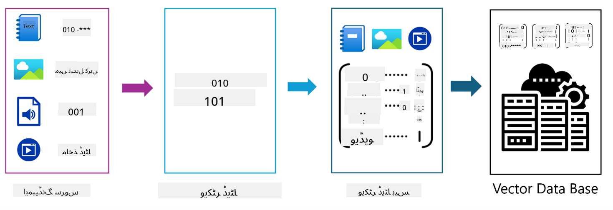
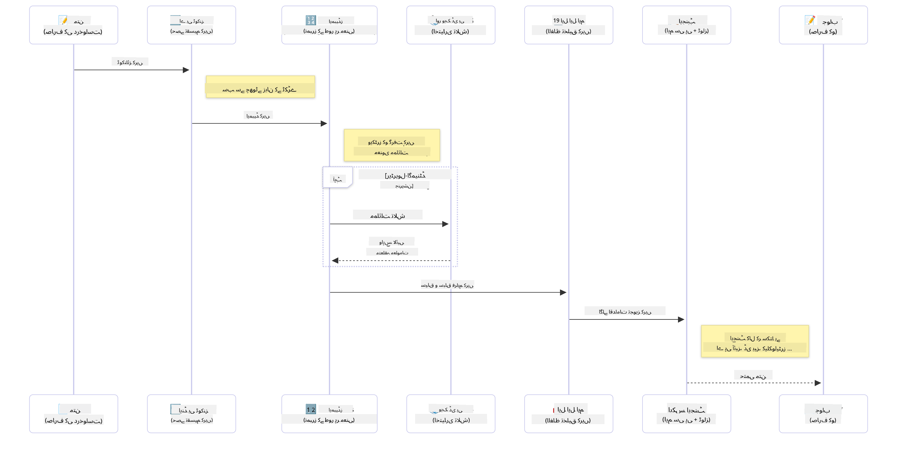

<!--
CO_OP_TRANSLATOR_METADATA:
{
  "original_hash": "6d8b4a0d774dc2a1e97c95859a6d6e4b",
  "translation_date": "2025-07-21T18:38:42+00:00",
  "source_file": "01-IntroToGenAI/README.md",
  "language_code": "ur"
}
-->
# جنریٹو اے آئی کا تعارف - جاوا ایڈیشن

## آپ کیا سیکھیں گے

- **جنریٹو اے آئی کے بنیادی اصول** جیسے LLMs، پرامپٹ انجینئرنگ، ٹوکنز، ایمبیڈنگز، اور ویکٹر ڈیٹا بیس
- **جاوا اے آئی ڈیولپمنٹ ٹولز کا موازنہ** جیسے Azure OpenAI SDK، Spring AI، اور OpenAI Java SDK
- **ماڈل کانٹیکسٹ پروٹوکول دریافت کریں** اور اے آئی ایجنٹ کمیونیکیشن میں اس کا کردار

## مواد کی فہرست

- [تعارف](../../../01-IntroToGenAI)
- [جنریٹو اے آئی کے تصورات پر ایک مختصر نظر](../../../01-IntroToGenAI)
- [پرامپٹ انجینئرنگ کا جائزہ](../../../01-IntroToGenAI)
- [ٹوکنز، ایمبیڈنگز، اور ایجنٹس](../../../01-IntroToGenAI)
- [جاوا کے لیے اے آئی ڈیولپمنٹ ٹولز اور لائبریریاں](../../../01-IntroToGenAI)
  - [OpenAI Java SDK](../../../01-IntroToGenAI)
  - [Spring AI](../../../01-IntroToGenAI)
  - [Azure OpenAI Java SDK](../../../01-IntroToGenAI)
- [خلاصہ](../../../01-IntroToGenAI)
- [اگلے اقدامات](../../../01-IntroToGenAI)

## تعارف

جنریٹو اے آئی فار بیگنرز - جاوا ایڈیشن کے پہلے باب میں خوش آمدید! یہ بنیادی سبق آپ کو جنریٹو اے آئی کے اہم تصورات اور جاوا کے ذریعے ان کے ساتھ کام کرنے کا طریقہ سکھاتا ہے۔ آپ اے آئی ایپلیکیشنز کے بنیادی اجزاء کے بارے میں سیکھیں گے، جن میں بڑے لینگویج ماڈلز (LLMs)، ٹوکنز، ایمبیڈنگز، اور اے آئی ایجنٹس شامل ہیں۔ ہم اس کورس میں استعمال ہونے والے جاوا ٹولز کا بھی جائزہ لیں گے۔

### جنریٹو اے آئی کے تصورات پر ایک مختصر نظر

جنریٹو اے آئی ایک قسم کی مصنوعی ذہانت ہے جو ڈیٹا سے سیکھے گئے پیٹرنز اور تعلقات کی بنیاد پر نیا مواد تخلیق کرتی ہے، جیسے کہ متن، تصاویر، یا کوڈ۔ جنریٹو اے آئی ماڈلز انسانی جیسے جوابات پیدا کر سکتے ہیں، سیاق و سباق کو سمجھ سکتے ہیں، اور کبھی کبھار ایسا مواد تخلیق کر سکتے ہیں جو انسانی جیسا لگتا ہے۔

جب آپ اپنی جاوا اے آئی ایپلیکیشنز تیار کریں گے، تو آپ **جنریٹو اے آئی ماڈلز** کے ساتھ کام کریں گے تاکہ مواد تخلیق کیا جا سکے۔ جنریٹو اے آئی ماڈلز کی کچھ صلاحیتیں شامل ہیں:

- **متن کی تخلیق**: چیٹ بوٹس، مواد، اور متن کی تکمیل کے لیے انسانی جیسے متن تیار کرنا۔
- **تصویری تخلیق اور تجزیہ**: حقیقت پسندانہ تصاویر بنانا، تصاویر کو بہتر بنانا، اور اشیاء کا پتہ لگانا۔
- **کوڈ کی تخلیق**: کوڈ کے ٹکڑے یا اسکرپٹس لکھنا۔

مخصوص قسم کے ماڈلز مختلف کاموں کے لیے بہتر بنائے گئے ہیں۔ مثال کے طور پر، **چھوٹے لینگویج ماڈلز (SLMs)** اور **بڑے لینگویج ماڈلز (LLMs)** دونوں متن کی تخلیق کو سنبھال سکتے ہیں، جہاں LLMs عام طور پر پیچیدہ کاموں کے لیے بہتر کارکردگی پیش کرتے ہیں۔ تصویری کاموں کے لیے، آپ خصوصی وژن ماڈلز یا ملٹی موڈل ماڈلز استعمال کریں گے۔

یقیناً، ان ماڈلز کے جوابات ہمیشہ کامل نہیں ہوتے۔ آپ نے شاید سنا ہوگا کہ ماڈلز "ہیلوسینیٹ" کرتے ہیں یا غلط معلومات کو مستند انداز میں پیش کرتے ہیں۔ لیکن آپ ماڈل کو واضح ہدایات اور سیاق و سباق فراہم کرکے بہتر جوابات دینے میں مدد کر سکتے ہیں۔ یہی وہ جگہ ہے جہاں **پرامپٹ انجینئرنگ** کام آتی ہے۔

#### پرامپٹ انجینئرنگ کا جائزہ

پرامپٹ انجینئرنگ اے آئی ماڈلز کو مطلوبہ نتائج کی طرف رہنمائی کرنے کے لیے مؤثر ان پٹس ڈیزائن کرنے کا عمل ہے۔ اس میں شامل ہیں:

- **وضاحت**: ہدایات کو واضح اور غیر مبہم بنانا۔
- **سیاق و سباق**: ضروری پس منظر کی معلومات فراہم کرنا۔
- **پابندیاں**: کسی بھی حدود یا فارمیٹس کی وضاحت کرنا۔

پرامپٹ انجینئرنگ کے کچھ بہترین طریقے شامل ہیں پرامپٹ ڈیزائن، واضح ہدایات، کام کی تقسیم، ون شاٹ اور فیو شاٹ لرننگ، اور پرامپٹ ٹیوننگ۔ مختلف پرامپٹس کی جانچ کرنا ضروری ہے تاکہ یہ معلوم ہو سکے کہ آپ کے مخصوص استعمال کے کیس کے لیے کیا بہتر کام کرتا ہے۔

جب آپ ایپلیکیشنز تیار کرتے ہیں، تو آپ مختلف قسم کے پرامپٹس کے ساتھ کام کریں گے:
- **سسٹم پرامپٹس**: ماڈل کے رویے کے لیے بنیادی قواعد اور سیاق و سباق مرتب کریں۔
- **یوزر پرامپٹس**: آپ کی ایپلیکیشن کے صارفین سے ان پٹ ڈیٹا۔
- **اسسٹنٹ پرامپٹس**: سسٹم اور یوزر پرامپٹس کی بنیاد پر ماڈل کے جوابات۔

> **مزید سیکھیں**: پرامپٹ انجینئرنگ کے بارے میں مزید جانیں [جنریٹو اے آئی فار بیگنرز کورس کے پرامپٹ انجینئرنگ باب](https://github.com/microsoft/generative-ai-for-beginners/tree/main/04-prompt-engineering-fundamentals) میں۔

#### ٹوکنز، ایمبیڈنگز، اور ایجنٹس

جب آپ جنریٹو اے آئی ماڈلز کے ساتھ کام کرتے ہیں، تو آپ **ٹوکنز**، **ایمبیڈنگز**، **ایجنٹس**، اور **ماڈل کانٹیکسٹ پروٹوکول (MCP)** جیسے اصطلاحات کا سامنا کریں گے۔ ان تصورات کا تفصیلی جائزہ یہاں دیا گیا ہے:

- **ٹوکنز**: ٹوکنز متن کا سب سے چھوٹا یونٹ ہیں جو ماڈل میں استعمال ہوتا ہے۔ یہ الفاظ، حروف، یا سب ورڈز ہو سکتے ہیں۔ ٹوکنز متن کے ڈیٹا کو اس فارمیٹ میں ظاہر کرنے کے لیے استعمال کیے جاتے ہیں جو ماڈل سمجھ سکتا ہے۔ مثال کے طور پر، جملہ "The quick brown fox jumped over the lazy dog" کو ٹوکنائز کیا جا سکتا ہے جیسے ["The", " quick", " brown", " fox", " jumped", " over", " the", " lazy", " dog"] یا ["The", " qu", "ick", " br", "own", " fox", " jump", "ed", " over", " the", " la", "zy", " dog"] ٹوکنائزیشن کی حکمت عملی پر منحصر ہے۔

ٹوکنائزیشن متن کو ان چھوٹے یونٹس میں تقسیم کرنے کا عمل ہے۔ یہ اہم ہے کیونکہ ماڈلز ٹوکنز پر کام کرتے ہیں نہ کہ خام متن پر۔ پرامپٹ میں ٹوکنز کی تعداد ماڈل کے جواب کی لمبائی اور معیار کو متاثر کرتی ہے، کیونکہ ماڈلز کے کانٹیکسٹ ونڈو کے لیے ٹوکن کی حدود ہوتی ہیں (مثلاً، GPT-4o کے لیے کل کانٹیکسٹ 128K ٹوکنز، ان پٹ اور آؤٹ پٹ دونوں شامل ہیں)۔

  جاوا میں، آپ OpenAI SDK جیسی لائبریریوں کا استعمال کر سکتے ہیں تاکہ ٹوکنائزیشن کو خودکار طور پر سنبھالا جا سکے جب ماڈلز کو درخواستیں بھیجی جائیں۔

- **ایمبیڈنگز**: ایمبیڈنگز ٹوکنز کی ویکٹر نمائندگی ہیں جو معنوی معنی کو ظاہر کرتی ہیں۔ یہ عددی نمائندگی ہیں (عام طور پر فلوٹنگ پوائنٹ نمبرز کی arrays) جو ماڈلز کو الفاظ کے درمیان تعلقات کو سمجھنے اور سیاق و سباق کے لحاظ سے متعلقہ جوابات پیدا کرنے کی اجازت دیتی ہیں۔ مشابہت والے الفاظ کی ایمبیڈنگز مشابہت رکھتی ہیں، جس سے ماڈل مترادفات اور معنوی تعلقات جیسے تصورات کو سمجھ سکتا ہے۔

  جاوا میں، آپ OpenAI SDK یا دیگر لائبریریوں کا استعمال کر سکتے ہیں جو ایمبیڈنگز کی تخلیق کی حمایت کرتی ہیں۔ یہ ایمبیڈنگز معنوی تلاش جیسے کاموں کے لیے ضروری ہیں، جہاں آپ معنی کی بنیاد پر مشابہ مواد تلاش کرنا چاہتے ہیں نہ کہ متن کے عین مطابق میچز۔

- **ویکٹر ڈیٹا بیس**: ویکٹر ڈیٹا بیس ایمبیڈنگز کے لیے خصوصی اسٹوریج سسٹمز ہیں جو مشابہت تلاش کے لیے بہتر بنائے گئے ہیں۔ یہ مؤثر طریقے سے تلاش کو فعال کرتے ہیں اور Retrieval-Augmented Generation (RAG) پیٹرنز کے لیے اہم ہیں جہاں آپ معنوی مشابہت کی بنیاد پر بڑے ڈیٹا سیٹس سے متعلقہ معلومات تلاش کرنا چاہتے ہیں نہ کہ عین مطابق میچز۔

> **نوٹ**: اس کورس میں، ہم ویکٹر ڈیٹا بیس کا احاطہ نہیں کریں گے لیکن ان کا ذکر کرنا ضروری سمجھتے ہیں کیونکہ وہ حقیقی دنیا کی ایپلیکیشنز میں عام طور پر استعمال ہوتے ہیں۔

- **ایجنٹس اور MCP**: اے آئی کے اجزاء جو خود مختاری سے ماڈلز، ٹولز، اور بیرونی سسٹمز کے ساتھ تعامل کرتے ہیں۔ ماڈل کانٹیکسٹ پروٹوکول (MCP) ایجنٹس کو بیرونی ڈیٹا ذرائع اور ٹولز تک محفوظ رسائی فراہم کرنے کا ایک معیاری طریقہ فراہم کرتا ہے۔ مزید جانیں ہمارے [MCP فار بیگنرز](https://github.com/microsoft/mcp-for-beginners) کورس میں۔

جاوا اے آئی ایپلیکیشنز میں، آپ ٹوکنز کو متن کی پروسیسنگ کے لیے، ایمبیڈنگز کو معنوی تلاش اور RAG کے لیے، ویکٹر ڈیٹا بیس کو ڈیٹا کی بازیافت کے لیے، اور ایجنٹس کو MCP کے ساتھ ذہین، ٹول استعمال کرنے والے سسٹمز بنانے کے لیے استعمال کریں گے۔

### جاوا کے لیے اے آئی ڈیولپمنٹ ٹولز اور لائبریریاں

جاوا اے آئی ڈیولپمنٹ کے لیے بہترین ٹولنگ فراہم کرتا ہے۔ اس کورس میں ہم تین اہم لائبریریوں کا جائزہ لیں گے - OpenAI Java SDK، Azure OpenAI SDK، اور Spring AI۔

یہاں ایک فوری حوالہ جدول ہے جو دکھاتا ہے کہ ہر باب کی مثالوں میں کون سا SDK استعمال کیا گیا ہے:

| باب | نمونہ | SDK |
|---------|--------|-----|
| 02-SetupDevEnvironment | src/github-models/ | OpenAI Java SDK |
| 02-SetupDevEnvironment | src/basic-chat-azure/ | Spring AI Azure OpenAI |
| 03-CoreGenerativeAITechniques | examples/ | Azure OpenAI SDK |
| 04-PracticalSamples | petstory/ | OpenAI Java SDK |
| 04-PracticalSamples | foundrylocal/ | OpenAI Java SDK |
| 04-PracticalSamples | mcp/calculator/ | Spring AI MCP SDK + LangChain4j |

**SDK دستاویزات کے لنکس:**
- [Azure OpenAI Java SDK](https://github.com/Azure/azure-sdk-for-java/tree/azure-ai-openai_1.0.0-beta.16/sdk/openai/azure-ai-openai)
- [Spring AI](https://docs.spring.io/spring-ai/reference/)
- [OpenAI Java SDK](https://github.com/openai/openai-java)
- [LangChain4j](https://docs.langchain4j.dev/)

#### OpenAI Java SDK

OpenAI SDK OpenAI API کے لیے سرکاری جاوا لائبریری ہے۔ یہ OpenAI کے ماڈلز کے ساتھ تعامل کے لیے ایک سادہ اور مستقل انٹرفیس فراہم کرتا ہے، جس سے جاوا ایپلیکیشنز میں اے آئی صلاحیتوں کو شامل کرنا آسان ہو جاتا ہے۔ باب 2 کے GitHub Models کی مثال، باب 4 کے Pet Story ایپلیکیشن اور Foundry Local کی مثال OpenAI SDK کے طریقہ کار کو ظاہر کرتی ہیں۔

#### Spring AI

Spring AI ایک جامع فریم ورک ہے جو Spring ایپلیکیشنز میں اے آئی صلاحیتیں لاتا ہے، مختلف اے آئی فراہم کنندگان کے لیے ایک مستقل تجریدی پرت فراہم کرتا ہے۔ یہ Spring ایکو سسٹم کے ساتھ بغیر کسی رکاوٹ کے انضمام کرتا ہے، جس سے انٹرپرائز جاوا ایپلیکیشنز کے لیے مثالی انتخاب بن جاتا ہے جنہیں اے آئی صلاحیتوں کی ضرورت ہوتی ہے۔

Spring AI کی طاقت اس کے Spring ایکو سسٹم کے ساتھ بغیر کسی رکاوٹ کے انضمام میں ہے، جس سے Spring کے مانوس پیٹرنز جیسے dependency injection، configuration management، اور testing frameworks کے ساتھ پروڈکشن کے لیے تیار اے آئی ایپلیکیشنز بنانا آسان ہو جاتا ہے۔ آپ باب 2 اور 4 میں Spring AI کا استعمال کریں گے تاکہ ایپلیکیشنز بنائی جا سکیں جو OpenAI اور ماڈل کانٹیکسٹ پروٹوکول (MCP) Spring AI لائبریریوں دونوں کا فائدہ اٹھاتی ہیں۔

##### ماڈل کانٹیکسٹ پروٹوکول (MCP)

[ماڈل کانٹیکسٹ پروٹوکول (MCP)](https://modelcontextprotocol.io/) ایک ابھرتا ہوا معیار ہے جو اے آئی ایپلیکیشنز کو بیرونی ڈیٹا ذرائع اور ٹولز کے ساتھ محفوظ طریقے سے تعامل کرنے کے قابل بناتا ہے۔ MCP اے آئی ماڈلز کو سیاق و سباق کی معلومات تک رسائی اور آپ کی ایپلیکیشنز میں اعمال انجام دینے کا ایک معیاری طریقہ فراہم کرتا ہے۔

باب 4 میں، آپ ایک سادہ MCP کیلکولیٹر سروس بنائیں گے جو Spring AI کے ساتھ ماڈل کانٹیکسٹ پروٹوکول کے بنیادی اصولوں کو ظاہر کرتی ہے، یہ دکھاتے ہوئے کہ بنیادی ٹول انضمام اور سروس آرکیٹیکچرز کیسے بنائے جائیں۔

#### Azure OpenAI Java SDK

Azure OpenAI کلائنٹ لائبریری جاوا کے لیے OpenAI کے REST APIs کی ایک موافقت ہے جو ایک idiomatic انٹرفیس اور Azure SDK ایکو سسٹم کے باقی حصے کے ساتھ انضمام فراہم کرتی ہے۔ باب 3 میں، آپ Azure OpenAI SDK کا استعمال کرتے ہوئے ایپلیکیشنز بنائیں گے، جن میں چیٹ ایپلیکیشنز، فنکشن کالنگ، اور RAG (Retrieval-Augmented Generation) پیٹرنز شامل ہیں۔

> نوٹ: Azure OpenAI SDK خصوصیات کے لحاظ سے OpenAI Java SDK سے پیچھے ہے، لہذا مستقبل کے منصوبوں کے لیے OpenAI Java SDK استعمال کرنے پر غور کریں۔

## خلاصہ

**مبارک ہو!** آپ نے کامیابی سے:

- **جنریٹو اے آئی کے بنیادی اصول سیکھے** جن میں LLMs، پرامپٹ انجینئرنگ، ٹوکنز، ایمبیڈنگز، اور ویکٹر ڈیٹا بیس شامل ہیں۔
- **جاوا اے آئی ڈیولپمنٹ ٹولز کا موازنہ کیا** جن میں Azure OpenAI SDK، Spring AI، اور OpenAI Java SDK شامل ہیں۔
- **ماڈل کانٹیکسٹ پروٹوکول دریافت کیا** اور اے آئی ایجنٹ کمیونیکیشن میں اس کا کردار سمجھا۔

## اگلے اقدامات

[باب 2: ڈیولپمنٹ ماحول ترتیب دینا](../02-SetupDevEnvironment/README.md)

**ڈسکلیمر**:  
یہ دستاویز AI ترجمہ سروس [Co-op Translator](https://github.com/Azure/co-op-translator) کا استعمال کرتے ہوئے ترجمہ کی گئی ہے۔ ہم درستگی کے لیے کوشش کرتے ہیں، لیکن براہ کرم آگاہ رہیں کہ خودکار ترجمے میں غلطیاں یا غیر درستیاں ہو سکتی ہیں۔ اصل دستاویز کو اس کی اصل زبان میں مستند ذریعہ سمجھا جانا چاہیے۔ اہم معلومات کے لیے، پیشہ ور انسانی ترجمہ کی سفارش کی جاتی ہے۔ ہم اس ترجمے کے استعمال سے پیدا ہونے والی کسی بھی غلط فہمی یا غلط تشریح کے ذمہ دار نہیں ہیں۔