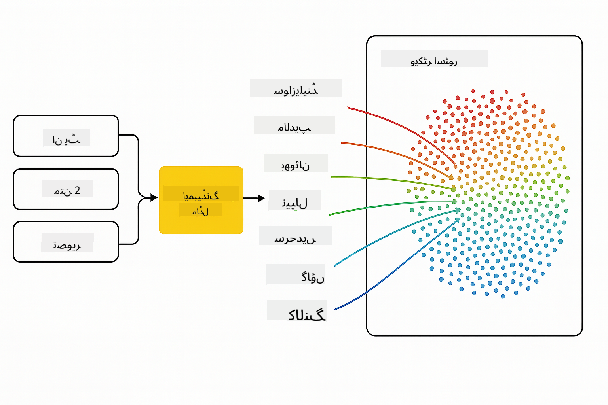

<!--
CO_OP_TRANSLATOR_METADATA:
{
  "original_hash": "75bfb080ca725e8a9aa9c80cae25fba1",
  "translation_date": "2025-07-29T08:16:19+00:00",
  "source_file": "01-IntroToGenAI/README.md",
  "language_code": "ur"
}
-->
# جنریٹو اے آئی کا تعارف - جاوا ایڈیشن

## آپ کیا سیکھیں گے

- **جنریٹو اے آئی کے بنیادی اصول**، جن میں LLMs، پرامپٹ انجینئرنگ، ٹوکنز، ایمبیڈنگز، اور ویکٹر ڈیٹابیس شامل ہیں  
- **جاوا اے آئی ڈیولپمنٹ ٹولز کا موازنہ**، جیسے Azure OpenAI SDK، Spring AI، اور OpenAI Java SDK  
- **ماڈل کانٹیکسٹ پروٹوکول دریافت کریں** اور اے آئی ایجنٹس کی کمیونیکیشن میں اس کا کردار  

## مواد کی فہرست

- [تعارف](../../../01-IntroToGenAI)  
- [جنریٹو اے آئی کے تصورات پر ایک مختصر نظر](../../../01-IntroToGenAI)  
- [پرامپٹ انجینئرنگ کا جائزہ](../../../01-IntroToGenAI)  
- [ٹوکنز، ایمبیڈنگز، اور ایجنٹس](../../../01-IntroToGenAI)  
- [جاوا کے لیے اے آئی ڈیولپمنٹ ٹولز اور لائبریریاں](../../../01-IntroToGenAI)  
  - [OpenAI Java SDK](../../../01-IntroToGenAI)  
  - [Spring AI](../../../01-IntroToGenAI)  
  - [Azure OpenAI Java SDK](../../../01-IntroToGenAI)  
- [خلاصہ](../../../01-IntroToGenAI)  
- [اگلے اقدامات](../../../01-IntroToGenAI)  

## تعارف

جنریٹو اے آئی فار بیگنرز - جاوا ایڈیشن کے پہلے باب میں خوش آمدید! یہ بنیادی سبق آپ کو جنریٹو اے آئی کے اہم تصورات اور جاوا کے ذریعے ان کے ساتھ کام کرنے کا طریقہ سکھائے گا۔ آپ اے آئی ایپلیکیشنز کے بنیادی اجزاء کے بارے میں سیکھیں گے، جن میں بڑے لینگویج ماڈلز (LLMs)، ٹوکنز، ایمبیڈنگز، اور اے آئی ایجنٹس شامل ہیں۔ ہم ان بنیادی جاوا ٹولز کا بھی جائزہ لیں گے جو آپ اس کورس میں استعمال کریں گے۔

### جنریٹو اے آئی کے تصورات پر ایک مختصر نظر

جنریٹو اے آئی مصنوعی ذہانت کی ایک قسم ہے جو ڈیٹا سے سیکھے گئے پیٹرنز اور تعلقات کی بنیاد پر نیا مواد تخلیق کرتی ہے، جیسے کہ متن، تصاویر، یا کوڈ۔ جنریٹو اے آئی ماڈلز انسانی جیسی جوابات تخلیق کر سکتے ہیں، سیاق و سباق کو سمجھ سکتے ہیں، اور بعض اوقات ایسا مواد بنا سکتے ہیں جو انسانی تخلیق کردہ معلوم ہو۔

جب آپ اپنی جاوا اے آئی ایپلیکیشنز تیار کریں گے، تو آپ **جنریٹو اے آئی ماڈلز** کے ساتھ مواد تخلیق کرنے کے لیے کام کریں گے۔ جنریٹو اے آئی ماڈلز کی کچھ صلاحیتیں شامل ہیں:

- **متن کی تخلیق**: چیٹ بوٹس، مواد، اور متن کی تکمیل کے لیے انسانی جیسا متن تیار کرنا۔  
- **تصویری تخلیق اور تجزیہ**: حقیقت پسندانہ تصاویر بنانا، تصاویر کو بہتر بنانا، اور اشیاء کا پتہ لگانا۔  
- **کوڈ تخلیق**: کوڈ کے ٹکڑے یا اسکرپٹس لکھنا۔  

مخصوص کاموں کے لیے مختلف قسم کے ماڈلز کو بہتر بنایا گیا ہے۔ مثال کے طور پر، **چھوٹے لینگویج ماڈلز (SLMs)** اور **بڑے لینگویج ماڈلز (LLMs)** دونوں متن کی تخلیق کو سنبھال سکتے ہیں، لیکن LLMs عام طور پر پیچیدہ کاموں کے لیے بہتر کارکردگی پیش کرتے ہیں۔ تصویری کاموں کے لیے، آپ خصوصی وژن ماڈلز یا ملٹی موڈل ماڈلز استعمال کریں گے۔

یقیناً، ان ماڈلز کے جوابات ہمیشہ کامل نہیں ہوتے۔ آپ نے شاید سنا ہوگا کہ ماڈلز "ہیلوسینیٹ" کرتے ہیں یا غلط معلومات کو مستند انداز میں پیش کرتے ہیں۔ لیکن آپ ماڈل کو واضح ہدایات اور سیاق و سباق فراہم کرکے بہتر جوابات دینے میں مدد کر سکتے ہیں۔ یہیں پر **پرامپٹ انجینئرنگ** کا کردار آتا ہے۔

#### پرامپٹ انجینئرنگ کا جائزہ

پرامپٹ انجینئرنگ ایک ایسا عمل ہے جس میں مؤثر ان پٹس ڈیزائن کیے جاتے ہیں تاکہ اے آئی ماڈلز کو مطلوبہ آؤٹ پٹس کی طرف رہنمائی کی جا سکے۔ اس میں شامل ہے:

- **وضاحت**: ہدایات کو واضح اور غیر مبہم بنانا۔  
- **سیاق و سباق**: ضروری پس منظر کی معلومات فراہم کرنا۔  
- **حدود**: کسی بھی پابندیوں یا فارمیٹس کی وضاحت کرنا۔  

پرامپٹ انجینئرنگ کے لیے کچھ بہترین طریقے شامل ہیں: پرامپٹ ڈیزائن، واضح ہدایات، کام کی تقسیم، ون شاٹ اور فیو شاٹ لرننگ، اور پرامپٹ ٹیوننگ۔ مختلف پرامپٹس کی جانچ کرنا ضروری ہے تاکہ آپ کے مخصوص استعمال کے کیس کے لیے بہترین کام کرنے والے پرامپٹس کا پتہ لگایا جا سکے۔

ایپلیکیشنز تیار کرتے وقت، آپ مختلف قسم کے پرامپٹس کے ساتھ کام کریں گے:
- **سسٹم پرامپٹس**: ماڈل کے رویے کے لیے بنیادی اصول اور سیاق و سباق طے کرتے ہیں۔  
- **یوزر پرامپٹس**: آپ کی ایپلیکیشن کے صارفین سے ان پٹ ڈیٹا۔  
- **اسسٹنٹ پرامپٹس**: سسٹم اور یوزر پرامپٹس کی بنیاد پر ماڈل کے جوابات۔  

> **مزید سیکھیں**: پرامپٹ انجینئرنگ کے بارے میں مزید جاننے کے لیے [جنریٹو اے آئی فار بیگنرز کورس کے پرامپٹ انجینئرنگ باب](https://github.com/microsoft/generative-ai-for-beginners/tree/main/04-prompt-engineering-fundamentals) کا مطالعہ کریں۔

#### ٹوکنز، ایمبیڈنگز، اور ایجنٹس

جنریٹو اے آئی ماڈلز کے ساتھ کام کرتے وقت، آپ اصطلاحات جیسے **ٹوکنز**، **ایمبیڈنگز**، **ایجنٹس**، اور **ماڈل کانٹیکسٹ پروٹوکول (MCP)** کا سامنا کریں گے۔ یہاں ان تصورات کا تفصیلی جائزہ دیا گیا ہے:

- **ٹوکنز**: ٹوکنز متن کی سب سے چھوٹی اکائی ہیں جو ماڈل میں استعمال ہوتی ہیں۔ یہ الفاظ، حروف، یا سب ورڈز ہو سکتے ہیں۔ ٹوکنز متن کے ڈیٹا کو اس فارمیٹ میں ظاہر کرنے کے لیے استعمال کیے جاتے ہیں جسے ماڈل سمجھ سکے۔ مثال کے طور پر، جملہ "The quick brown fox jumped over the lazy dog" کو ٹوکنائز کیا جا سکتا ہے جیسے ["The", " quick", " brown", " fox", " jumped", " over", " the", " lazy", " dog"] یا ["The", " qu", "ick", " br", "own", " fox", " jump", "ed", " over", " the", " la", "zy", " dog"]، ٹوکنائزیشن کی حکمت عملی پر منحصر ہے۔

ٹوکنائزیشن وہ عمل ہے جس میں متن کو ان چھوٹی اکائیوں میں تقسیم کیا جاتا ہے۔ یہ اہم ہے کیونکہ ماڈلز خام متن کے بجائے ٹوکنز پر کام کرتے ہیں۔ پرامپٹ میں ٹوکنز کی تعداد ماڈل کے جواب کی لمبائی اور معیار کو متاثر کرتی ہے، کیونکہ ماڈلز کے سیاق و سباق کی ونڈو کے لیے ٹوکن کی حد ہوتی ہے (مثال کے طور پر، GPT-4o کے لیے کل سیاق و سباق 128K ٹوکنز، ان پٹ اور آؤٹ پٹ دونوں شامل ہیں)۔

جاوا میں، آپ OpenAI SDK جیسی لائبریریوں کا استعمال کر سکتے ہیں جو ماڈلز کو درخواست بھیجتے وقت ٹوکنائزیشن کو خودکار طور پر سنبھالتی ہیں۔

- **ایمبیڈنگز**: ایمبیڈنگز ٹوکنز کی ویکٹر نمائندگی ہیں جو معنوی معنی کو ظاہر کرتی ہیں۔ یہ عددی نمائندگی (عام طور پر فلوٹنگ پوائنٹ نمبرز کی صفیں) ہیں جو ماڈلز کو الفاظ کے درمیان تعلقات کو سمجھنے اور سیاق و سباق کے مطابق جوابات تیار کرنے کی اجازت دیتی ہیں۔ مشابہ الفاظ کی ایمبیڈنگز مشابہ ہوتی ہیں، جس سے ماڈل مترادفات اور معنوی تعلقات کو سمجھ سکتا ہے۔

جاوا میں، آپ OpenAI SDK یا دیگر لائبریریوں کا استعمال کرتے ہوئے ایمبیڈنگز تیار کر سکتے ہیں جو ایمبیڈنگ جنریشن کی حمایت کرتی ہیں۔ یہ ایمبیڈنگز ان کاموں کے لیے ضروری ہیں جیسے معنوی تلاش، جہاں آپ مواد کو معنی کی بنیاد پر تلاش کرنا چاہتے ہیں نہ کہ متن کے عین مطابق میچز پر۔

- **ویکٹر ڈیٹابیسز**: ویکٹر ڈیٹابیسز خصوصی اسٹوریج سسٹمز ہیں جو ایمبیڈنگز کے لیے بہتر بنائے گئے ہیں۔ یہ معنوی مشابہت کی بنیاد پر مؤثر تلاش کو ممکن بناتے ہیں اور ریٹریول-آگمینٹڈ جنریشن (RAG) پیٹرنز کے لیے اہم ہیں، جہاں آپ کو بڑے ڈیٹاسیٹس سے متعلقہ معلومات تلاش کرنے کی ضرورت ہوتی ہے۔

> **نوٹ**: اس کورس میں، ہم ویکٹر ڈیٹابیسز کا احاطہ نہیں کریں گے لیکن ان کا ذکر کرنا ضروری سمجھتے ہیں کیونکہ یہ حقیقی دنیا کی ایپلیکیشنز میں عام طور پر استعمال ہوتے ہیں۔

- **ایجنٹس اور MCP**: اے آئی کے اجزاء جو ماڈلز، ٹولز، اور بیرونی سسٹمز کے ساتھ خود مختار طور پر تعامل کرتے ہیں۔ ماڈل کانٹیکسٹ پروٹوکول (MCP) ایجنٹس کو بیرونی ڈیٹا ذرائع اور ٹولز تک محفوظ رسائی فراہم کرنے کا ایک معیاری طریقہ فراہم کرتا ہے۔ ہمارے [MCP فار بیگنرز](https://github.com/microsoft/mcp-for-beginners) کورس میں مزید جانیں۔

جاوا اے آئی ایپلیکیشنز میں، آپ ٹوکنز کو متن کی پروسیسنگ کے لیے، ایمبیڈنگز کو معنوی تلاش اور RAG کے لیے، ویکٹر ڈیٹابیسز کو ڈیٹا کی بازیافت کے لیے، اور ایجنٹس کو MCP کے ساتھ ذہین، ٹول استعمال کرنے والے سسٹمز بنانے کے لیے استعمال کریں گے۔

### جاوا کے لیے اے آئی ڈیولپمنٹ ٹولز اور لائبریریاں

جاوا اے آئی ڈیولپمنٹ کے لیے بہترین ٹولنگ فراہم کرتا ہے۔ اس کورس میں ہم تین اہم لائبریریوں کا جائزہ لیں گے - OpenAI Java SDK، Azure OpenAI SDK، اور Spring AI۔

یہاں ایک فوری حوالہ جدول ہے جو دکھاتا ہے کہ ہر باب کی مثالوں میں کون سا SDK استعمال کیا گیا ہے:

| باب | نمونہ | SDK |  
|---------|--------|-----|  
| 02-SetupDevEnvironment | github-models | OpenAI Java SDK |  
| 02-SetupDevEnvironment | basic-chat-azure | Spring AI Azure OpenAI |  
| 03-CoreGenerativeAITechniques | examples | Azure OpenAI SDK |  
| 04-PracticalSamples | petstory | OpenAI Java SDK |  
| 04-PracticalSamples | foundrylocal | OpenAI Java SDK |  
| 04-PracticalSamples | calculator | Spring AI MCP SDK + LangChain4j |  

**SDK دستاویزات کے لنکس:**  
- [Azure OpenAI Java SDK](https://github.com/Azure/azure-sdk-for-java/tree/azure-ai-openai_1.0.0-beta.16/sdk/openai/azure-ai-openai)  
- [Spring AI](https://docs.spring.io/spring-ai/reference/)  
- [OpenAI Java SDK](https://github.com/openai/openai-java)  
- [LangChain4j](https://docs.langchain4j.dev/)  

#### OpenAI Java SDK

OpenAI SDK OpenAI API کے لیے سرکاری جاوا لائبریری ہے۔ یہ OpenAI کے ماڈلز کے ساتھ تعامل کے لیے ایک سادہ اور مستقل انٹرفیس فراہم کرتا ہے، جس سے جاوا ایپلیکیشنز میں اے آئی کی صلاحیتوں کو ضم کرنا آسان ہو جاتا ہے۔ باب 2 کے GitHub ماڈلز کی مثال، باب 4 کے Pet Story ایپلیکیشن اور Foundry Local کی مثال OpenAI SDK کے طریقہ کار کو ظاہر کرتی ہیں۔

#### Spring AI

Spring AI ایک جامع فریم ورک ہے جو Spring ایپلیکیشنز میں اے آئی کی صلاحیتیں لاتا ہے، مختلف اے آئی فراہم کنندگان کے درمیان ایک مستقل ایبسٹریکشن لیئر فراہم کرتا ہے۔ یہ Spring ایکوسسٹم کے ساتھ بغیر کسی رکاوٹ کے ضم ہوتا ہے، جس سے یہ انٹرپرائز جاوا ایپلیکیشنز کے لیے مثالی انتخاب بن جاتا ہے جنہیں اے آئی کی صلاحیتوں کی ضرورت ہوتی ہے۔

Spring AI کی طاقت اس کے Spring ایکوسسٹم کے ساتھ بغیر کسی رکاوٹ کے انضمام میں ہے، جس سے یہ مانوس Spring پیٹرنز جیسے ڈپینڈنسی انجیکشن، کنفیگریشن مینجمنٹ، اور ٹیسٹنگ فریم ورک کے ساتھ پروڈکشن کے لیے تیار اے آئی ایپلیکیشنز بنانا آسان بناتا ہے۔ آپ باب 2 اور 4 میں Spring AI کا استعمال کریں گے تاکہ ایسی ایپلیکیشنز بنائی جا سکیں جو OpenAI اور ماڈل کانٹیکسٹ پروٹوکول (MCP) Spring AI لائبریریوں دونوں کا فائدہ اٹھائیں۔

##### ماڈل کانٹیکسٹ پروٹوکول (MCP)

[ماڈل کانٹیکسٹ پروٹوکول (MCP)](https://modelcontextprotocol.io/) ایک ابھرتا ہوا معیار ہے جو اے آئی ایپلیکیشنز کو بیرونی ڈیٹا ذرائع اور ٹولز کے ساتھ محفوظ طریقے سے تعامل کرنے کے قابل بناتا ہے۔ MCP اے آئی ماڈلز کو سیاق و سباق کی معلومات تک رسائی اور آپ کی ایپلیکیشنز میں اعمال انجام دینے کا ایک معیاری طریقہ فراہم کرتا ہے۔

باب 4 میں، آپ ایک سادہ MCP کیلکولیٹر سروس بنائیں گے جو Spring AI کے ساتھ ماڈل کانٹیکسٹ پروٹوکول کے بنیادی اصولوں کو ظاہر کرتی ہے، یہ دکھاتے ہوئے کہ بنیادی ٹول انضمام اور سروس آرکیٹیکچرز کیسے بنائے جائیں۔

#### Azure OpenAI Java SDK

Azure OpenAI کلائنٹ لائبریری برائے جاوا OpenAI کے REST APIs کا ایک موافق ورژن ہے جو Azure SDK ایکوسسٹم کے ساتھ انضمام اور ایک آئیڈیومیٹک انٹرفیس فراہم کرتا ہے۔ باب 3 میں، آپ Azure OpenAI SDK کا استعمال کرتے ہوئے ایپلیکیشنز بنائیں گے، جن میں چیٹ ایپلیکیشنز، فنکشن کالنگ، اور RAG (ریٹریول-آگمینٹڈ جنریشن) پیٹرنز شامل ہیں۔

> نوٹ: Azure OpenAI SDK خصوصیات کے لحاظ سے OpenAI Java SDK سے پیچھے ہے، لہذا مستقبل کے منصوبوں کے لیے OpenAI Java SDK استعمال کرنے پر غور کریں۔

## خلاصہ

یہ بنیادی باتوں کا اختتام ہے! آپ نے اب یہ سمجھ لیا ہے:

- جنریٹو اے آئی کے بنیادی تصورات - LLMs اور پرامپٹ انجینئرنگ سے لے کر ٹوکنز، ایمبیڈنگز، اور ویکٹر ڈیٹابیسز تک  
- جاوا اے آئی ڈیولپمنٹ کے لیے آپ کے ٹول کٹ کے اختیارات: Azure OpenAI SDK، Spring AI، اور OpenAI Java SDK  
- ماڈل کانٹیکسٹ پروٹوکول کیا ہے اور یہ اے آئی ایجنٹس کو بیرونی ٹولز کے ساتھ کام کرنے کے قابل کیسے بناتا ہے  

## اگلے اقدامات

[باب 2: ڈیولپمنٹ ماحول کی ترتیب](../02-SetupDevEnvironment/README.md)  

**ڈس کلیمر**:  
یہ دستاویز AI ترجمہ سروس [Co-op Translator](https://github.com/Azure/co-op-translator) کا استعمال کرتے ہوئے ترجمہ کی گئی ہے۔ ہم درستگی کے لیے کوشش کرتے ہیں، لیکن براہ کرم آگاہ رہیں کہ خودکار ترجمے میں غلطیاں یا عدم درستگی ہو سکتی ہیں۔ اصل دستاویز، جو اس کی مقامی زبان میں ہے، کو مستند ذریعہ سمجھا جانا چاہیے۔ اہم معلومات کے لیے، پیشہ ور انسانی ترجمہ کی سفارش کی جاتی ہے۔ اس ترجمے کے استعمال سے پیدا ہونے والی کسی بھی غلط فہمی یا غلط تشریح کے لیے ہم ذمہ دار نہیں ہیں۔