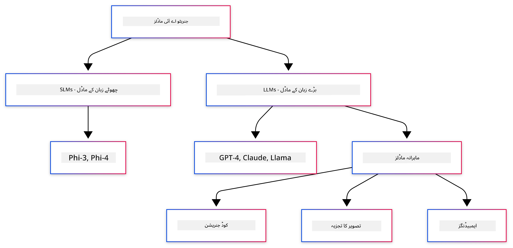
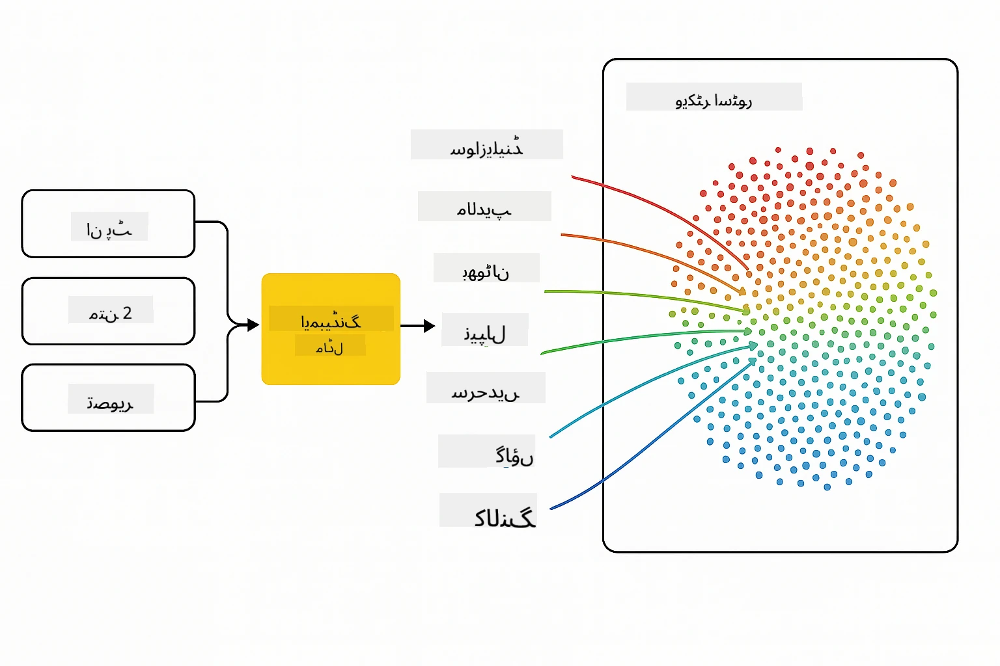
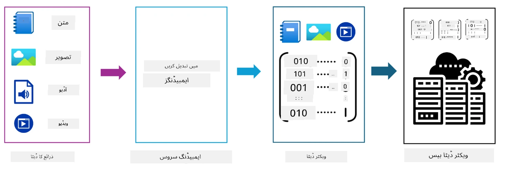
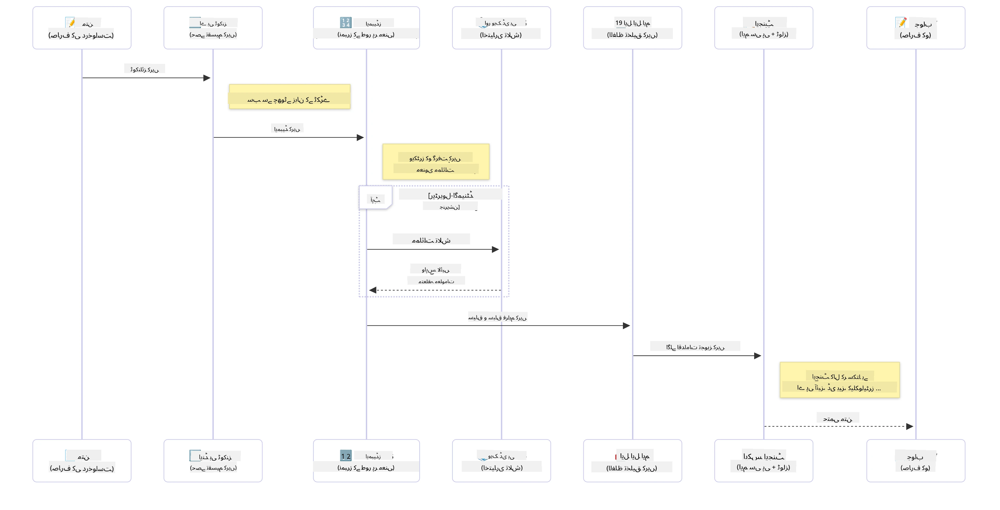

# جنریٹو اے آئی کا تعارف – جاوا ایڈیشن

> **ویڈیو**: [اس سبق کے لیے یوٹیوب پر ویڈیو جائزہ دیکھیں۔](https://www.youtube.com/watch?v=XH46tGp_eSw) آپ اوپر تھمب نیل تصویر پر بھی کلک کر سکتے ہیں۔

## آپ کیا سیکھیں گے

- **جنریٹو اے آئی کی بنیادی باتیں** بشمول LLMs، پرامپٹ انجینئرنگ، ٹوکنز، ایمبیڈڈنگز، اور ویکٹر ڈیٹابیسز  
- **جاوا اے آئی ڈیولپمنٹ ٹولز کا موازنہ** بشمول Azure OpenAI SDK، Spring AI، اور OpenAI Java SDK  
- **ماڈل کانٹیکسٹ پروٹوکول کو دریافت کریں** اور اس کا کردار اے آئی ایجنٹ کمیونیکیشن میں  

## فہرستِ مضامین

- [تعارف](#تعارف)
- [جنریٹو اے آئی کے تصورات پر جلدی نظر](#جنریٹو-اے-آئی-کے-تصورات-پر-جلدی-نظر)
- [پرامپٹ انجینئرنگ کا جائزہ](#پرامپٹ-انجینئرنگ-کا-جائزہ)
- [ٹوکنز، ایمبیڈڈنگز، اور ایجنٹس](#ٹوکنز،-ایمبیڈڈنگز،-اور-ایجنٹس)
- [جاوا کے لیے اے آئی ڈیولپمنٹ ٹولز اور لائبریریز](#جاوا-کے-لیے-اے-آئی-ڈیولپمنٹ-ٹولز-اور-لائبریریز)
  - [OpenAI Java SDK](#openai-java-sdk)
  - [Spring AI](#spring-ai)
  - [Azure OpenAI Java SDK](#azure-openai-java-sdk)
- [خلاصہ](#خلاصہ)
- [اگلے اقدامات](#اگلے-اقدامات)

## تعارف

جنریٹو اے آئی برائے مبتدیوں – جاوا ایڈیشن کے پہلے باب میں خوش آمدید! یہ بنیادی سبق آپ کو جنریٹو اے آئی کے بنیادی تصورات اور جاوا کے ذریعے ان کے ساتھ کام کرنے کا طریقہ متعارف کرواتا ہے۔ آپ اے آئی ایپلیکیشنز کے اہم اجزاء جیسے کہ بڑے زبان ماڈلز (LLMs)، ٹوکنز، ایمبیڈڈنگز، اور اے آئی ایجنٹس کے بارے میں سیکھیں گے۔ ہم اس کورس میں استعمال ہونے والے بنیادی جاوا ٹولنگ کو بھی دریافت کریں گے۔

### جنریٹو اے آئی کے تصورات پر جلدی نظر

جنریٹو اے آئی ایک قسم کی مصنوعی ذہانت ہے جو ڈیٹا سے سیکھے گئے نمونوں اور تعلقات کی بنیاد پر نیا مواد تخلیق کرتی ہے، جیسے متن، تصاویر، یا کوڈ۔ جنریٹو اے آئی ماڈلز انسانی طرح کے جوابات تخلیق کر سکتے ہیں، سیاق و سباق کو سمجھ سکتے ہیں، اور کبھی کبھار ایسا مواد پیدا کر سکتے ہیں جو بالکل انسان نما لگتا ہے۔

جب آپ اپنی جاوا اے آئی ایپلیکیشنز تیار کریں گے، تو آپ ***جنریٹو اے آئی ماڈلز*** کے ساتھ مواد تخلیق کریں گے۔ جنریٹو اے آئی ماڈلز کی کچھ خصوصیات یہ ہیں:

- **ٹیکسٹ جنریشن**: چیٹ بوٹس، مواد، اور متن کی تکمیل کے لیے انسان نما متن تیار کرنا۔  
- **تصویر کی تخلیق اور تجزیہ**: حقیقت جیسی تصاویر بنانا، تصاویر کو بہتر بنانا، اور اشیاء کا پتہ لگانا۔  
- **کوڈ جنریشن**: کوڈ کے ٹکڑے یا اسکرپٹس لکھنا۔

مخصوص کاموں کے لیے مختلف اقسام کے ماڈلز موجود ہیں۔ مثال کے طور پر، **چھوٹے زبان ماڈلز (SLMs)** اور **بڑے زبان ماڈلز (LLMs)** دونوں ٹیکسٹ جنریشن کر سکتے ہیں، جب کہ LLMs عموماً پیچیدہ کاموں کے لیے بہتر کارکردگی پیش کرتے ہیں۔ تصویری کاموں کے لیے آپ خصوصی وژن ماڈلز یا ملٹی موڈل ماڈلز استعمال کریں گے۔

یقیناً، ان ماڈلز کے جوابات ہمیشہ مکمل درست نہیں ہوتے۔ آپ نے شاید سنا ہوگا کہ ماڈلز "ہیلوسینیٹ" کرتے ہیں یا غلط معلومات کو اعتماد کے ساتھ پیش کرتے ہیں۔ لیکن آپ ماڈل کو بہتر جوابات پیدا کرنے کے لیے واضح ہدایات اور سیاق و سباق فراہم کر کے رہنمائی کر سکتے ہیں۔ اسی جگہ **پرامپٹ انجینئرنگ** آتی ہے۔

#### پرامپٹ انجینئرنگ کا جائزہ

پرامپٹ انجینئرنگ مؤثر ان پٹس ڈیزائن کرنے کا عمل ہے تاکہ اے آئی ماڈلز کو مطلوبہ نتائج کی طرف رہنمائی کی جا سکے۔ اس میں شامل ہے:

- **وضاحت**: ہدایات کو واضح اور غیر مبہم بنانا۔  
- **سیاق و سباق**: ضروری پسِ منظر کی معلومات فراہم کرنا۔  
- **محدودیتیں**: کسی بھی پابندیوں یا فارمیٹس کی وضاحت۔

پرامپٹ انجینئرنگ کی کچھ بہترین مشقوں میں پرامپٹ ڈیزائن، واضح ہدایات، کام کو تقسیم کرنا، ایک شاٹ اور چند شاٹ لرننگ، اور پرامپٹ ٹیوننگ شامل ہیں۔ مختلف پرامپٹس کی جانچ کرنا ضروری ہے تاکہ آپ کے مخصوص استعمال کے معاملے کے لیے بہترین معلوم ہو۔

ایپلیکیشنز تیار کرتے ہوئے، آپ مختلف قسم کے پرامپٹس کے ساتھ کام کریں گے:  
- **سسٹم پرامپٹس**: ماڈل کے رویے کے بنیادی قواعد اور سیاق و سباق مرتب کرتے ہیں  
- **یوزر پرامپٹس**: آپ کی ایپلیکیشن کے صارفین سے ان پٹ ڈیٹا  
- **اسسٹنٹ پرامپٹس**: ماڈل کے جوابات جو سسٹم اور یوزر پرامپٹس کی بنیاد پر ہوتے ہیں  

> **مزید جانیں**: [جنریٹو اے آئی برائے مبتدی کورس کے پرامپٹ انجینئرنگ باب](https://github.com/microsoft/generative-ai-for-beginners/tree/main/04-prompt-engineering-fundamentals) میں پرامپٹ انجینئرنگ کے بارے میں مزید جانیں

#### ٹوکنز، ایمبیڈڈنگز، اور ایجنٹس

جنریٹو اے آئی ماڈلز کے ساتھ کام کرتے وقت آپ کو **ٹوکنز**، **ایمبیڈڈنگز**، **ایجنٹس**، اور **ماڈل کانٹیکسٹ پروٹوکول (MCP)** جیسے اصطلاحات کا سامنا ہوگا۔ یہاں ان تصورات کا تفصیلی جائزہ ہے:

- **ٹوکنز**: ٹوکنز ماڈل میں متن کی سب سے چھوٹی اکائی ہوتے ہیں۔ یہ الفاظ، کردار، یا سب ورڈز ہو سکتے ہیں۔ ٹوکنز متن کو اس فارم میں ظاہر کرتے ہیں جسے ماڈل سمجھ سکتا ہے۔ مثال کے طور پر جملہ "The quick brown fox jumped over the lazy dog" کو ٹوکنائز کیا جا سکتا ہے ["The", " quick", " brown", " fox", " jumped", " over", " the", " lazy", " dog"] یا ["The", " qu", "ick", " br", "own", " fox", " jump", "ed", " over", " the", " la", "zy", " dog"]، ٹوکنائزیشن کی حکمت عملی پر منحصر۔

ٹوکینائزیشن کا مطلب متن کو چھوٹے چھوٹے یونٹس میں تقسیم کرنا ہے۔ یہ ضروری ہے کیونکہ ماڈلز خام متن کے بجائے ٹوکنز پر کام کرتے ہیں۔ پرامپٹ میں ٹوکنز کی تعداد ماڈل کے جواب کی لمبائی اور معیار کو متاثر کرتی ہے، کیونکہ ماڈلز کے کانٹیکسٹ ونڈو کے لیے ٹوکن کی حد ہوتی ہے (مثلاً، GPT-4o کے لیے کل کانٹیکسٹ 128K ٹوکنز، ان پٹ اور آؤٹ پٹ دونوں شامل ہیں)۔

جاوا میں، آپ OpenAI SDK جیسی لائبریریز استعمال کر کے AI ماڈلز کو درخواست بھیجتے وقت ٹوکینائزیشن خودکار طریقے سے کر سکتے ہیں۔

- **ایمبیڈڈنگز**: ایمبیڈڈنگز ٹوکنز کی ویکٹر نمائندگیاں ہوتی ہیں جو معنوی معنا کو ظاہر کرتی ہیں۔ یہ عددی نمائندگیاں (عام طور پر فلوٹنگ پوائنٹ نمبرز کی صفیں) ہوتی ہیں، جو ماڈلز کو الفاظ کے درمیان تعلقات کو سمجھنے اور سیاق و سباق کے لحاظ سے متعلقہ جوابات پیدا کرنے میں مدد دیتی ہیں۔ مشابه الفاظ کی ایمبیڈڈنگز بھی مشابہ ہوتی ہیں، جو ماڈل کو مترادفات اور معنوی تعلقات جیسے تصورات کو سمجھنے کے قابل بناتی ہیں۔

جاوا میں، آپ OpenAI SDK یا دیگر لائبریریز کا استعمال کر کے ایمبیڈڈنگز بنا سکتے ہیں۔ یہ ایمبیڈڈنگز ایسے کاموں کے لیے ضروری ہیں جیسے معنوی تلاش، جہاں آپ لفظ بہ لفظ میل کی بجائے معنی کی بنیاد پر مماثل مواد تلاش کرنا چاہتے ہیں۔

- **ویکٹر ڈیٹابیسز**: ویکٹر ڈیٹابیسز ایسی مخصوص ذخیرہ اندوزی کی نظامیں ہیں جو ایمبیڈڈنگز کے لیے بہتر کی گئی ہیں۔ یہ مؤثر مماثلت تلاش کی سہولت دیتی ہیں اور RAG (ریٹریول-آگمینٹڈ جنریشن) پیٹرنز کے لیے اہم ہیں، جہاں آپ کو معنوی مماثلت کی بنیاد پر بڑے ڈیٹا سیٹس سے متعلقہ معلومات تلاش کرنا ہوتی ہے۔

> **نوٹ**: اس کورس میں ہم ویکٹر ڈیٹابیسز کا احاطہ نہیں کریں گے لیکن انہیں ذکر کرنا ضروری سمجھتے ہیں کیونکہ یہ حقیقی دنیا کی ایپلیکیشنز میں عام طور پر استعمال ہوتے ہیں۔

- **ایجنٹس اور MCP**: اے آئی کے ایسے اجزاء جو خودکار طور پر ماڈلز، ٹولز اور بیرونی نظاموں کے ساتھ تعامل کرتے ہیں۔ ماڈل کانٹیکسٹ پروٹوکول (MCP) ایجنٹس کو بیرونی ڈیٹا ذرائع اور ٹولز تک محفوظ رسائی فراہم کرنے کا ایک معیاری طریقہ فراہم کرتا ہے۔ مزید جاننے کے لیے ہمارے [MCP برائے مبتدی](https://github.com/microsoft/mcp-for-beginners) کورس کو دیکھیں۔

جاوا AI ایپلیکیشنز میں، آپ متن کی پروسیسنگ کے لیے ٹوکنز، معنوی تلاش اور RAG کے لیے ایمبیڈڈنگز، ڈیٹا بازیافت کے لیے ویکٹر ڈیٹابیسز، اور ذہین، ٹول استعمال کرنے والے نظام بنانے کے لیے MCP کے ساتھ ایجنٹس استعمال کریں گے۔

### جاوا کے لیے اے آئی ڈیولپمنٹ ٹولز اور لائبریریز

جاوا اے آئی ڈیولپمنٹ کے لیے بہترین ٹولنگ فراہم کرتا ہے۔ اس کورس میں ہم تین اہم لائبریریز پر غور کریں گے – OpenAI Java SDK، Azure OpenAI SDK، اور Spring AI۔

یہاں ایک تیز حوالہ جدول ہے جو دکھاتی ہے کہ ہر باب کی مثالوں میں کون سا SDK استعمال ہوتا ہے:

| باب | نمونہ | SDK |
|---------|--------|-----|
| 02-SetupDevEnvironment | github-models | OpenAI Java SDK |
| 02-SetupDevEnvironment | basic-chat-azure | Spring AI Azure OpenAI |
| 03-CoreGenerativeAITechniques | examples | Azure OpenAI SDK |
| 04-PracticalSamples | petstory | OpenAI Java SDK |
| 04-PracticalSamples | foundrylocal | OpenAI Java SDK |
| 04-PracticalSamples | calculator | Spring AI MCP SDK + LangChain4j |

**SDK دستاویزات کے لنکس:**  
- [Azure OpenAI Java SDK](https://github.com/Azure/azure-sdk-for-java/tree/azure-ai-openai_1.0.0-beta.16/sdk/openai/azure-ai-openai)  
- [Spring AI](https://docs.spring.io/spring-ai/reference/)  
- [OpenAI Java SDK](https://github.com/openai/openai-java)  
- [LangChain4j](https://docs.langchain4j.dev/)  

#### OpenAI Java SDK

OpenAI SDK جاوا کے لیے OpenAI API کی سرکاری لائبریری ہے۔ یہ OpenAI کے ماڈلز کے ساتھ تعامل کے لیے ایک آسان اور مستقل انٹرفیس فراہم کرتا ہے، جو جاوا ایپلیکیشنز میں AI صلاحیتوں کو مربوط کرنا آسان بناتا ہے۔ باب 2 کے گٹ ہب ماڈلز کا نمونہ، باب 4 کی PET اسٹوری ایپلیکیشن اور فاؤنڈری لوکل مثالیں OpenAI SDK طریقے کو ظاہر کرتی ہیں۔

#### Spring AI

Spring AI ایک جامع فریم ورک ہے جو سpring ایپلیکیشنز میں AI صلاحیتیں لاتا ہے، مختلف AI فراہم کنندگان کے درمیان ایک مستقل تجریدی پرت فراہم کرتا ہے۔ یہ سpring کے ماحولیاتی نظام کے ساتھ بغیر کسی رکاوٹ کے انٹیگریٹ ہوتا ہے، جو ایسے انٹرپرائز جاوا ایپلیکیشنز کے لیے مثالی انتخاب ہے جنہیں AI صلاحیتوں کی ضرورت ہوتی ہے۔

Spring AI کی طاقت اس کی سpring ماحولیاتی نظام کے ساتھ ہموار انضمام میں ہے، جو جان پہچان والے سpring پیٹرنز جیسے dependency injection، configuration management، اور testing frameworks کے ساتھ پروڈکشن ریڈی اے آئی ایپلیکیشنز بنانا آسان بناتا ہے۔ آپ باب 2 اور 4 میں ایسی ایپلیکیشنز بنانے کے لیے Spring AI استعمال کریں گے جو OpenAI اور Model Context Protocol (MCP) Spring AI لائبریریز دونوں کو استعمال کریں۔

##### ماڈل کانٹیکسٹ پروٹوکول (MCP)

[ماڈل کانٹیکسٹ پروٹوکول (MCP)](https://modelcontextprotocol.io/) ایک ابھرتا ہوا معیار ہے جو اے آئی ایپلیکیشنز کو بیرونی ڈیٹا ذرائع اور ٹولز کے ساتھ محفوظ طریقے سے بات چیت کرنے کے اہل بناتا ہے۔ MCP اے آئی ماڈلز کو سیاق و سباق کی معلومات تک رسائی اور آپ کی ایپلیکیشنز میں عمل درآمد کے لیے ایک معیاری طریقہ فراہم کرتا ہے۔

باب 4 میں، آپ ایک سادہ MCP کیلکولیٹر سروس بنائیں گے جو Spring AI کے ساتھ ماڈل کانٹیکسٹ پروٹوکول کی بنیادوں کا مظاہرہ کرتی ہے، دکھاتے ہوئے کہ بنیادی ٹول انٹیگریشنز اور سروس فن تعمیرات کیسے تخلیق کی جاتی ہیں۔

#### Azure OpenAI Java SDK

Azure OpenAI کلائنٹ لائبریری برائے جاوا OpenAI کے REST APIs کی ایک موافقت ہے جو Azure SDK ماحولیاتی نظام کے باقی حصے کے ساتھ ایک زبان کی مناسبت سے انٹرفیس اور انضمام فراہم کرتی ہے۔ باب 3 میں، آپ Azure OpenAI SDK استعمال کرتے ہوئے ایپلیکیشنز بنائیں گے، بشمول چیٹ ایپلیکیشنز، فنکشن کالنگ، اور RAG (ریٹریول-آگمینٹڈ جنریشن) پیٹرنز۔

> نوٹ: فیچرز کے لحاظ سے Azure OpenAI SDK OpenAI Java SDK کے پیچھے ہے، لہٰذا مستقبل کے منصوبوں کے لیے OpenAI Java SDK کا استعمال تجویز کیا جاتا ہے۔

## خلاصہ

یہ تھا بنیادی تعارف! اب آپ سمجھ چکے ہیں:

- جنریٹو اے آئی کے پیچھے بنیادی تصورات – LLMs اور پرامپٹ انجینئرنگ سے لے کر ٹوکنز، ایمبیڈڈنگز، اور ویکٹر ڈیٹابیسز تک  
- جاوا اے آئی ڈیولپمنٹ کے لیے آپ کے ٹول کٹس: Azure OpenAI SDK، Spring AI، اور OpenAI Java SDK  
- ماڈل کانٹیکسٹ پروٹوکول کیا ہے اور یہ کیسے اے آئی ایجنٹس کو بیرونی ٹولز کے ساتھ کام کرنے دیتا ہے  

## اگلے اقدامات

[باب 2: ڈیولپمنٹ ماحول کی ترتیب](../02-SetupDevEnvironment/README.md)

---

<!-- CO-OP TRANSLATOR DISCLAIMER START -->
**ڈس کلیمر**:
یہ دستاویز AI ترجمہ سروس [Co-op Translator](https://github.com/Azure/co-op-translator) کے ذریعے ترجمہ کی گئی ہے۔ اگرچہ ہم درستگی کی کوشش کرتے ہیں، براہ کرم آگاہ رہیں کہ خودکار تراجم میں غلطیاں یا نا درستیاں ہو سکتی ہیں۔ اصل دستاویز اپنی مادری زبان میں ہی معتبر ذریعہ سمجھی جانی چاہیے۔ اہم معلومات کے لیے، پیشہ ور انسانی ترجمہ کی سفارش کی جاتی ہے۔ ہم اس ترجمے کے استعمال سے پیدا ہونے والی کسی بھی غلط فہمی یا غلط تعبیرات کے لیے ذمہ دار نہیں ہیں۔
<!-- CO-OP TRANSLATOR DISCLAIMER END -->