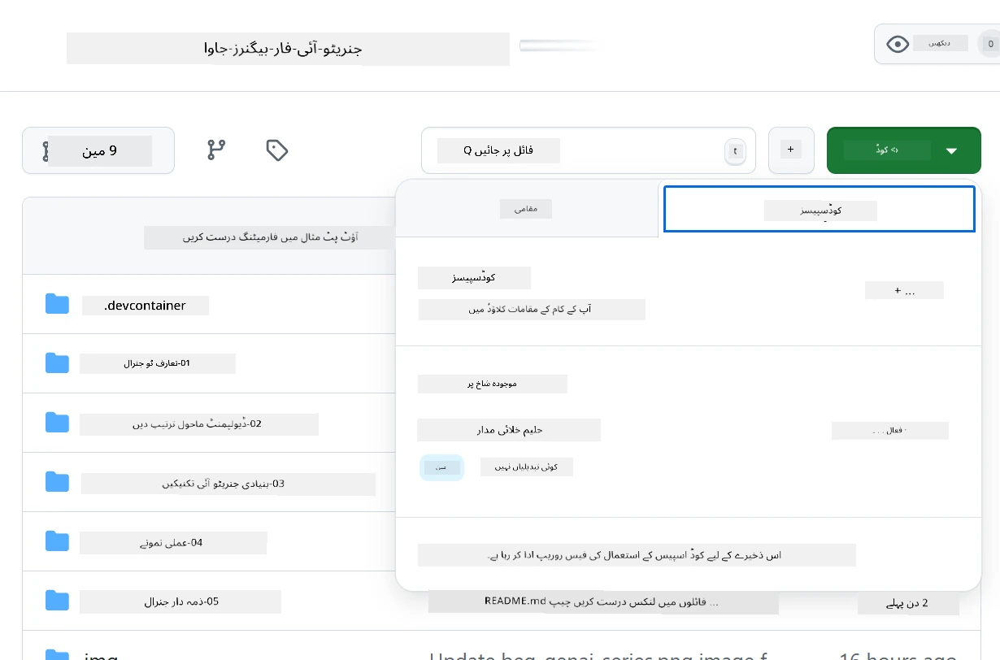
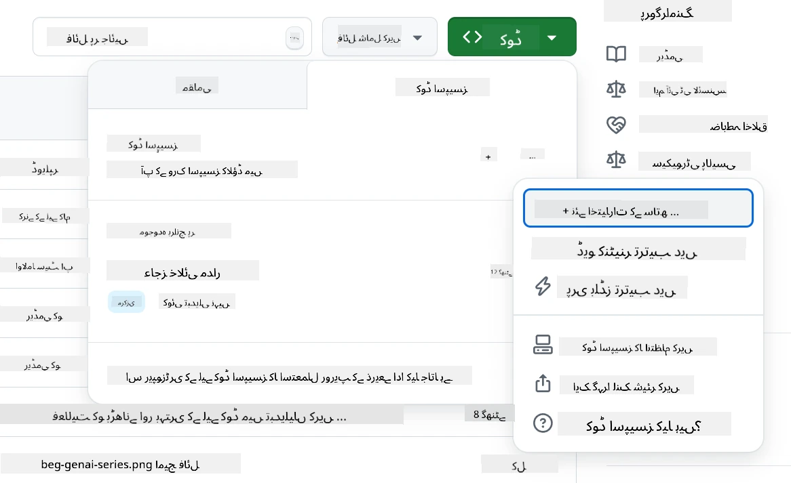
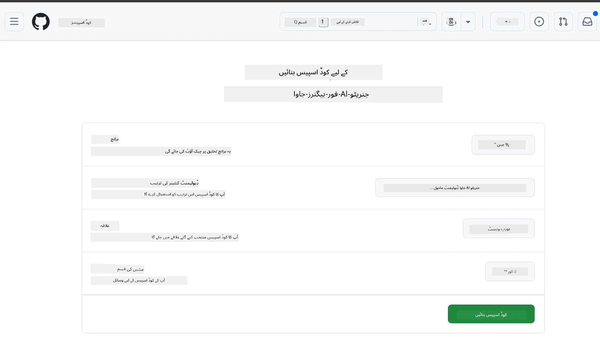
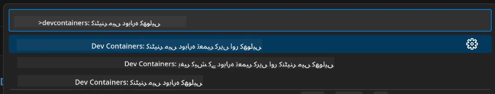
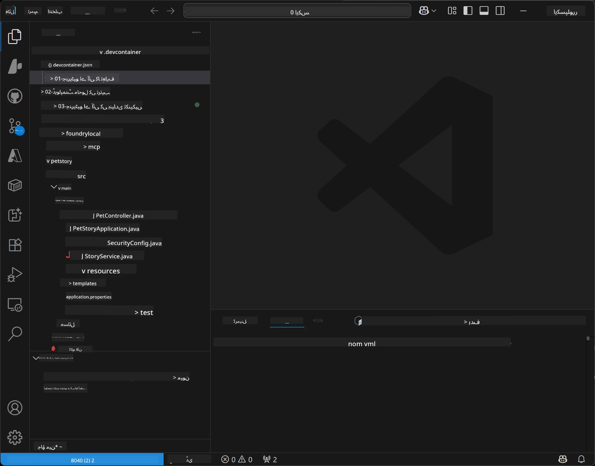
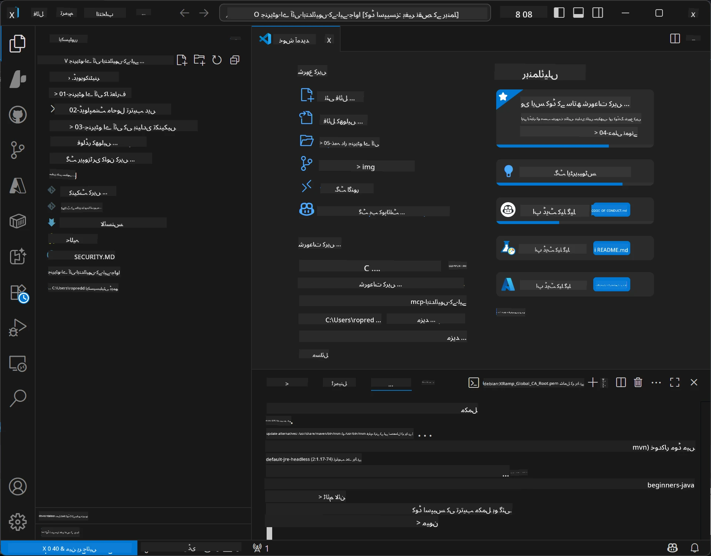

# جاوا کے لئے جنریٹیو اے آئی کے لیے ڈیولپمنٹ ماحول کی ترتیب

> **فوری آغاز**: کلاؤڈ میں 2 منٹ میں کوڈ لکھیں - پر جائیں [GitHub Codespaces Setup](../../../02-SetupDevEnvironment) - کوئی مقامی تنصیب ضروری نہیں اور گٹ ہب ماڈلز استعمال کرتا ہے!

> **Azure OpenAI میں دلچسپی رکھتے ہیں؟**، ہمارے [Azure OpenAI Setup Guide](getting-started-azure-openai.md) کو دیکھیں جس میں نیا Azure OpenAI ریسورس بنانے کے اقدامات ہیں۔

## آپ کیا سیکھیں گے

- AI ایپلیکیشنز کے لیے جاوا ڈیولپمنٹ ماحول قائم کرنا
- اپنی پسندیدہ ڈیولپمنٹ ماحول کا انتخاب اور ترتیب دینا (کلاؤڈ اولین Codespaces کے ساتھ، مقامی ڈیو کنٹینر، یا مکمل مقامی سیٹ اپ)
- GitHub Models سے جڑ کر اپنی ترتیب کی جانچ کرنا

## فہرست مضامین

- [آپ کیا سیکھیں گے](../../../02-SetupDevEnvironment)
- [تعارف](../../../02-SetupDevEnvironment)
- [مرحلہ 1: اپنا ڈیولپمنٹ ماحول قائم کریں](../../../02-SetupDevEnvironment)
  - [اختیار A: GitHub Codespaces (تجویز کردہ)](../../../02-SetupDevEnvironment)
  - [اختیار B: مقامی ڈیو کنٹینر](../../../02-SetupDevEnvironment)
  - [اختیار C: اپنی موجودہ مقامی تنصیب استعمال کریں](../../../02-SetupDevEnvironment)
- [مرحلہ 2: GitHub پرسنل ایکسیس ٹوکن بنائیں](../../../02-SetupDevEnvironment)
- [مرحلہ 3: اپنی ترتیب کو جانچیں](../../../02-SetupDevEnvironment)
- [مسائل کا حل](../../../02-SetupDevEnvironment)
- [خلاصہ](../../../02-SetupDevEnvironment)
- [اگلے اقدامات](../../../02-SetupDevEnvironment)

## تعارف

یہ باب آپ کو ڈیولپمنٹ ماحول قائم کرنے میں رہنمائی کرے گا۔ ہم **GitHub Models** کو اپنے بنیادی مثال کے طور پر استعمال کریں گے کیونکہ یہ مفت ہے، صرف GitHub اکاؤنٹ سے آسانی سے سیٹ اپ ہوتا ہے، کسی کریڈٹ کارڈ کی ضرورت نہیں، اور تجربے کے لیے متعدد ماڈلز تک رسائی فراہم کرتا ہے۔

**کوئی مقامی سیٹ اپ ضروری نہیں!** آپ فوری طور پر GitHub Codespaces کا استعمال کرتے ہوئے کوڈنگ شروع کر سکتے ہیں، جو آپ کے براؤزر میں مکمل ڈیولپمنٹ ماحول فراہم کرتا ہے۔


ہم اس کورس کے لیے [**GitHub Models**](https://github.com/marketplace?type=models) کے استعمال کی سفارش کرتے ہیں کیونکہ یہ:
- شروع کرنے کے لیے **مفت** ہے
- صرف GitHub اکاؤنٹ کے ساتھ **آسان** سیٹ اپ
- **کوئی کریڈٹ کارڈ** درکار نہیں
- تجربے کے لیے **متعدد ماڈلز** دستیاب ہیں

> **نوٹ**: اس تربیت میں استعمال ہونے والے GitHub Models کی یہ مفت حدود ہیں:
> - فی منٹ 15 درخواستیں (روزانہ 150)
> - فی درخواست تقریباً 8,000 الفاظ داخل، تقریباً 4,000 الفاظ باہر
> - 5 متوازی درخواستیں
> 
> پیداواری استعمال کے لیے، Azure AI Foundry Models میں اپنے Azure اکاؤنٹ کے ساتھ اپ گریڈ کریں۔ آپ کے کوڈ کو تبدیل کرنے کی ضرورت نہیں۔ دیکھیں [Azure AI Foundry دستاویزات](https://learn.microsoft.com/azure/ai-foundry/foundry-models/how-to/quickstart-github-models)۔

## مرحلہ 1: اپنا ڈیولپمنٹ ماحول قائم کریں

<a name="quick-start-cloud"></a>

ہم نے اس جنریٹیو AI جاوا کورس کے لیے آپ کے وقت کی بچت اور تمام ضروری ٹولز کی دستیابی کو یقینی بنانے کے لیے پہلے سے ترتیب دی گئی ڈیو کنٹینر تیار کیا ہے۔ اپنی پسندیدہ ڈیولپمنٹ اپروچ منتخب کریں:

### ماحول قائم کرنے کے اختیارات:

#### اختیار A: GitHub Codespaces (تجویز کردہ)

**2 منٹ میں کوڈنگ شروع کریں - کوئی مقامی سیٹ اپ ضروری نہیں!**

1. اس ریپوزٹری کو اپنے GitHub اکاؤنٹ پر فورک کریں
   > **نوٹ**: اگر آپ بنیادی کنفیگریشن میں ترمیم کرنا چاہتے ہیں تو براہ کرم [Dev Container Configuration](../../../.devcontainer/devcontainer.json) دیکھیں
2. **Code** → **Codespaces** ٹیب → **...** → **New with options...** پر کلک کریں
3. ڈیفالٹس استعمال کریں – یہ **Dev container configuration** منتخب کرے گا: اس کورس کے لیے بنائی گئی **Generative AI Java Development Environment** کلائنٹ ڈیو کنٹینر
4. **Create codespace** پر کلک کریں
5. ماحول تیار ہونے کے لیے تقریباً 2 منٹ انتظار کریں
6. [مرحلہ 2: GitHub ٹوکن بنائیں](../../../02-SetupDevEnvironment) پر جائیں







> **Codespaces کے فوائد**:
> - کوئی مقامی تنصیب ضروری نہیں
> - کسی بھی ڈیوائس پر براؤزر کے ساتھ کام کرتا ہے
> - تمام ٹولز اور dependencies کے ساتھ پہلے سے ترتیب دیا گیا
> - ذاتی اکاؤنٹس کے لیے ہر مہینے 60 گھنٹے مفت
> - تمام سیکھنے والوں کے لیے یکساں ماحول

#### اختیار B: مقامی ڈیو کنٹینر

**ان ڈیولپرز کے لیے جو Docker کے ساتھ مقامی ترقی پسند کرتے ہیں**

1. اس ریپوزٹری کو اپنی مقامی مشین پر فورک کریں اور کلون کریں
   > **نوٹ**: اگر آپ بنیادی کنفیگریشن میں ترمیم کرنا چاہتے ہیں تو براہ کرم [Dev Container Configuration](../../../.devcontainer/devcontainer.json) دیکھیں
2. [Docker Desktop](https://www.docker.com/products/docker-desktop/) اور [VS Code](https://code.visualstudio.com/) انسٹال کریں
3. VS Code میں [Dev Containers extension](https://marketplace.visualstudio.com/items?itemName=ms-vscode-remote.remote-containers) انسٹال کریں
4. VS Code میں اس ریپوزٹری فولڈر کو کھولیں
5. جب پوچها جائے، تو **Reopen in Container** پر کلک کریں (یا `Ctrl+Shift+P` → "Dev Containers: Reopen in Container" استعمال کریں)
6. کنٹینر کے بنانے اور شروع ہونے کا انتظار کریں
7. [مرحلہ 2: GitHub ٹوکن بنائیں](../../../02-SetupDevEnvironment) پر جائیں





#### اختیار C: اپنی موجودہ مقامی تنصیب استعمال کریں

**ان ڈیولپرز کے لیے جن کے پاس پہلے سے جاوا ماحول موجود ہے**

ضروریات:
- [Java 21+](https://www.oracle.com/java/technologies/javase/jdk21-archive-downloads.html) 
- [Maven 3.9+](https://maven.apache.org/download.cgi)
- [VS Code](https://code.visualstudio.com) یا آپ کی پسندیدہ IDE

اقدامات:
1. اس ریپوزٹری کو اپنی مقامی مشین پر کلون کریں
2. پروجیکٹ کو اپنی IDE میں کھولیں
3. [مرحلہ 2: GitHub ٹوکن بنائیں](../../../02-SetupDevEnvironment) پر جائیں

> **پرو ٹپ**: اگر آپ کے پاس کم صلاحیت والی مشین ہے لیکن آپ VS Code مقامی استعمال کرنا چاہتے ہیں، تو GitHub Codespaces استعمال کریں! آپ اپنے مقامی VS Code کو کلاؤڈ پر ہوسٹڈ Codespace سے جڑ سکتے ہیں تاکہ بہترین تجربہ حاصل ہو۔



## مرحلہ 2: GitHub پرسنل ایکسیس ٹوکن بنائیں

1. [GitHub Settings](https://github.com/settings/profile) پر جائیں اور اپنے پروفائل مینو سے **Settings** منتخب کریں۔
2. بائیں سائڈبار میں، **Developer settings** پر کلک کریں (عام طور پر نیچے کی جانب)۔
3. **Personal access tokens** کے تحت، **Fine-grained tokens** پر کلک کریں (یا اس براہ راست [لنک](https://github.com/settings/personal-access-tokens) پر جائیں)۔
4. **Generate new token** پر کلک کریں۔
5. "Token name" کے تحت ایک وضاحتی نام دیں (مثلاً `GenAI-Java-Course-Token`)۔
6. ایک وقت ختم ہونے کی تاریخ مقرر کریں (تجویز کردہ: 7 دن احتیاطی تدابیر کے لئے)۔
7. "Resource owner" کے تحت اپنا صارف اکاؤنٹ منتخب کریں۔
8. "Repository access" کے تحت وہ ریپوزٹریز منتخب کریں جنہیں آپ GitHub Models کے ساتھ استعمال کرنا چاہتے ہیں (یا "All repositories" اگر ضرورت ہو)۔
9. "Account permissions" کے تحت **Models** کو **Read-only** پر سیٹ کریں۔
10. **Generate token** پر کلک کریں۔
11. **اب اپنے ٹوکن کو کاپی اور محفوظ کریں** – آپ اسے دوبارہ نہیں دیکھ پائیں گے!

> **سیکیورٹی ٹپ**: اپنی ایکسیس ٹوکنز کے لیے کم از کم مطلوبہ حدود اور سب سے چھوٹا قابلِ عمل معیاد استعمال کریں۔

## مرحلہ 3: GitHub Models کی مثال کے ساتھ اپنی ترتیب کی جانچ کریں

جب آپ کا ڈیولپمنٹ ماحول تیار ہو جائے، تو آئیے GitHub Models انٹیگریشن کو ہمارے مثال اپلیکیشن میں [`02-SetupDevEnvironment/examples/github-models`](../../../02-SetupDevEnvironment/examples/github-models) میں آزمائیں۔

1. اپنے ڈیولپمنٹ ماحول میں ٹرمینل کھولیں۔
2. GitHub Models کی مثال کے فولڈر میں جائیں:
   ```bash
   cd 02-SetupDevEnvironment/examples/github-models
   ```
3. اپنا GitHub ٹوکن بطور انوائرنمنٹ ویریبل سیٹ کریں:
   ```bash
   # میک او ایس/لینکس
   export GITHUB_TOKEN=your_token_here
   
   # ونڈوز (کمانڈ پرامپٹ)
   set GITHUB_TOKEN=your_token_here
   
   # ونڈوز (پاور شیل)
   $env:GITHUB_TOKEN="your_token_here"
   ```

4. ایپلیکیشن چلائیں:
   ```bash
   mvn compile exec:java -Dexec.mainClass="com.example.githubmodels.App"
   ```

آپ کو اس طرح کا آؤٹ پٹ دکھائی دینا چاہیے:
```text
Using model: gpt-4.1-nano
Sending request to GitHub Models...
Response: Hello World!
```

### مثال کوڈ کو سمجھنا

سب سے پہلے، آئیے سمجھتے ہیں جو ہم نے ابھی چلایا۔ `examples/github-models` کے تحت موجود مثال OpenAI Java SDK استعمال کرتی ہے تاکہ GitHub Models سے جُڑے:

**یہ کوڈ کیا کرتا ہے:**
- آپ کے پرسنل ایکسیس ٹوکن کے ذریعے GitHub Models سے **کنیکٹ** ہوتا ہے
- AI ماڈل کو ایک سادہ "Say Hello World!" پیغام **بھیجتا** ہے
- AI کے جواب کو **حاصل کرتا** ہے اور دکھاتا ہے
- آپ کی ترتیب کو درست کام کرنے کی تصدیق **کرتا** ہے

**اہم انحصار** (`pom.xml` میں):
```xml
<dependency>
    <groupId>com.openai</groupId>
    <artifactId>openai-java</artifactId>
    <version>2.12.0</version>
</dependency>
```

**مین کوڈ** (`App.java`):
```java
// اوپن اے آئی جاوا ایس ڈی کے کا استعمال کرتے ہوئے گٹ ہب ماڈلز سے منسلک ہوں
OpenAIClient client = OpenAIOkHttpClient.builder()
    .apiKey(pat)
    .baseUrl("https://models.inference.ai.azure.com")
    .build();

// چیٹ تکمیل کی درخواست بنائیں
ChatCompletionCreateParams params = ChatCompletionCreateParams.builder()
    .model(modelId)
    .addSystemMessage("You are a concise assistant.")
    .addUserMessage("Say Hello World!")
    .build();

// اے آئی کا جواب حاصل کریں
ChatCompletion response = client.chat().completions().create(params);
System.out.println("Response: " + response.choices().get(0).message().content().orElse("No response content"));
```

## خلاصہ

شاندار! اب آپ کے پاس سب کچھ ترتیب دیا گیا ہے:

- AI ماڈلز تک رسائی کے لیے درست اجازتوں کے ساتھ GitHub پرسنل ایکسیس ٹوکن بنایا
- اپنا جاوا ڈیولپمنٹ ماحول چلایا (چاہے وہ Codespaces ہو، ڈیو کنٹینرز، یا مقامی)
- مفت AI ترقی کے لیے OpenAI Java SDK کے ذریعے GitHub Models سے جُڑے
- ایک سادہ مثال کے ساتھ جانچا کہ سب کچھ صحیح کام کر رہا ہے جو AI ماڈلز سے بات کرتا ہے

## اگلے اقدامات

[باب 3: کور جنریٹیو AI تکنیکس](../03-CoreGenerativeAITechniques/README.md)

## مسائل کا حل

مسائل درپیش ہیں؟ یہاں عام مسائل اور ان کے حل ہیں:

- **ٹوکن کام نہیں کر رہا؟** 
  - یقینی بنائیں کہ آپ نے پورا ٹوکن بغیر کسی اضافی خالی جگہ کے کاپی کیا ہے
  - تصدیق کریں کہ ٹوکن انوائرنمنٹ ویریبل کے طور پر صحیح سیٹ ہے
  - چیک کریں کہ آپ کے ٹوکن کی اجازتیں درست ہیں (Models: Read-only)

- **Maven نہیں مل رہا؟** 
  - اگر dev containers/Codespaces استعمال کر رہے ہیں تو Maven پیشگی انسٹال ہوتا ہے
  - مقامی سیٹ اپ کے لیے، Java 21+ اور Maven 3.9+ انسٹال ہونا چاہیے
  - `mvn --version` کمانڈ سے تصدیق کریں

- **کنیکشن کے مسائل؟** 
  - اپنے انٹرنیٹ کنیکشن کو چیک کریں
  - تصدیق کریں کہ GitHub آپ کے نیٹ ورک سے قابل رسائی ہے
  - یقینی بنائیں کہ آپ فائر وال کے پیچھے نہیں ہیں جو GitHub Models کے اینڈپوائنٹ کو بلاک کر رہا ہو

- **ڈیو کنٹینر شروع نہیں ہو رہا؟** 
  - یقینی بنائیں کہ Docker Desktop چل رہا ہے (مقامی ترقی کے لیے)
  - کنٹینر دوبارہ بنانے کی کوشش کریں: `Ctrl+Shift+P` → "Dev Containers: Rebuild Container"

- **ایپلیکیشن کمپائل کے ایررز؟**
  - یقینی بنائیں کہ آپ صحیح ڈائریکٹری میں ہیں: `02-SetupDevEnvironment/examples/github-models`
  - کلین اور دوبارہ تعمیر کی کوشش کریں: `mvn clean compile`

> **مدد چاہیے؟**: اب بھی مسئلہ ہے؟ ریپوزٹری میں ایک مسئلہ کھولیں اور ہم آپ کی مدد کریں گے۔

---

<!-- CO-OP TRANSLATOR DISCLAIMER START -->
**دستخطی دستبرداری**:
یہ دستاویز [Co-op Translator](https://github.com/Azure/co-op-translator) نامی AI ترجمہ سروس کے ذریعے ترجمہ کی گئی ہے۔ اگرچہ ہم درستگی کے لیے کوشاں ہیں، براہ کرم یاد رکھیں کہ خودکار تراجم میں غلطیاں یا عدم صحت ہو سکتی ہے۔ اصل دستاویز اپنی مادری زبان میں ہی معتبر ماخذ سمجھا جائے گا۔ اہم معلومات کے لیے پیشہ ورانہ انسانی ترجمہ تجویز کیا جاتا ہے۔ اس ترجمہ کے استعمال سے پیدا ہونے والی کسی بھی غلط فہمی یا غلط تشریح کی صورت میں ہم ذمہ دار نہیں ہوں گے۔
<!-- CO-OP TRANSLATOR DISCLAIMER END -->