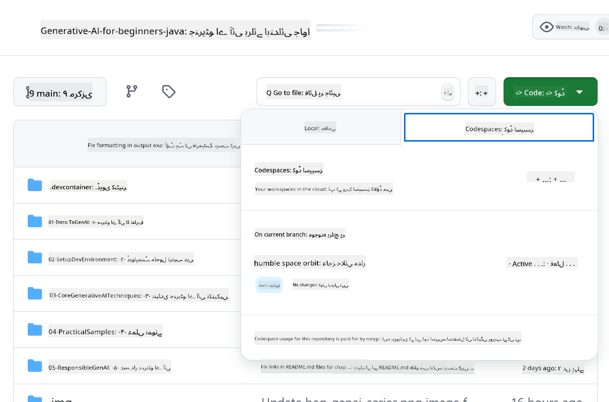

<!--
CO_OP_TRANSLATOR_METADATA:
{
  "original_hash": "e00bbea0f95c611aa3bec676d23e8b43",
  "translation_date": "2025-07-21T18:00:26+00:00",
  "source_file": "02-SetupDevEnvironment/getting-started-azure-openai.md",
  "language_code": "ur"
}
-->
# ایزور اوپن اے آئی کے لیے ڈیولپمنٹ ماحول ترتیب دینا

> **فوری آغاز**: یہ گائیڈ ایزور اوپن اے آئی سیٹ اپ کے لیے ہے۔ مفت ماڈلز کے ساتھ فوری آغاز کے لیے [GitHub Models with Codespaces](./README.md#quick-start-cloud) استعمال کریں۔

یہ گائیڈ آپ کو اس کورس میں جاوا اے آئی ایپلی کیشنز کے لیے ایزور اے آئی فاؤنڈری ماڈلز ترتیب دینے میں مدد دے گا۔

## مواد کی فہرست

- [فوری سیٹ اپ کا جائزہ](../../../02-SetupDevEnvironment)
- [مرحلہ 1: ایزور اے آئی فاؤنڈری وسائل بنائیں](../../../02-SetupDevEnvironment)
  - [ہب اور پروجیکٹ بنائیں](../../../02-SetupDevEnvironment)
  - [GPT-4o-mini ماڈل تعینات کریں](../../../02-SetupDevEnvironment)
- [مرحلہ 2: اپنا کوڈ اسپیس بنائیں](../../../02-SetupDevEnvironment)
- [مرحلہ 3: اپنا ماحول ترتیب دیں](../../../02-SetupDevEnvironment)
- [مرحلہ 4: اپنی سیٹ اپ کی جانچ کریں](../../../02-SetupDevEnvironment)
- [آگے کیا؟](../../../02-SetupDevEnvironment)
- [وسائل](../../../02-SetupDevEnvironment)
- [اضافی وسائل](../../../02-SetupDevEnvironment)

## فوری سیٹ اپ کا جائزہ

1. ایزور اے آئی فاؤنڈری وسائل بنائیں (ہب، پروجیکٹ، ماڈل)
2. جاوا ڈیولپمنٹ کنٹینر کے ساتھ کوڈ اسپیس بنائیں
3. اپنی .env فائل کو ایزور اوپن اے آئی کی اسناد کے ساتھ ترتیب دیں
4. مثال پروجیکٹ کے ساتھ اپنی سیٹ اپ کی جانچ کریں

## مرحلہ 1: ایزور اے آئی فاؤنڈری وسائل بنائیں

### ہب اور پروجیکٹ بنائیں

1. [ایزور اے آئی فاؤنڈری پورٹل](https://ai.azure.com/) پر جائیں اور سائن ان کریں
2. **+ Create** → **New hub** پر کلک کریں (یا **Management** → **All hubs** → **+ New hub** پر جائیں)
3. اپنے ہب کو ترتیب دیں:
   - **ہب کا نام**: مثلاً، "MyAIHub"
   - **سبسکرپشن**: اپنی ایزور سبسکرپشن منتخب کریں
   - **وسائل گروپ**: نیا بنائیں یا موجودہ منتخب کریں
   - **مقام**: اپنے قریب ترین مقام کا انتخاب کریں
   - **اسٹوریج اکاؤنٹ**: ڈیفالٹ استعمال کریں یا حسب ضرورت ترتیب دیں
   - **کی والٹ**: ڈیفالٹ استعمال کریں یا حسب ضرورت ترتیب دیں
   - **Next** → **Review + create** → **Create** پر کلک کریں
4. بننے کے بعد، **+ New project** پر کلک کریں (یا ہب کے جائزہ صفحے سے **Create project** پر کلک کریں)
   - **پروجیکٹ کا نام**: مثلاً، "GenAIJava"
   - **Create** پر کلک کریں

### GPT-4o-mini ماڈل تعینات کریں

1. اپنے پروجیکٹ میں، **Model catalog** پر جائیں اور **gpt-4o-mini** تلاش کریں
   - *متبادل: **Deployments** → **+ Create deployment** پر جائیں*
2. gpt-4o-mini ماڈل کارڈ پر **Deploy** پر کلک کریں
3. تعیناتی کو ترتیب دیں:
   - **تعیناتی کا نام**: "gpt-4o-mini"
   - **ماڈل ورژن**: تازہ ترین استعمال کریں
   - **تعیناتی کی قسم**: اسٹینڈرڈ
4. **Deploy** پر کلک کریں
5. تعیناتی کے بعد، **Deployments** ٹیب پر جائیں اور یہ قدریں کاپی کریں:
   - **تعیناتی کا نام** (مثلاً، "gpt-4o-mini")
   - **ٹارگٹ یو آر آئی** (مثلاً، `https://your-hub-name.openai.azure.com/`)  
      > **اہم**: صرف بیس یو آر ایل کاپی کریں (مثلاً، `https://myhub.openai.azure.com/`) مکمل اینڈ پوائنٹ راستہ نہیں۔
   - **کلید** (Keys and Endpoint سیکشن سے)

> **اب بھی مسئلہ ہو رہا ہے؟** آفیشل [ایزور اے آئی فاؤنڈری دستاویزات](https://learn.microsoft.com/azure/ai-foundry/how-to/create-projects?tabs=ai-foundry&pivots=hub-project) دیکھیں

## مرحلہ 2: اپنا کوڈ اسپیس بنائیں

1. اس ریپوزٹری کو اپنے GitHub اکاؤنٹ میں فورک کریں
   > **نوٹ**: اگر آپ بنیادی کنفیگریشن میں ترمیم کرنا چاہتے ہیں تو [Dev Container Configuration](../../../.devcontainer/devcontainer.json) دیکھیں
2. اپنی فورک شدہ ریپوزٹری میں، **Code** → **Codespaces** ٹیب پر کلک کریں
3. **...** → **New with options...** پر کلک کریں  

4. **Dev container configuration** منتخب کریں: 
   - **Generative AI Java Development Environment**
5. **Create codespace** پر کلک کریں

## مرحلہ 3: اپنا ماحول ترتیب دیں

جب آپ کا کوڈ اسپیس تیار ہو جائے، تو اپنی ایزور اوپن اے آئی کی اسناد ترتیب دیں:

1. **ریپوزٹری روٹ سے مثال پروجیکٹ پر جائیں:**
   ```bash
   cd 02-SetupDevEnvironment/src/basic-chat-azure
   ```

2. **اپنی .env فائل بنائیں:**
   ```bash
   cp .env.example .env
   ```

3. **اپنی .env فائل کو ایزور اوپن اے آئی کی اسناد کے ساتھ ایڈٹ کریں:**
   ```bash
   # Your Azure OpenAI API key (from Azure AI Foundry portal)
   AZURE_AI_KEY=your-actual-api-key-here
   
   # Your Azure OpenAI endpoint URL (e.g., https://myhub.openai.azure.com/)
   AZURE_AI_ENDPOINT=https://your-hub-name.openai.azure.com/
   ```

   > **سیکیورٹی نوٹ**: 
   > - اپنی `.env` فائل کو ورژن کنٹرول میں کبھی شامل نہ کریں
   > - `.env` فائل پہلے ہی `.gitignore` میں شامل ہے
   > - اپنی API کیز کو محفوظ رکھیں اور انہیں باقاعدگی سے تبدیل کریں

## مرحلہ 4: اپنی سیٹ اپ کی جانچ کریں

مثال ایپلیکیشن کو چلائیں تاکہ اپنی ایزور اوپن اے آئی کنکشن کی جانچ کریں:

```bash
mvn clean spring-boot:run
```

آپ کو GPT-4o-mini ماڈل سے ایک جواب نظر آنا چاہیے!

> **VS کوڈ صارفین**: آپ `F5` دباکر بھی ایپلیکیشن چلا سکتے ہیں۔ لانچ کنفیگریشن پہلے ہی آپ کی `.env` فائل کو خودکار طور پر لوڈ کرنے کے لیے سیٹ ہے۔

> **مکمل مثال**: تفصیلی ہدایات اور مسئلہ حل کرنے کے لیے [End-to-End Azure OpenAI Example](./src/basic-chat-azure/README.md) دیکھیں۔

## آگے کیا؟

**سیٹ اپ مکمل!** آپ کے پاس اب:
- gpt-4o-mini کے ساتھ ایزور اوپن اے آئی تعینات
- مقامی .env فائل کنفیگریشن
- جاوا ڈیولپمنٹ ماحول تیار

**جاری رکھیں** [باب 3: بنیادی جنریٹو اے آئی تکنیکیں](../03-CoreGenerativeAITechniques/README.md) پر تاکہ اے آئی ایپلیکیشنز بنانا شروع کریں!

## وسائل

- [ایزور اے آئی فاؤنڈری دستاویزات](https://learn.microsoft.com/azure/ai-services/)
- [Spring AI Azure OpenAI دستاویزات](https://docs.spring.io/spring-ai/reference/api/clients/azure-openai-chat.html)
- [ایزور اوپن اے آئی جاوا SDK](https://learn.microsoft.com/java/api/overview/azure/ai-openai-readme)

## اضافی وسائل

- [VS کوڈ ڈاؤنلوڈ کریں](https://code.visualstudio.com/Download)
- [ڈوکر ڈیسک ٹاپ حاصل کریں](https://www.docker.com/products/docker-desktop)
- [Dev Container Configuration](../../../.devcontainer/devcontainer.json)

**ڈسکلیمر**:  
یہ دستاویز AI ترجمہ سروس [Co-op Translator](https://github.com/Azure/co-op-translator) کا استعمال کرتے ہوئے ترجمہ کی گئی ہے۔ ہم درستگی کے لیے کوشش کرتے ہیں، لیکن براہ کرم آگاہ رہیں کہ خودکار ترجمے میں غلطیاں یا غیر درستیاں ہو سکتی ہیں۔ اصل دستاویز کو اس کی اصل زبان میں مستند ذریعہ سمجھا جانا چاہیے۔ اہم معلومات کے لیے، پیشہ ور انسانی ترجمہ کی سفارش کی جاتی ہے۔ ہم اس ترجمے کے استعمال سے پیدا ہونے والی کسی بھی غلط فہمی یا غلط تشریح کے ذمہ دار نہیں ہیں۔