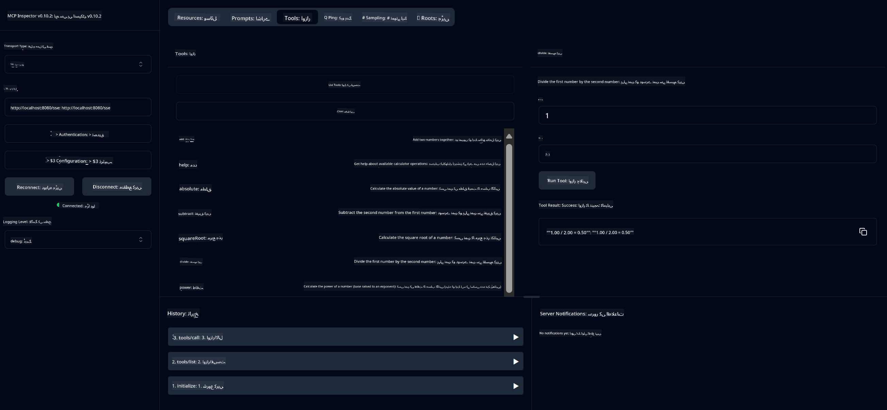

<!--
CO_OP_TRANSLATOR_METADATA:
{
  "original_hash": "7bf9a4a832911269a8bd0decb97ff36c",
  "translation_date": "2025-07-21T18:22:14+00:00",
  "source_file": "04-PracticalSamples/mcp/calculator/README.md",
  "language_code": "ur"
}
-->
# بنیادی کیلکولیٹر ایم سی پی سروس

>**نوٹ**: اس باب میں ایک [**ٹیوٹوریل**](./TUTORIAL.md) شامل ہے جو آپ کو مکمل نمونوں کو چلانے کے طریقے کی رہنمائی کرتا ہے۔

**ماڈل کانٹیکسٹ پروٹوکول (MCP)** کے ساتھ آپ کے پہلے عملی تجربے میں خوش آمدید! پچھلے ابواب میں، آپ نے جنریٹو اے آئی کے بنیادی اصولوں کے بارے میں سیکھا اور اپنا ترقیاتی ماحول ترتیب دیا۔ اب وقت ہے کہ کچھ عملی چیز بنائیں۔

یہ کیلکولیٹر سروس دکھاتی ہے کہ اے آئی ماڈلز ایم سی پی کا استعمال کرتے ہوئے بیرونی ٹولز کے ساتھ محفوظ طریقے سے کیسے تعامل کر سکتے ہیں۔ اے آئی ماڈل کی کبھی کبھار ناقابل اعتماد ریاضی کی صلاحیتوں پر انحصار کرنے کے بجائے، ہم ایک مضبوط نظام بنانے کا طریقہ دکھائیں گے جہاں اے آئی درست حسابات کے لیے خصوصی خدمات کو کال کر سکتا ہے۔

## مواد کی فہرست

- [آپ کیا سیکھیں گے](../../../../../04-PracticalSamples/mcp/calculator)
- [ضروریات](../../../../../04-PracticalSamples/mcp/calculator)
- [اہم تصورات](../../../../../04-PracticalSamples/mcp/calculator)
- [جلدی شروع کریں](../../../../../04-PracticalSamples/mcp/calculator)
- [دستیاب کیلکولیٹر آپریشنز](../../../../../04-PracticalSamples/mcp/calculator)
- [ٹیسٹ کلائنٹس](../../../../../04-PracticalSamples/mcp/calculator)
  - [1. براہ راست ایم سی پی کلائنٹ (SDKClient)](../../../../../04-PracticalSamples/mcp/calculator)
  - [2. اے آئی سے چلنے والا کلائنٹ (LangChain4jClient)](../../../../../04-PracticalSamples/mcp/calculator)
- [ایم سی پی انسپکٹر (ویب یو آئی)](../../../../../04-PracticalSamples/mcp/calculator)
  - [مرحلہ وار ہدایات](../../../../../04-PracticalSamples/mcp/calculator)

## آپ کیا سیکھیں گے

اس مثال پر کام کرتے ہوئے، آپ سمجھیں گے:
- اسپرنگ بوٹ کا استعمال کرتے ہوئے ایم سی پی کے مطابق خدمات کیسے بنائیں
- براہ راست پروٹوکول مواصلات اور اے آئی سے چلنے والے تعامل کے درمیان فرق
- اے آئی ماڈلز فیصلہ کیسے کرتے ہیں کہ کب اور کیسے بیرونی ٹولز استعمال کریں
- ٹول سے چلنے والی اے آئی ایپلیکیشنز بنانے کے بہترین طریقے

ایم سی پی کے تصورات سیکھنے والے ابتدائی افراد کے لیے بہترین، جو اپنی پہلی اے آئی ٹول انٹیگریشن بنانے کے لیے تیار ہیں!

## ضروریات

- جاوا 21+
- میون 3.6+
- **گٹ ہب ٹوکن**: اے آئی سے چلنے والے کلائنٹ کے لیے ضروری ہے۔ اگر آپ نے ابھی تک یہ ترتیب نہیں دیا ہے، تو [باب 2: اپنا ترقیاتی ماحول ترتیب دینا](../../../02-SetupDevEnvironment/README.md) دیکھیں۔

## اہم تصورات

**ماڈل کانٹیکسٹ پروٹوکول (MCP)** اے آئی ایپلیکیشنز کو بیرونی ٹولز کے ساتھ محفوظ طریقے سے جڑنے کا ایک معیاری طریقہ ہے۔ اسے ایک "پل" کے طور پر سوچیں جو اے آئی ماڈلز کو ہمارے کیلکولیٹر جیسے بیرونی خدمات استعمال کرنے کی اجازت دیتا ہے۔ اے آئی ماڈل خود ریاضی کرنے کی کوشش کرنے کے بجائے (جو ناقابل اعتماد ہو سکتا ہے)، یہ ہمارے کیلکولیٹر سروس کو کال کر کے درست نتائج حاصل کر سکتا ہے۔ ایم سی پی اس بات کو یقینی بناتا ہے کہ یہ مواصلات محفوظ اور مستقل طور پر ہوں۔

**سرور-سینٹ ایونٹس (SSE)** سرور اور کلائنٹس کے درمیان حقیقی وقت میں مواصلات کو فعال کرتا ہے۔ روایتی HTTP درخواستوں کے برعکس جہاں آپ پوچھتے ہیں اور جواب کا انتظار کرتے ہیں، ایس ایس ای سرور کو کلائنٹ کو مسلسل اپ ڈیٹس بھیجنے کی اجازت دیتا ہے۔ یہ اے آئی ایپلیکیشنز کے لیے بہترین ہے جہاں جوابات اسٹریم کیے جا سکتے ہیں یا پروسیس کرنے میں وقت لگ سکتا ہے۔

**اے آئی ٹولز اور فنکشن کالنگ** اے آئی ماڈلز کو خود بخود بیرونی فنکشنز (جیسے کیلکولیٹر آپریشنز) کا انتخاب اور استعمال کرنے کی اجازت دیتا ہے، صارف کی درخواستوں کی بنیاد پر۔ جب آپ پوچھتے ہیں "15 + 27 کیا ہے؟"، اے آئی ماڈل سمجھتا ہے کہ آپ جمع چاہتے ہیں، خود بخود ہمارے `add` ٹول کو صحیح پیرامیٹرز (15، 27) کے ساتھ کال کرتا ہے، اور قدرتی زبان میں نتیجہ واپس کرتا ہے۔ اے آئی ایک ذہین کوآرڈینیٹر کے طور پر کام کرتا ہے جو جانتا ہے کہ ہر ٹول کو کب اور کیسے استعمال کرنا ہے۔

## جلدی شروع کریں

### 1. کیلکولیٹر ایپلیکیشن ڈائریکٹری پر جائیں
```bash
cd Generative-AI-for-beginners-java/04-PracticalSamples/mcp/calculator
```

### 2. بنائیں اور چلائیں
```bash
mvn clean install -DskipTests
java -jar target/calculator-server-0.0.1-SNAPSHOT.jar
```

### 2. کلائنٹس کے ساتھ ٹیسٹ کریں
- **SDKClient**: براہ راست ایم سی پی پروٹوکول تعامل
- **LangChain4jClient**: اے آئی سے چلنے والا قدرتی زبان تعامل (گٹ ہب ٹوکن کی ضرورت ہے)

## دستیاب کیلکولیٹر آپریشنز

- `add(a, b)`, `subtract(a, b)`, `multiply(a, b)`, `divide(a, b)`
- `power(base, exponent)`, `squareRoot(number)`, `absolute(number)`
- `modulus(a, b)`, `help()`

## ٹیسٹ کلائنٹس

### 1. براہ راست ایم سی پی کلائنٹ (SDKClient)
خام ایم سی پی پروٹوکول مواصلات کی جانچ کرتا ہے۔ چلائیں:
```bash
mvn test-compile exec:java -Dexec.mainClass="com.microsoft.mcp.sample.client.SDKClient" -Dexec.classpathScope=test
```

### 2. اے آئی سے چلنے والا کلائنٹ (LangChain4jClient)
گٹ ہب ماڈلز کے ساتھ قدرتی زبان تعامل کو ظاہر کرتا ہے۔ گٹ ہب ٹوکن کی ضرورت ہے (دیکھیں [ضروریات](../../../../../04-PracticalSamples/mcp/calculator))۔

**چلائیں:**
```bash
mvn test-compile exec:java -Dexec.mainClass="com.microsoft.mcp.sample.client.LangChain4jClient" -Dexec.classpathScope=test
```

## ایم سی پی انسپکٹر (ویب یو آئی)

ایم سی پی انسپکٹر ایک بصری ویب انٹرفیس فراہم کرتا ہے تاکہ آپ کو کوڈ لکھے بغیر اپنی ایم سی پی سروس کی جانچ کرنے میں مدد ملے۔ ایم سی پی کو سمجھنے کے لیے ابتدائی افراد کے لیے بہترین!

### مرحلہ وار ہدایات:

1. **کیلکولیٹر سرور شروع کریں** (اگر پہلے سے نہیں چل رہا):
   ```bash
   java -jar target/calculator-server-0.0.1-SNAPSHOT.jar
   ```

2. **ایم سی پی انسپکٹر انسٹال کریں اور چلائیں** ایک نئے ٹرمینل میں:
   ```bash
   npx @modelcontextprotocol/inspector
   ```

3. **ویب انٹرفیس کھولیں**:
   - ایک پیغام تلاش کریں جیسے "انسپکٹر چل رہا ہے http://localhost:6274 پر"
   - اپنے ویب براؤزر میں وہ یو آر ایل کھولیں

4. **اپنی کیلکولیٹر سروس سے جڑیں**:
   - ویب انٹرفیس میں، ٹرانسپورٹ قسم کو "SSE" پر سیٹ کریں
   - یو آر ایل سیٹ کریں: `http://localhost:8080/sse`
   - "Connect" بٹن پر کلک کریں

5. **دستیاب ٹولز کو دریافت کریں**:
   - "List Tools" پر کلک کریں تاکہ تمام کیلکولیٹر آپریشنز دیکھ سکیں
   - آپ کو `add`, `subtract`, `multiply` وغیرہ جیسے فنکشنز نظر آئیں گے

6. **ایک کیلکولیٹر آپریشن کی جانچ کریں**:
   - ایک ٹول منتخب کریں (مثلاً "add")
   - پیرامیٹرز درج کریں (مثلاً `a: 15`, `b: 27`)
   - "Run Tool" پر کلک کریں
   - اپنی ایم سی پی سروس کے ذریعے واپس کیا گیا نتیجہ دیکھیں!

یہ بصری طریقہ آپ کو بالکل سمجھنے میں مدد دیتا ہے کہ ایم سی پی مواصلات کیسے کام کرتے ہیں، اس سے پہلے کہ آپ اپنے کلائنٹس بنائیں۔



---
**حوالہ:** [ایم سی پی سرور بوٹ اسٹارٹر ڈاکس](https://docs.spring.io/spring-ai/reference/api/mcp/mcp-server-boot-starter-docs.html)

**ڈسکلیمر**:  
یہ دستاویز AI ترجمہ سروس [Co-op Translator](https://github.com/Azure/co-op-translator) کا استعمال کرتے ہوئے ترجمہ کی گئی ہے۔ ہم درستگی کے لیے کوشش کرتے ہیں، لیکن براہ کرم آگاہ رہیں کہ خودکار ترجمے میں غلطیاں یا غیر درستیاں ہو سکتی ہیں۔ اصل دستاویز کو اس کی اصل زبان میں مستند ذریعہ سمجھا جانا چاہیے۔ اہم معلومات کے لیے، پیشہ ور انسانی ترجمہ کی سفارش کی جاتی ہے۔ ہم اس ترجمے کے استعمال سے پیدا ہونے والی کسی بھی غلط فہمی یا غلط تشریح کے ذمہ دار نہیں ہیں۔