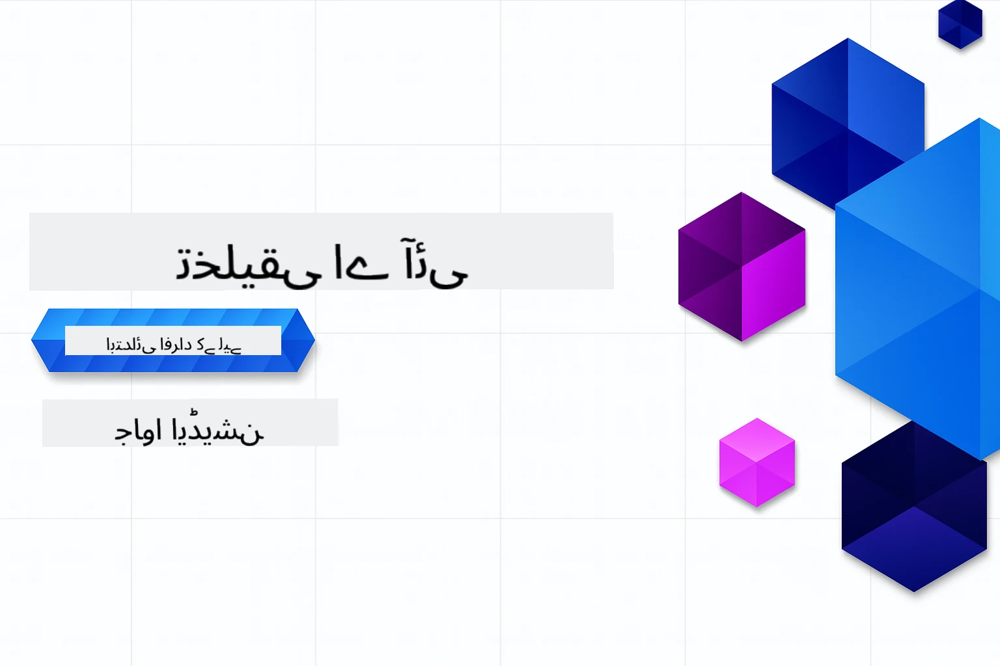

# ابتدائی افراد کے لیے جنریٹو AI - جاوا ایڈیشن
[](https://discord.gg/nTYy5BXMWG)



**وقت کی ذمہ داری**: پورا ورکشاپ آن لائن مکمل کیا جا سکتا ہے بغیر لوکل سیٹ اپ کے۔ ماحول کی ترتیب میں 2 منٹ لگتے ہیں، اور نمونوں کی جانچ پڑتال میں 1-3 گھنٹے لگ سکتے ہیں دریافت کی گہرائی پر منحصر ہے۔

> **فوری آغاز**

1. اس ریپوزیٹری کو اپنے GitHub اکاؤنٹ پر فورک کریں  
2. **Code** → **Codespaces** ٹیب → **...** → **New with options...** پر کلک کریں  
3. ڈیفالٹ استعمال کریں – یہ اس کورس کے لیے بنائی گئی Development container کا انتخاب کرے گا  
4. **Create codespace** پر کلک کریں  
5. تقریباً 2 منٹ انتظار کریں تاکہ ماحول تیار ہو جائے  
6. سیدھا [پہلے مثال](./02-SetupDevEnvironment/README.md#step-2-create-a-github-personal-access-token) پر جائیں  

> **کیا آپ مقامی کلون کرنا پسند کریں گے؟**  
>  
> یہ ریپوزیٹری 50+ زبانوں کے تراجم شامل ہے جو ڈاؤن لوڈ سائز کو نمایاں طور پر بڑھا دیتے ہیں۔ بغیر تراجم کے کلون کرنے کے لیے، sparse checkout استعمال کریں:  
> ```bash
> git clone --filter=blob:none --sparse https://github.com/microsoft/Generative-AI-for-beginners-java.git
> cd Generative-AI-for-beginners-java
> git sparse-checkout set --no-cone '/*' '!translations' '!translated_images'
> ```
> یہ آپ کو کورس مکمل کرنے کے لیے ہر وہ چیز فراہم کرتا ہے جس کی آپ کو ضرورت ہے، اور بہت تیز تر ڈاؤن لوڈ ہوتا ہے۔

## کثیر لسانی تعاون

### GitHub Action کے ذریعے معاونت (خودکار اور ہمیشہ تازہ)

<!-- CO-OP TRANSLATOR LANGUAGES TABLE START -->
[Arabic](../ar/README.md) | [Bengali](../bn/README.md) | [Bulgarian](../bg/README.md) | [Burmese (Myanmar)](../my/README.md) | [Chinese (Simplified)](../zh-CN/README.md) | [Chinese (Traditional, Hong Kong)](../zh-HK/README.md) | [Chinese (Traditional, Macau)](../zh-MO/README.md) | [Chinese (Traditional, Taiwan)](../zh-TW/README.md) | [Croatian](../hr/README.md) | [Czech](../cs/README.md) | [Danish](../da/README.md) | [Dutch](../nl/README.md) | [Estonian](../et/README.md) | [Finnish](../fi/README.md) | [French](../fr/README.md) | [German](../de/README.md) | [Greek](../el/README.md) | [Hebrew](../he/README.md) | [Hindi](../hi/README.md) | [Hungarian](../hu/README.md) | [Indonesian](../id/README.md) | [Italian](../it/README.md) | [Japanese](../ja/README.md) | [Kannada](../kn/README.md) | [Korean](../ko/README.md) | [Lithuanian](../lt/README.md) | [Malay](../ms/README.md) | [Malayalam](../ml/README.md) | [Marathi](../mr/README.md) | [Nepali](../ne/README.md) | [Nigerian Pidgin](../pcm/README.md) | [Norwegian](../no/README.md) | [Persian (Farsi)](../fa/README.md) | [Polish](../pl/README.md) | [Portuguese (Brazil)](../pt-BR/README.md) | [Portuguese (Portugal)](../pt-PT/README.md) | [Punjabi (Gurmukhi)](../pa/README.md) | [Romanian](../ro/README.md) | [Russian](../ru/README.md) | [Serbian (Cyrillic)](../sr/README.md) | [Slovak](../sk/README.md) | [Slovenian](../sl/README.md) | [Spanish](../es/README.md) | [Swahili](../sw/README.md) | [Swedish](../sv/README.md) | [Tagalog (Filipino)](../tl/README.md) | [Tamil](../ta/README.md) | [Telugu](../te/README.md) | [Thai](../th/README.md) | [Turkish](../tr/README.md) | [Ukrainian](../uk/README.md) | [Urdu](./README.md) | [Vietnamese](../vi/README.md)

## کورس کا ڈھانچہ اور سیکھنے کا راستہ

### **باب 1: جنریٹو AI کا تعارف**
- **بنیادی تصورات**: بڑے لینگویج ماڈلز، ٹوکنز، ایمبیڈنگز، اور AI صلاحیتوں کی سمجھ  
- **جاوا AI ماحولیاتی نظام**: Spring AI اور OpenAI SDKs کا جائزہ  
- **ماڈل کانٹیکسٹ پروٹوکول**: MCP کا تعارف اور AI ایجنٹ مواصلات میں اس کا کردار  
- **عملی اطلاقات**: اصلی دنیا کے منظرنامے جن میں چیٹ بوٹس اور مواد کی تخلیق شامل ہے  
- **[→ باب 1 شروع کریں](./01-IntroToGenAI/README.md)**

### **باب 2: ترقیاتی ماحول کی ترتیب**
- **کثیر فراہم کنندگان کی کنفیگریشن**: GitHub Models، Azure OpenAI، اور OpenAI Java SDK انضمامات کی ترتیب  
- **Spring Boot + Spring AI**: ادارہ جاتی AI ایپلیکیشن کی ترقی کے لیے بہترین طریقے  
- **GitHub Models**: پروٹوٹائپنگ اور سیکھنے کے لیے مفت AI ماڈل تک رسائی (کریڈٹ کارڈ کی ضرورت نہیں)  
- **ترقیاتی آلات**: ڈوکر کنٹینرز، VS Code، اور GitHub Codespaces کی ترتیب  
- **[→ باب 2 شروع کریں](./02-SetupDevEnvironment/README.md)**

### **باب 3: بنیادی جنریٹو AI تکنیکس**
- **پرومپٹ انجینئرنگ**: AI ماڈل کے ردعمل کو بہتر بنانے کی تکنیکس  
- **ایمبیڈنگز اور ویکٹر آپریشنز**: سیمانٹک سرچ اور مشابہت کی تلاش کا نفاذ  
- **ریٹریول-اگمنٹڈ جنریشن (RAG)**: AI کو اپنے ڈیٹا ذرائع کے ساتھ جوڑنا  
- **فنکشن کالنگ**: AI صلاحیتوں کو اپنی مرضی کے اوزار اور پلگ انز کے ساتھ بڑھانا  
- **[→ باب 3 شروع کریں](./03-CoreGenerativeAITechniques/README.md)**

### **باب 4: عملی اطلاقات اور پروجیکٹس**
- **پالتو جانور کی کہانی جنریٹر** (`petstory/`): GitHub Models کے ساتھ تخلیقی مواد کی تخلیق  
- **Foundry Local Demo** (`foundrylocal/`): OpenAI Java SDK کے ساتھ مقامی AI ماڈل انضمام  
- **MCP کیلکولیٹر سروس** (`calculator/`): Spring AI کے ساتھ بنیادی ماڈل کانٹیکسٹ پروٹوکول کا نفاذ  
- **[→ باب 4 شروع کریں](./04-PracticalSamples/README.md)**

### **باب 5: ذمہ دار AI ترقی**
- **GitHub Models کی حفاظت**: بلٹ اِن مواد کی فلٹرنگ اور حفاظتی میکانزم کا تجربہ (سخت بلاکس اور نرم انکار)  
- **ذمہ دار AI ڈیمو**: عملی مثال جو دکھاتی ہے کہ جدید AI حفاظتی نظام کس طرح کام کرتے ہیں  
- **بہترین مشقیں**: اخلاقی AI ترقی اور تعیناتی کی ضروری ہدایات  
- **[→ باب 5 شروع کریں](./05-ResponsibleGenAI/README.md)**

## اضافی وسائل

<!-- CO-OP TRANSLATOR OTHER COURSES START -->
### لینگ چین
[](https://aka.ms/langchain4j-for-beginners)
[](https://aka.ms/langchainjs-for-beginners?WT.mc_id=m365-94501-dwahlin)

---

### Azure / Edge / MCP / ایجنٹس
[](https://github.com/microsoft/AZD-for-beginners?WT.mc_id=academic-105485-koreyst)
[](https://github.com/microsoft/edgeai-for-beginners?WT.mc_id=academic-105485-koreyst)
[](https://github.com/microsoft/mcp-for-beginners?WT.mc_id=academic-105485-koreyst)
[](https://github.com/microsoft/ai-agents-for-beginners?WT.mc_id=academic-105485-koreyst)

---
 
### جنریٹو AI سیریز
[](https://github.com/microsoft/generative-ai-for-beginners?WT.mc_id=academic-105485-koreyst)
[-9333EA?style=for-the-badge&labelColor=E5E7EB&color=9333EA)](https://github.com/microsoft/Generative-AI-for-beginners-dotnet?WT.mc_id=academic-105485-koreyst)
[-C084FC?style=for-the-badge&labelColor=E5E7EB&color=C084FC)](https://github.com/microsoft/generative-ai-for-beginners-java?WT.mc_id=academic-105485-koreyst)
[-E879F9?style=for-the-badge&labelColor=E5E7EB&color=E879F9)](https://github.com/microsoft/generative-ai-with-javascript?WT.mc_id=academic-105485-koreyst)

---
 
### بنیادی تعلیم
[](https://aka.ms/ml-beginners?WT.mc_id=academic-105485-koreyst)
[](https://aka.ms/datascience-beginners?WT.mc_id=academic-105485-koreyst)
[](https://aka.ms/ai-beginners?WT.mc_id=academic-105485-koreyst)
[](https://github.com/microsoft/Security-101?WT.mc_id=academic-96948-sayoung)
[](https://aka.ms/webdev-beginners?WT.mc_id=academic-105485-koreyst)
[](https://aka.ms/iot-beginners?WT.mc_id=academic-105485-koreyst)
[](https://github.com/microsoft/xr-development-for-beginners?WT.mc_id=academic-105485-koreyst)

---
 
### کوپائلٹ سیریز
[](https://aka.ms/GitHubCopilotAI?WT.mc_id=academic-105485-koreyst)
[](https://github.com/microsoft/mastering-github-copilot-for-dotnet-csharp-developers?WT.mc_id=academic-105485-koreyst)
[](https://github.com/microsoft/CopilotAdventures?WT.mc_id=academic-105485-koreyst)
<!-- CO-OP TRANSLATOR OTHER COURSES END -->

## مدد حاصل کرنا

اگر آپ پھنس جائیں یا AI ایپلیکیشنز بنانے کے بارے میں کوئی سوال ہو تو۔ MCP کے بارے میں تبادلہ خیال کرنے والے دیگر سیکھنے والوں اور تجربہ کار ڈویلپرز سے شامل ہوں۔ یہ ایک معاون کمیونٹی ہے جہاں سوالات خوش آمدید ہیں اور علم آزادانہ طور پر شیئر کیا جاتا ہے۔

[](https://discord.gg/nTYy5BXMWG)

اگر آپ کے پاس مصنوعات کے بارے میں آراء یا تعمیر کے دوران غلطیاں ہوں تو یہاں جائیں:

[](https://aka.ms/foundry/forum)

---

<!-- CO-OP TRANSLATOR DISCLAIMER START -->
**دفعِ احترام**:  
یہ دستاویز AI ترجمہ سروس [Co-op Translator](https://github.com/Azure/co-op-translator) کے ذریعے ترجمہ کی گئی ہے۔ اگرچہ ہم درستگی کی کوشش کرتے ہیں، براہ کرم آگاہ رہیں کہ خودکار ترجمے میں غلطیاں یا عدم مطابقت ہو سکتی ہے۔ اصل دستاویز اپنی مادری زبان میں مستند ماخذ سمجھی جانی چاہیے۔ اہم معلومات کے لیے پیشہ ورانہ انسانی ترجمہ کی سفارش کی جاتی ہے۔ اس ترجمے کے استعمال سے پیدا ہونے والی کسی بھی غلط فہمی یا غلط تشریح کی ذمہ داری ہم پر عائد نہیں ہوگی۔
<!-- CO-OP TRANSLATOR DISCLAIMER END -->