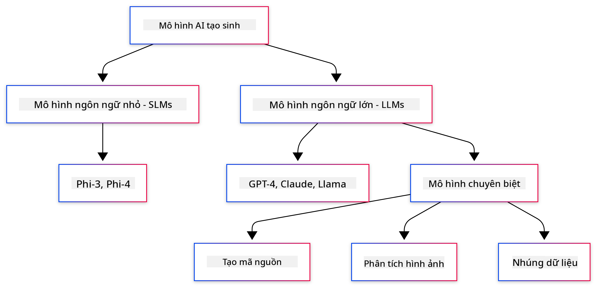
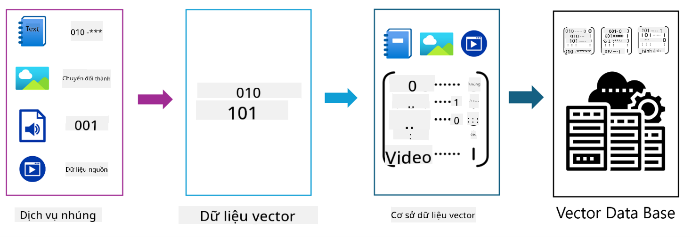

<!--
CO_OP_TRANSLATOR_METADATA:
{
  "original_hash": "6d8b4a0d774dc2a1e97c95859a6d6e4b",
  "translation_date": "2025-07-21T20:17:51+00:00",
  "source_file": "01-IntroToGenAI/README.md",
  "language_code": "vi"
}
-->
# Giới thiệu về Generative AI - Phiên bản Java

## Những điều bạn sẽ học

- **Kiến thức cơ bản về Generative AI** bao gồm LLMs, kỹ thuật tạo prompt, tokens, embeddings, và cơ sở dữ liệu vector
- **So sánh các công cụ phát triển AI trong Java** bao gồm Azure OpenAI SDK, Spring AI, và OpenAI Java SDK
- **Khám phá Giao thức Ngữ cảnh Mô hình (Model Context Protocol)** và vai trò của nó trong giao tiếp giữa các tác nhân AI

## Mục lục

- [Giới thiệu](../../../01-IntroToGenAI)
- [Tóm tắt nhanh về các khái niệm Generative AI](../../../01-IntroToGenAI)
- [Ôn lại kỹ thuật tạo prompt](../../../01-IntroToGenAI)
- [Tokens, embeddings, và agents](../../../01-IntroToGenAI)
- [Công cụ và thư viện phát triển AI cho Java](../../../01-IntroToGenAI)
  - [OpenAI Java SDK](../../../01-IntroToGenAI)
  - [Spring AI](../../../01-IntroToGenAI)
  - [Azure OpenAI Java SDK](../../../01-IntroToGenAI)
- [Tóm tắt](../../../01-IntroToGenAI)
- [Bước tiếp theo](../../../01-IntroToGenAI)

## Giới thiệu

Chào mừng bạn đến với chương đầu tiên của Generative AI cho Người Mới Bắt Đầu - Phiên bản Java! Bài học nền tảng này sẽ giới thiệu bạn đến các khái niệm cốt lõi của Generative AI và cách làm việc với chúng bằng Java. Bạn sẽ học về các thành phần cơ bản của ứng dụng AI, bao gồm Mô hình Ngôn ngữ Lớn (LLMs), tokens, embeddings, và các tác nhân AI. Chúng ta cũng sẽ khám phá các công cụ Java chính mà bạn sẽ sử dụng trong suốt khóa học này.

### Tóm tắt nhanh về các khái niệm Generative AI

Generative AI là một loại trí tuệ nhân tạo có khả năng tạo nội dung mới, chẳng hạn như văn bản, hình ảnh, hoặc mã, dựa trên các mẫu và mối quan hệ học được từ dữ liệu. Các mô hình Generative AI có thể tạo ra phản hồi giống con người, hiểu ngữ cảnh, và đôi khi thậm chí tạo nội dung trông giống như do con người tạo ra.

Khi bạn phát triển các ứng dụng AI bằng Java, bạn sẽ làm việc với **các mô hình Generative AI** để tạo nội dung. Một số khả năng của các mô hình Generative AI bao gồm:

- **Tạo văn bản**: Soạn thảo văn bản giống con người cho chatbot, nội dung, và hoàn thành văn bản.
- **Tạo và phân tích hình ảnh**: Tạo hình ảnh thực tế, cải thiện ảnh, và phát hiện đối tượng.
- **Tạo mã**: Viết đoạn mã hoặc script.

Có những loại mô hình cụ thể được tối ưu hóa cho các nhiệm vụ khác nhau. Ví dụ, cả **Mô hình Ngôn ngữ Nhỏ (SLMs)** và **Mô hình Ngôn ngữ Lớn (LLMs)** đều có thể xử lý việc tạo văn bản, với LLMs thường mang lại hiệu suất tốt hơn cho các nhiệm vụ phức tạp. Đối với các nhiệm vụ liên quan đến hình ảnh, bạn sẽ sử dụng các mô hình thị giác chuyên biệt hoặc mô hình đa phương thức.

Tất nhiên, các phản hồi từ những mô hình này không phải lúc nào cũng hoàn hảo. Bạn có thể đã nghe về việc các mô hình "ảo tưởng" hoặc tạo ra thông tin sai lệch một cách tự tin. Nhưng bạn có thể hướng dẫn mô hình tạo ra các phản hồi tốt hơn bằng cách cung cấp cho chúng các hướng dẫn và ngữ cảnh rõ ràng. Đây là lúc **kỹ thuật tạo prompt** phát huy tác dụng.

#### Ôn lại kỹ thuật tạo prompt

Kỹ thuật tạo prompt là thực hành thiết kế các đầu vào hiệu quả để hướng dẫn các mô hình AI tạo ra các kết quả mong muốn. Nó bao gồm:

- **Rõ ràng**: Làm cho các hướng dẫn rõ ràng và không mơ hồ.
- **Ngữ cảnh**: Cung cấp thông tin nền cần thiết.
- **Ràng buộc**: Chỉ định bất kỳ giới hạn hoặc định dạng nào.

Một số thực hành tốt nhất cho kỹ thuật tạo prompt bao gồm thiết kế prompt, hướng dẫn rõ ràng, phân chia nhiệm vụ, học một lần và học ít lần, và tinh chỉnh prompt. Việc thử nghiệm các prompt khác nhau là rất quan trọng để tìm ra điều gì hoạt động tốt nhất cho trường hợp sử dụng cụ thể của bạn.

Khi phát triển ứng dụng, bạn sẽ làm việc với các loại prompt khác nhau:
- **Prompt hệ thống**: Đặt các quy tắc cơ bản và ngữ cảnh cho hành vi của mô hình
- **Prompt người dùng**: Dữ liệu đầu vào từ người dùng ứng dụng của bạn
- **Prompt trợ lý**: Phản hồi của mô hình dựa trên prompt hệ thống và người dùng

> **Tìm hiểu thêm**: Tìm hiểu thêm về kỹ thuật tạo prompt trong [chương Prompt Engineering của khóa học GenAI cho Người Mới Bắt Đầu](https://github.com/microsoft/generative-ai-for-beginners/tree/main/04-prompt-engineering-fundamentals)

#### Tokens, embeddings, và agents

Khi làm việc với các mô hình Generative AI, bạn sẽ gặp các thuật ngữ như **tokens**, **embeddings**, **agents**, và **Giao thức Ngữ cảnh Mô hình (MCP)**. Dưới đây là tổng quan chi tiết về các khái niệm này:

- **Tokens**: Tokens là đơn vị nhỏ nhất của văn bản trong một mô hình. Chúng có thể là từ, ký tự, hoặc các phần từ. Tokens được sử dụng để đại diện cho dữ liệu văn bản ở định dạng mà mô hình có thể hiểu. Ví dụ, câu "The quick brown fox jumped over the lazy dog" có thể được phân tách thành ["The", " quick", " brown", " fox", " jumped", " over", " the", " lazy", " dog"] hoặc ["The", " qu", "ick", " br", "own", " fox", " jump", "ed", " over", " the", " la", "zy", " dog"] tùy thuộc vào chiến lược phân tách.

Phân tách là quá trình chia nhỏ văn bản thành các đơn vị nhỏ hơn này. Điều này rất quan trọng vì các mô hình hoạt động trên tokens thay vì văn bản thô. Số lượng tokens trong một prompt ảnh hưởng đến độ dài và chất lượng phản hồi của mô hình, vì các mô hình có giới hạn tokens cho cửa sổ ngữ cảnh của chúng (ví dụ: 128K tokens cho tổng ngữ cảnh của GPT-4o, bao gồm cả đầu vào và đầu ra).

  Trong Java, bạn có thể sử dụng các thư viện như OpenAI SDK để xử lý phân tách tự động khi gửi yêu cầu đến các mô hình AI.

- **Embeddings**: Embeddings là các biểu diễn vector của tokens, nắm bắt ý nghĩa ngữ nghĩa. Chúng là các biểu diễn số (thường là các mảng số thập phân) cho phép các mô hình hiểu mối quan hệ giữa các từ và tạo ra các phản hồi phù hợp với ngữ cảnh. Các từ tương tự có embeddings tương tự, giúp mô hình hiểu các khái niệm như từ đồng nghĩa và mối quan hệ ngữ nghĩa.

  Trong Java, bạn có thể tạo embeddings bằng cách sử dụng OpenAI SDK hoặc các thư viện khác hỗ trợ tạo embeddings. Các embeddings này rất quan trọng cho các nhiệm vụ như tìm kiếm ngữ nghĩa, nơi bạn muốn tìm nội dung tương tự dựa trên ý nghĩa thay vì khớp chính xác văn bản.

- **Cơ sở dữ liệu vector**: Cơ sở dữ liệu vector là các hệ thống lưu trữ chuyên biệt được tối ưu hóa cho embeddings. Chúng cho phép tìm kiếm tương tự hiệu quả và rất quan trọng cho các mẫu RAG (Retrieval-Augmented Generation), nơi bạn cần tìm thông tin liên quan từ các tập dữ liệu lớn dựa trên sự tương đồng ngữ nghĩa thay vì khớp chính xác.

> **Lưu ý**: Trong khóa học này, chúng ta sẽ không đề cập đến cơ sở dữ liệu vector nhưng nghĩ rằng chúng đáng được nhắc đến vì chúng thường được sử dụng trong các ứng dụng thực tế.

- **Agents & MCP**: Các thành phần AI tự động tương tác với các mô hình, công cụ, và hệ thống bên ngoài. Giao thức Ngữ cảnh Mô hình (MCP) cung cấp một cách tiêu chuẩn hóa để các agents truy cập dữ liệu và công cụ bên ngoài một cách an toàn. Tìm hiểu thêm trong khóa học [MCP cho Người Mới Bắt Đầu](https://github.com/microsoft/mcp-for-beginners).

Trong các ứng dụng AI Java, bạn sẽ sử dụng tokens để xử lý văn bản, embeddings để tìm kiếm ngữ nghĩa và RAG, cơ sở dữ liệu vector để truy xuất dữ liệu, và agents với MCP để xây dựng các hệ thống thông minh sử dụng công cụ.

### Công cụ và thư viện phát triển AI cho Java

Java cung cấp các công cụ tuyệt vời cho phát triển AI. Có ba thư viện chính mà chúng ta sẽ khám phá trong suốt khóa học này - OpenAI Java SDK, Azure OpenAI SDK, và Spring AI.

Dưới đây là bảng tham khảo nhanh hiển thị SDK nào được sử dụng trong các ví dụ của từng chương:

| Chương | Mẫu | SDK |
|---------|--------|-----|
| 02-SetupDevEnvironment | src/github-models/ | OpenAI Java SDK |
| 02-SetupDevEnvironment | src/basic-chat-azure/ | Spring AI Azure OpenAI |
| 03-CoreGenerativeAITechniques | examples/ | Azure OpenAI SDK |
| 04-PracticalSamples | petstory/ | OpenAI Java SDK |
| 04-PracticalSamples | foundrylocal/ | OpenAI Java SDK |
| 04-PracticalSamples | mcp/calculator/ | Spring AI MCP SDK + LangChain4j |

**Liên kết tài liệu SDK:**
- [Azure OpenAI Java SDK](https://github.com/Azure/azure-sdk-for-java/tree/azure-ai-openai_1.0.0-beta.16/sdk/openai/azure-ai-openai)
- [Spring AI](https://docs.spring.io/spring-ai/reference/)
- [OpenAI Java SDK](https://github.com/openai/openai-java)
- [LangChain4j](https://docs.langchain4j.dev/)

#### OpenAI Java SDK

OpenAI SDK là thư viện Java chính thức cho API OpenAI. Nó cung cấp một giao diện đơn giản và nhất quán để tương tác với các mô hình của OpenAI, giúp dễ dàng tích hợp các khả năng AI vào các ứng dụng Java. Ví dụ GitHub Models của Chương 2, ứng dụng Pet Story của Chương 4 và ví dụ Foundry Local minh họa cách tiếp cận với OpenAI SDK.

#### Spring AI

Spring AI là một framework toàn diện mang lại các khả năng AI cho các ứng dụng Spring, cung cấp một lớp trừu tượng nhất quán trên các nhà cung cấp AI khác nhau. Nó tích hợp liền mạch với hệ sinh thái Spring, làm cho nó trở thành lựa chọn lý tưởng cho các ứng dụng Java doanh nghiệp cần các khả năng AI.

Điểm mạnh của Spring AI nằm ở sự tích hợp liền mạch với hệ sinh thái Spring, giúp dễ dàng xây dựng các ứng dụng AI sẵn sàng cho sản xuất với các mẫu Spring quen thuộc như tiêm phụ thuộc, quản lý cấu hình, và các framework kiểm thử. Bạn sẽ sử dụng Spring AI trong Chương 2 và 4 để xây dựng các ứng dụng tận dụng cả thư viện OpenAI và Model Context Protocol (MCP) của Spring AI.

##### Giao thức Ngữ cảnh Mô hình (MCP)

[Giao thức Ngữ cảnh Mô hình (MCP)](https://modelcontextprotocol.io/) là một tiêu chuẩn mới nổi cho phép các ứng dụng AI tương tác an toàn với các nguồn dữ liệu và công cụ bên ngoài. MCP cung cấp một cách tiêu chuẩn hóa để các mô hình AI truy cập thông tin ngữ cảnh và thực hiện các hành động trong ứng dụng của bạn.

Trong Chương 4, bạn sẽ xây dựng một dịch vụ máy tính MCP đơn giản minh họa các nguyên tắc cơ bản của Giao thức Ngữ cảnh Mô hình với Spring AI, cho thấy cách tạo tích hợp công cụ cơ bản và kiến trúc dịch vụ.

#### Azure OpenAI Java SDK

Thư viện khách hàng Azure OpenAI cho Java là một phiên bản thích nghi của các API REST của OpenAI, cung cấp một giao diện theo phong cách Java và tích hợp với phần còn lại của hệ sinh thái SDK Azure. Trong Chương 3, bạn sẽ xây dựng các ứng dụng sử dụng Azure OpenAI SDK, bao gồm các ứng dụng trò chuyện, gọi hàm, và các mẫu RAG (Retrieval-Augmented Generation).

> Lưu ý: Azure OpenAI SDK hiện có ít tính năng hơn so với OpenAI Java SDK, vì vậy cho các dự án tương lai, hãy cân nhắc sử dụng OpenAI Java SDK.

## Tóm tắt

**Chúc mừng bạn!** Bạn đã:

- **Học về các kiến thức cơ bản của Generative AI** bao gồm LLMs, kỹ thuật tạo prompt, tokens, embeddings, và cơ sở dữ liệu vector
- **So sánh các công cụ phát triển AI trong Java** bao gồm Azure OpenAI SDK, Spring AI, và OpenAI Java SDK
- **Khám phá Giao thức Ngữ cảnh Mô hình** và vai trò của nó trong giao tiếp giữa các tác nhân AI

## Bước tiếp theo

[Chương 2: Thiết lập Môi trường Phát triển](../02-SetupDevEnvironment/README.md)

**Tuyên bố miễn trừ trách nhiệm**:  
Tài liệu này đã được dịch bằng dịch vụ dịch thuật AI [Co-op Translator](https://github.com/Azure/co-op-translator). Mặc dù chúng tôi cố gắng đảm bảo độ chính xác, xin lưu ý rằng các bản dịch tự động có thể chứa lỗi hoặc không chính xác. Tài liệu gốc bằng ngôn ngữ bản địa nên được coi là nguồn thông tin chính thức. Đối với các thông tin quan trọng, khuyến nghị sử dụng dịch vụ dịch thuật chuyên nghiệp bởi con người. Chúng tôi không chịu trách nhiệm cho bất kỳ sự hiểu lầm hoặc diễn giải sai nào phát sinh từ việc sử dụng bản dịch này.