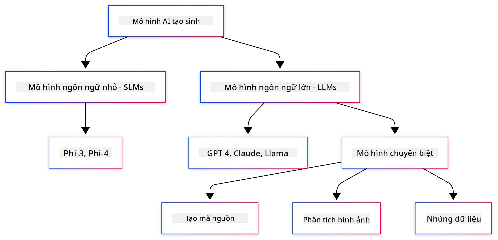
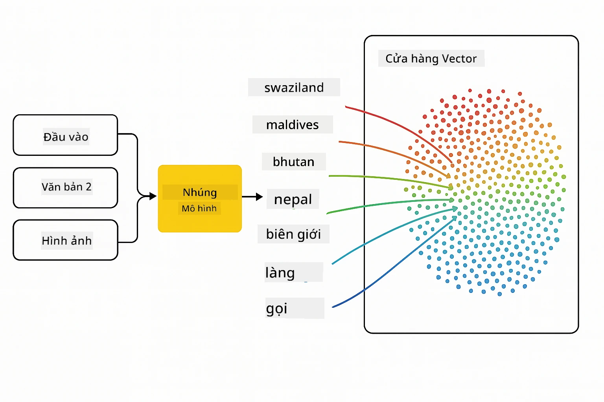
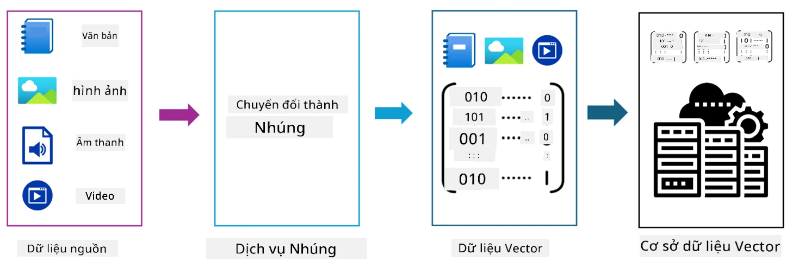
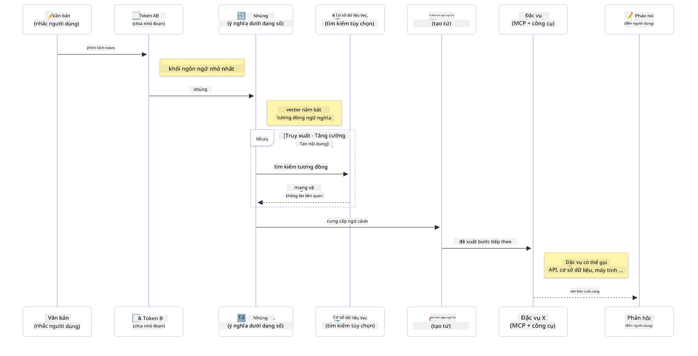

# Giới thiệu về Generative AI - Phiên bản Java

> **Video**: [Xem video tổng quan về bài học này trên YouTube.](https://www.youtube.com/watch?v=XH46tGp_eSw) Bạn cũng có thể nhấp vào hình thu nhỏ ở trên.

## Những gì bạn sẽ học

- **Kiến thức cơ bản về Generative AI** bao gồm LLMs, kỹ thuật prompt, tokens, embeddings và cơ sở dữ liệu vector
- **So sánh các công cụ phát triển AI cho Java** bao gồm Azure OpenAI SDK, Spring AI, và OpenAI Java SDK
- **Khám phá Model Context Protocol** và vai trò của nó trong giao tiếp của các tác nhân AI

## Mục lục

- [Giới thiệu](#giới-thiệu)
- [Ôn tập nhanh các khái niệm về Generative AI](#ôn-tập-nhanh-các-khái-niệm-về-generative-ai)
- [Ôn tập kỹ thuật prompt](#ôn-tập-kỹ-thuật-prompt)
- [Tokens, embeddings và tác nhân](#tokens-embeddings-và-tác-nhân)
- [Công cụ và thư viện phát triển AI cho Java](#công-cụ-và-thư-viện-phát-triển-ai-cho-java)
  - [OpenAI Java SDK](#openai-java-sdk)
  - [Spring AI](#spring-ai)
  - [Azure OpenAI Java SDK](#azure-openai-java-sdk)
- [Tóm tắt](#tóm-tắt)
- [Bước tiếp theo](#bước-tiếp-theo)

## Giới thiệu

Chào mừng bạn đến với chương đầu tiên của Generative AI for Beginners - Phiên bản Java! Bài học nền tảng này sẽ giới thiệu cho bạn các khái niệm cốt lõi về generative AI và cách làm việc với chúng bằng Java. Bạn sẽ tìm hiểu về các thành phần cơ bản của ứng dụng AI, bao gồm Large Language Models (LLMs), tokens, embeddings, và các tác nhân AI. Chúng ta cũng sẽ khám phá các công cụ Java chính mà bạn sẽ sử dụng trong suốt khóa học này.

### Ôn tập nhanh các khái niệm về Generative AI

Generative AI là một loại trí tuệ nhân tạo tạo ra nội dung mới, chẳng hạn như văn bản, hình ảnh hay mã nguồn, dựa trên các mẫu và mối quan hệ học được từ dữ liệu. Các mô hình generative AI có thể tạo ra các phản hồi giống như con người, hiểu ngữ cảnh, và đôi khi tạo ra nội dung trông rất tự nhiên.

Khi phát triển các ứng dụng AI bằng Java, bạn sẽ làm việc với **mô hình generative AI** để tạo nội dung. Một số khả năng của các mô hình generative AI bao gồm:

- **Tạo Văn bản**: Soạn thảo văn bản giống như con người cho chatbot, nội dung và hoàn thiện văn bản.
- **Tạo và Phân tích Hình ảnh**: Tạo ảnh thực tế, cải thiện ảnh, và phát hiện đối tượng.
- **Tạo Mã Code**: Viết đoạn mã hoặc kịch bản.

Có những loại mô hình được tối ưu cho các nhiệm vụ khác nhau. Ví dụ, cả **Small Language Models (SLMs)** và **Large Language Models (LLMs)** đều có thể xử lý việc tạo văn bản, trong đó LLM thường có hiệu suất tốt hơn cho các nhiệm vụ phức tạp. Đối với các tác vụ liên quan đến hình ảnh, bạn sẽ sử dụng các mô hình thị giác chuyên biệt hoặc mô hình đa phương tiện.

Tất nhiên, các phản hồi từ những mô hình này không phải lúc nào cũng hoàn hảo. Có thể bạn đã nghe về việc mô hình "ảo giác" hoặc tạo ra thông tin sai một cách rất tự tin. Nhưng bạn có thể giúp dẫn dắt mô hình tạo ra phản hồi tốt hơn bằng cách cung cấp cho chúng hướng dẫn và ngữ cảnh rõ ràng. Đây chính là lúc **kỹ thuật prompt** phát huy tác dụng.

#### Ôn tập kỹ thuật prompt

Kỹ thuật prompt là thực hành thiết kế các đầu vào hiệu quả để hướng các mô hình AI tới kết quả mong muốn. Nó bao gồm:

- **Rõ ràng**: Làm cho hướng dẫn trở nên rõ ràng và không mơ hồ.
- **Ngữ cảnh**: Cung cấp thông tin nền cần thiết.
- **Ràng buộc**: Xác định bất kỳ giới hạn hay định dạng nào.

Một số thực hành tốt nhất cho kỹ thuật prompt bao gồm thiết kế prompt, hướng dẫn rõ ràng, phân chia nhiệm vụ, học một lần và học vài lần, cùng với điều chỉnh prompt. Việc thử nghiệm các prompt khác nhau là rất quan trọng để tìm ra cách nào phù hợp nhất với trường hợp sử dụng cụ thể của bạn.

Khi phát triển ứng dụng, bạn sẽ làm việc với các loại prompt khác nhau:
- **System prompts**: Đặt các quy tắc cơ bản và ngữ cảnh cho hành vi của mô hình
- **User prompts**: Dữ liệu đầu vào từ người dùng ứng dụng của bạn
- **Assistant prompts**: Phản hồi của mô hình dựa trên system và user prompts

> **Tìm hiểu thêm**: Tìm hiểu thêm về kỹ thuật prompt trong [Chương Kỹ Thuật Prompt của khóa học GenAI cho Người Mới](https://github.com/microsoft/generative-ai-for-beginners/tree/main/04-prompt-engineering-fundamentals)

#### Tokens, embeddings và tác nhân

Khi làm việc với mô hình generative AI, bạn sẽ gặp các thuật ngữ như **tokens**, **embeddings**, **tác nhân** và **Model Context Protocol (MCP)**. Dưới đây là tổng quan chi tiết về những khái niệm này:

- **Tokens**: Tokens là đơn vị nhỏ nhất của văn bản trong một mô hình. Chúng có thể là từ, ký tự hoặc các phần từ. Tokens được dùng để đại diện dữ liệu văn bản dưới dạng mà mô hình có thể hiểu được. Ví dụ, câu "The quick brown fox jumped over the lazy dog" có thể được token hóa thành ["The", " quick", " brown", " fox", " jumped", " over", " the", " lazy", " dog"] hoặc ["The", " qu", "ick", " br", "own", " fox", " jump", "ed", " over", " the", " la", "zy", " dog"] tùy theo chiến lược token hóa.

Tokenization là quá trình phân tách văn bản thành các đơn vị nhỏ này. Điều này rất quan trọng vì các mô hình vận hành trên tokens thay vì văn bản thô. Số lượng tokens trong một prompt ảnh hưởng đến độ dài và chất lượng phản hồi của mô hình, vì các mô hình có giới hạn tokens cho cửa sổ ngữ cảnh của chúng (ví dụ: 128K tokens cho tổng ngữ cảnh của GPT-4o, bao gồm cả đầu vào và đầu ra).

  Trong Java, bạn có thể sử dụng các thư viện như OpenAI SDK để xử lý tokenization tự động khi gửi yêu cầu đến các mô hình AI.

- **Embeddings**: Embeddings là các biểu diễn vector của tokens giúp thể hiện ý nghĩa ngữ nghĩa. Chúng là các biểu diễn số (thường là mảng các số thực) giúp mô hình hiểu được mối quan hệ giữa các từ và tạo ra phản hồi phù hợp với ngữ cảnh. Các từ tương tự có embeddings tương tự, cho phép mô hình hiểu các khái niệm như đồng nghĩa và mối quan hệ ngữ nghĩa.

  Trong Java, bạn có thể tạo embeddings bằng cách sử dụng OpenAI SDK hoặc các thư viện khác hỗ trợ tạo embeddings. Các embeddings này rất quan trọng cho các tác vụ như tìm kiếm ngữ nghĩa, khi bạn muốn tìm nội dung tương tự dựa trên ý nghĩa hơn là đối sánh chính xác văn bản.

- **Cơ sở dữ liệu vector**: Cơ sở dữ liệu vector là các hệ thống lưu trữ chuyên biệt được tối ưu hóa cho embeddings. Chúng cho phép tìm kiếm gần đúng hiệu quả và rất quan trọng cho các mô hình Retrieval-Augmented Generation (RAG) khi bạn cần tìm thông tin liên quan từ bộ dữ liệu lớn dựa trên sự tương đồng ngữ nghĩa thay vì đối sánh chính xác.

> **Lưu ý**: Trong khóa học này, chúng ta sẽ không đi sâu về cơ sở dữ liệu vector nhưng nên nhắc đến vì chúng thường được sử dụng trong các ứng dụng thực tế.

- **Các tác nhân & MCP**: Các thành phần AI tương tác tự động với mô hình, công cụ và hệ thống bên ngoài. Model Context Protocol (MCP) cung cấp cách thức chuẩn hóa để các tác nhân truy cập an toàn các nguồn dữ liệu và công cụ bên ngoài. Tìm hiểu thêm trong khóa học [MCP cho Người Mới](https://github.com/microsoft/mcp-for-beginners).

Trong các ứng dụng AI Java, bạn sẽ sử dụng tokens để xử lý văn bản, embeddings cho tìm kiếm ngữ nghĩa và RAG, cơ sở dữ liệu vector để truy xuất dữ liệu, và các tác nhân với MCP để xây dựng hệ thống thông minh sử dụng công cụ.

### Công cụ và thư viện phát triển AI cho Java

Java cung cấp các công cụ tuyệt vời cho phát triển AI. Có ba thư viện chính mà chúng ta sẽ khám phá trong suốt khóa học này - OpenAI Java SDK, Azure OpenAI SDK, và Spring AI.

Dưới đây là bảng tham chiếu nhanh cho thấy SDK nào được dùng trong ví dụ của từng chương:

| Chương | Ví dụ | SDK |
|---------|--------|-----|
| 02-SetupDevEnvironment | github-models | OpenAI Java SDK |
| 02-SetupDevEnvironment | basic-chat-azure | Spring AI Azure OpenAI |
| 03-CoreGenerativeAITechniques | examples | Azure OpenAI SDK |
| 04-PracticalSamples | petstory | OpenAI Java SDK |
| 04-PracticalSamples | foundrylocal | OpenAI Java SDK |
| 04-PracticalSamples | calculator | Spring AI MCP SDK + LangChain4j |

**Liên kết tài liệu SDK:**
- [Azure OpenAI Java SDK](https://github.com/Azure/azure-sdk-for-java/tree/azure-ai-openai_1.0.0-beta.16/sdk/openai/azure-ai-openai)
- [Spring AI](https://docs.spring.io/spring-ai/reference/)
- [OpenAI Java SDK](https://github.com/openai/openai-java)
- [LangChain4j](https://docs.langchain4j.dev/)

#### OpenAI Java SDK

OpenAI SDK là thư viện Java chính thức cho API OpenAI. Nó cung cấp giao diện đơn giản và nhất quán để tương tác với các mô hình của OpenAI, giúp dễ dàng tích hợp năng lực AI vào ứng dụng Java. Ví dụ GitHub Models trong chương 2, ứng dụng Pet Story và ví dụ Foundry Local trong chương 4 minh họa cách sử dụng OpenAI SDK.

#### Spring AI

Spring AI là một framework toàn diện mang năng lực AI đến các ứng dụng Spring, cung cấp một lớp trừu tượng nhất quán trên nhiều nhà cung cấp AI khác nhau. Nó tích hợp mượt mà với hệ sinh thái Spring, trở thành lựa chọn lý tưởng cho các ứng dụng doanh nghiệp Java cần năng lực AI.

Điểm mạnh của Spring AI nằm ở sự tích hợp liền mạch với hệ sinh thái Spring, giúp dễ dàng xây dựng các ứng dụng AI sẵn sàng cho sản xuất với các mẫu quen thuộc của Spring như dependency injection, quản lý cấu hình và framework kiểm thử. Bạn sẽ sử dụng Spring AI trong chương 2 và 4 để xây dựng các ứng dụng sử dụng cả thư viện OpenAI và Model Context Protocol (MCP).

##### Model Context Protocol (MCP)

[Model Context Protocol (MCP)](https://modelcontextprotocol.io/) là một tiêu chuẩn mới nổi giúp các ứng dụng AI tương tác an toàn với dữ liệu và công cụ bên ngoài. MCP cung cấp cách tiêu chuẩn hóa để các mô hình AI truy cập thông tin ngữ cảnh và thực thi hành động trong ứng dụng của bạn.

Trong chương 4, bạn sẽ xây dựng một dịch vụ máy tính đơn giản sử dụng MCP minh họa các nguyên lý cơ bản của Model Context Protocol với Spring AI, cho thấy cách tạo tích hợp công cụ cơ bản và kiến trúc dịch vụ.

#### Azure OpenAI Java SDK

Thư viện client Azure OpenAI cho Java là một phiên bản điều chỉnh các API REST của OpenAI cung cấp giao diện thân thiện và tích hợp với hệ sinh thái Azure SDK. Trong chương 3, bạn sẽ xây dựng các ứng dụng sử dụng Azure OpenAI SDK, bao gồm ứng dụng chat, gọi hàm và mô hình RAG (Retrieval-Augmented Generation).

> Lưu ý: Azure OpenAI SDK hơi chậm hơn OpenAI Java SDK về mặt tính năng, nên cho các dự án tương lai hãy cân nhắc sử dụng OpenAI Java SDK.

## Tóm tắt

Như vậy là bạn đã nắm được nền tảng! Bạn bây giờ hiểu được:

- Các khái niệm cốt lõi đằng sau generative AI - từ LLMs và kỹ thuật prompt đến tokens, embeddings và cơ sở dữ liệu vector
- Các lựa chọn công cụ phát triển AI cho Java: Azure OpenAI SDK, Spring AI, và OpenAI Java SDK
- Model Context Protocol là gì và cách nó cho phép các tác nhân AI làm việc với các công cụ bên ngoài

## Bước tiếp theo

[Chương 2: Thiết lập môi trường phát triển](../02-SetupDevEnvironment/README.md)

---

<!-- CO-OP TRANSLATOR DISCLAIMER START -->
**Từ chối trách nhiệm**:  
Tài liệu này đã được dịch bằng dịch vụ dịch thuật AI [Co-op Translator](https://github.com/Azure/co-op-translator). Mặc dù chúng tôi nỗ lực đảm bảo độ chính xác, xin lưu ý rằng các bản dịch tự động có thể chứa lỗi hoặc không chính xác. Tài liệu gốc bằng ngôn ngữ bản địa được coi là nguồn thông tin chính xác nhất. Đối với các thông tin quan trọng, khuyến nghị sử dụng dịch vụ dịch thuật chuyên nghiệp do con người thực hiện. Chúng tôi không chịu trách nhiệm về bất kỳ sự hiểu lầm hoặc giải thích sai nào phát sinh từ việc sử dụng bản dịch này.
<!-- CO-OP TRANSLATOR DISCLAIMER END -->