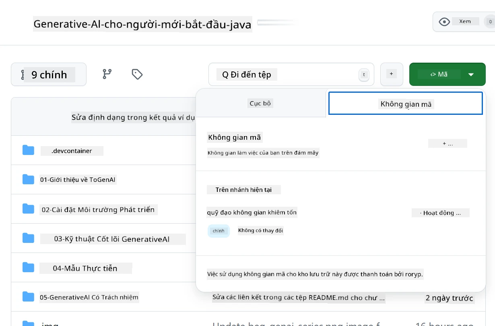
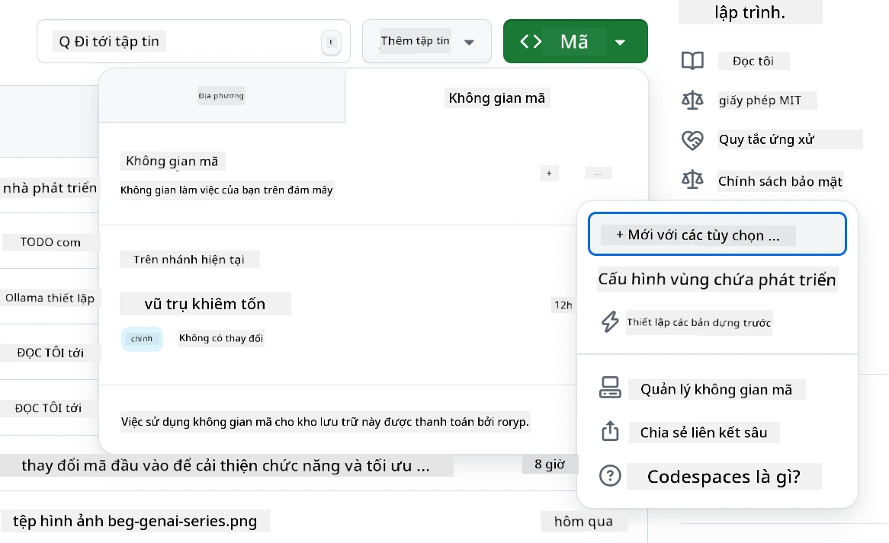
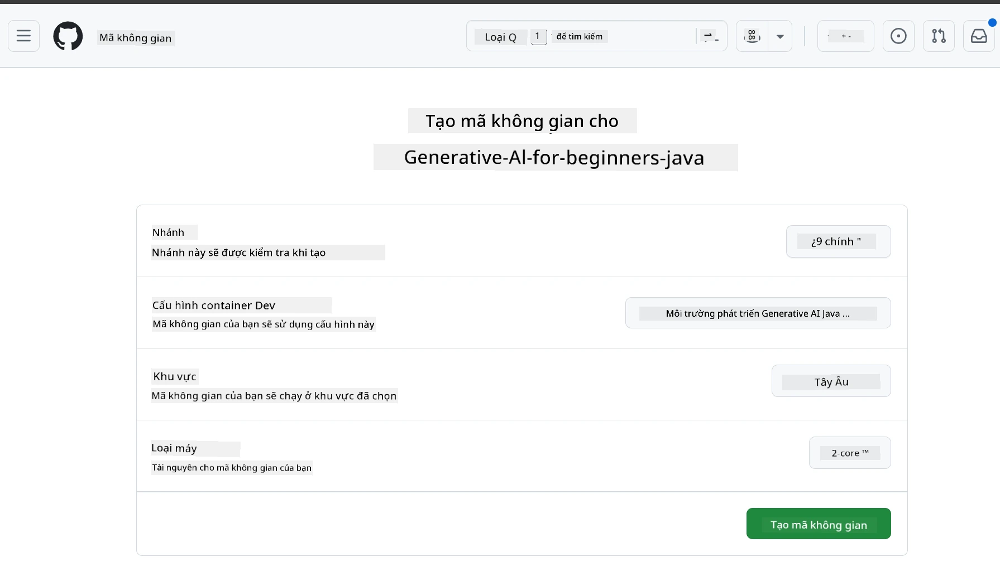
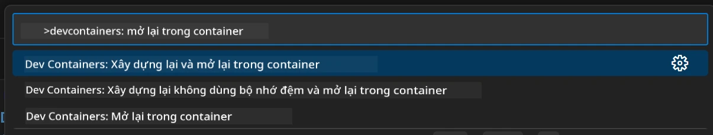
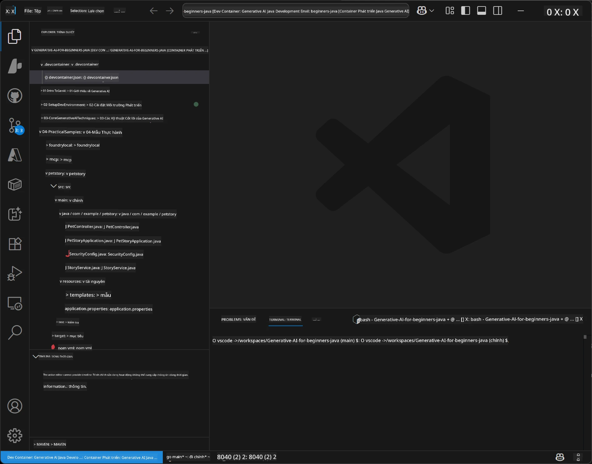
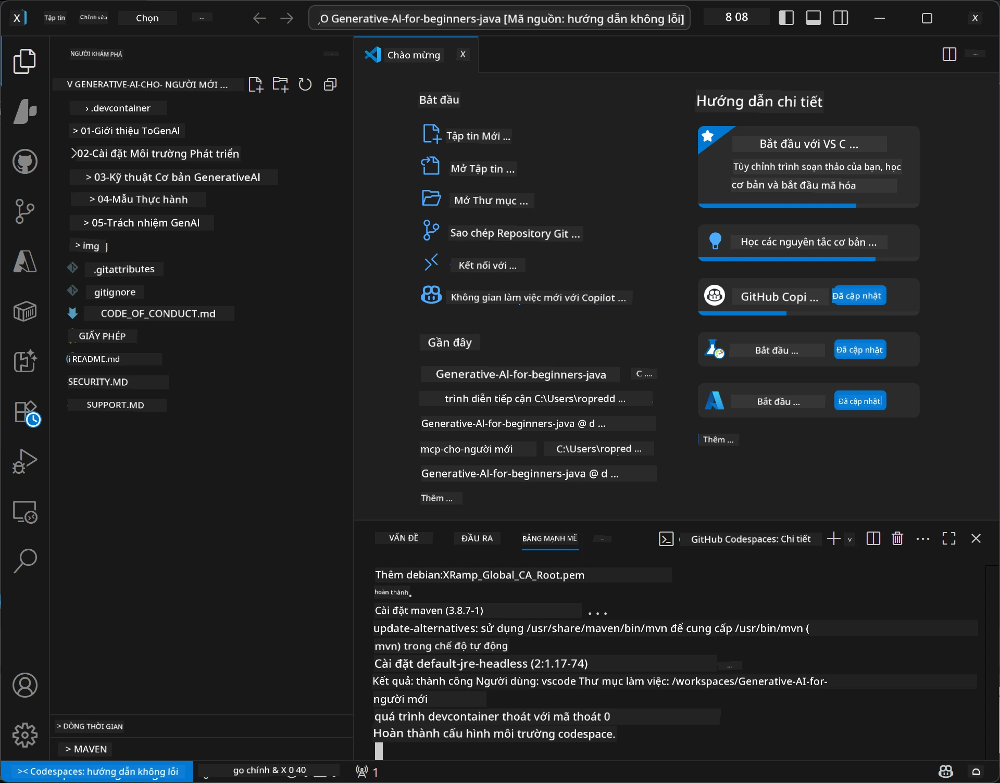

# Thiết Lập Môi Trường Phát Triển cho Generative AI bằng Java

> **Bắt Đầu Nhanh**: Lập trình trên đám mây trong 2 phút - Nhảy tới [Thiết Lập GitHub Codespaces](../../../02-SetupDevEnvironment) - không cần cài đặt cục bộ và sử dụng các mô hình github!

> **Quan tâm đến Azure OpenAI?**, xem [Hướng Dẫn Thiết Lập Azure OpenAI](getting-started-azure-openai.md) với các bước tạo tài nguyên Azure OpenAI mới.

## Bạn Sẽ Học Gì

- Thiết lập môi trường phát triển Java cho các ứng dụng AI
- Chọn và cấu hình môi trường phát triển ưa thích của bạn (ưu tiên đám mây với Codespaces, container dev cục bộ, hoặc thiết lập hoàn toàn cục bộ)
- Kiểm tra thiết lập của bạn bằng cách kết nối với GitHub Models

## Mục Lục

- [Bạn Sẽ Học Gì](../../../02-SetupDevEnvironment)
- [Giới Thiệu](../../../02-SetupDevEnvironment)
- [Bước 1: Thiết Lập Môi Trường Phát Triển](../../../02-SetupDevEnvironment)
  - [Tùy Chọn A: GitHub Codespaces (Khuyến nghị)](../../../02-SetupDevEnvironment)
  - [Tùy Chọn B: Local Dev Container](../../../02-SetupDevEnvironment)
  - [Tùy Chọn C: Sử Dụng Cài Đặt Cục Bộ Hiện Có](../../../02-SetupDevEnvironment)
- [Bước 2: Tạo GitHub Personal Access Token](../../../02-SetupDevEnvironment)
- [Bước 3: Kiểm Tra Thiết Lập](../../../02-SetupDevEnvironment)
- [Khắc Phục Sự Cố](../../../02-SetupDevEnvironment)
- [Tóm Tắt](../../../02-SetupDevEnvironment)
- [Các Bước Tiếp Theo](../../../02-SetupDevEnvironment)

## Giới Thiệu

Chương này sẽ hướng dẫn bạn thiết lập môi trường phát triển. Chúng ta sẽ sử dụng **GitHub Models** làm ví dụ chính vì nó miễn phí, dễ thiết lập chỉ với tài khoản GitHub, không yêu cầu thẻ tín dụng, và cung cấp truy cập tới nhiều mô hình để thử nghiệm.

**Không cần thiết lập cục bộ!** Bạn có thể bắt đầu lập trình ngay bằng GitHub Codespaces, cung cấp môi trường phát triển đầy đủ trên trình duyệt của bạn.


Chúng tôi khuyên bạn dùng [**GitHub Models**](https://github.com/marketplace?type=models) cho khóa học này vì nó:
- **Miễn phí** để bắt đầu
- **Dễ dàng** thiết lập chỉ với tài khoản GitHub
- **Không cần thẻ tín dụng**
- **Nhiều mô hình** để thử nghiệm

> **Lưu ý**: Các GitHub Models sử dụng trong đào tạo này có các giới hạn miễn phí sau:
> - 15 yêu cầu mỗi phút (150 mỗi ngày)
> - ~8,000 từ đầu vào, ~4,000 từ đầu ra mỗi yêu cầu
> - 5 yêu cầu đồng thời
> 
> Để sử dụng sản xuất, nâng cấp lên Azure AI Foundry Models với tài khoản Azure của bạn. Mã của bạn không cần phải thay đổi. Xem [tài liệu Azure AI Foundry](https://learn.microsoft.com/azure/ai-foundry/foundry-models/how-to/quickstart-github-models).


## Bước 1: Thiết Lập Môi Trường Phát Triển

<a name="quick-start-cloud"></a>

Chúng tôi đã tạo sẵn một container phát triển được cấu hình để giảm thiểu thời gian thiết lập và đảm bảo bạn có tất cả công cụ cần thiết cho khóa học Generative AI cho Java này. Chọn phương pháp phát triển bạn ưa thích:

### Các Tùy Chọn Thiết Lập Môi Trường:

#### Tùy Chọn A: GitHub Codespaces (Khuyến nghị)

**Bắt đầu lập trình trong 2 phút - không cần cài đặt cục bộ!**

1. Fork kho lưu trữ này vào tài khoản GitHub của bạn
   > **Lưu ý**: Nếu bạn muốn sửa đổi cấu hình cơ bản, vui lòng xem [Cấu hình Dev Container](../../../.devcontainer/devcontainer.json)
2. Nhấn **Code** → tab **Codespaces** → **...** → **New with options...**
3. Sử dụng mặc định – điều này sẽ chọn **Cấu hình Dev container**: **Generative AI Java Development Environment** devcontainer tùy chỉnh cho khóa học này
4. Nhấn **Create codespace**
5. Chờ khoảng ~2 phút để môi trường sẵn sàng
6. Tiếp tục đến [Bước 2: Tạo GitHub Token](../../../02-SetupDevEnvironment)








> **Lợi Ích của Codespaces**:
> - Không cần cài đặt cục bộ
> - Hoạt động trên mọi thiết bị có trình duyệt
> - Được cấu hình sẵn với tất cả công cụ và phụ thuộc
> - Miễn phí 60 giờ mỗi tháng cho tài khoản cá nhân
> - Môi trường nhất quán cho tất cả học viên

#### Tùy Chọn B: Local Dev Container

**Dành cho lập trình viên thích phát triển cục bộ với Docker**

1. Fork và clone kho lưu trữ này vào máy tính của bạn
   > **Lưu ý**: Nếu bạn muốn sửa đổi cấu hình cơ bản, vui lòng xem [Cấu hình Dev Container](../../../.devcontainer/devcontainer.json)
2. Cài đặt [Docker Desktop](https://www.docker.com/products/docker-desktop/) và [VS Code](https://code.visualstudio.com/)
3. Cài đặt [Tiện ích Dev Containers extension](https://marketplace.visualstudio.com/items?itemName=ms-vscode-remote.remote-containers) trong VS Code
4. Mở thư mục kho lưu trữ trong VS Code
5. Khi có thông báo, nhấp **Reopen in Container** (hoặc dùng `Ctrl+Shift+P` → "Dev Containers: Reopen in Container")
6. Chờ container được xây dựng và khởi động
7. Tiếp tục đến [Bước 2: Tạo GitHub Token](../../../02-SetupDevEnvironment)





#### Tùy Chọn C: Sử Dụng Cài Đặt Cục Bộ Hiện Có

**Dành cho lập trình viên có môi trường Java hiện có**

Yêu cầu trước:
- [Java 21+](https://www.oracle.com/java/technologies/javase/jdk21-archive-downloads.html)
- [Maven 3.9+](https://maven.apache.org/download.cgi)
- [VS Code](https://code.visualstudio.com) hoặc IDE bạn thích

Các bước:
1. Clone kho lưu trữ này vào máy của bạn
2. Mở dự án trong IDE của bạn
3. Tiếp tục đến [Bước 2: Tạo GitHub Token](../../../02-SetupDevEnvironment)

> **Mẹo Chuyên Nghiệp**: Nếu máy bạn cấu hình thấp nhưng muốn sử dụng VS Code cục bộ, hãy sử dụng GitHub Codespaces! Bạn có thể kết nối VS Code cục bộ với Codespace trên đám mây để tận hưởng cả hai thế giới.




## Bước 2: Tạo GitHub Personal Access Token

1. Truy cập [GitHub Settings](https://github.com/settings/profile) và chọn **Settings** trong menu profile.
2. Ở thanh bên trái, nhấn **Developer settings** (thường ở dưới cùng).
3. Dưới **Personal access tokens**, nhấn **Fine-grained tokens** (hoặc theo đường dẫn trực tiếp này [link](https://github.com/settings/personal-access-tokens)).
4. Nhấn **Generate new token**.
5. Ở phần "Token name", nhập tên mô tả (ví dụ, `GenAI-Java-Course-Token`).
6. Đặt ngày hết hạn (khuyến nghị: 7 ngày để đảm bảo bảo mật tốt).
7. Ở phần "Resource owner", chọn tài khoản người dùng của bạn.
8. Ở phần "Repository access", chọn kho lưu trữ bạn muốn dùng với GitHub Models (hoặc "All repositories" nếu cần).
9. Ở phần "Account permissions", tìm **Models** và đặt quyền thành **Read-only**.
10. Nhấn **Generate token**.
11. **Sao chép và lưu token ngay bây giờ** – bạn sẽ không thấy lại nó nữa!

> **Mẹo bảo mật**: Sử dụng phạm vi quyền tối thiểu cần thiết và thời gian hết hạn ngắn nhất phù hợp cho các token truy cập của bạn.

## Bước 3: Kiểm Tra Thiết Lập Với Ví Dụ GitHub Models

Khi môi trường phát triển của bạn đã sẵn sàng, hãy kiểm tra tích hợp GitHub Models với ứng dụng ví dụ của chúng ta trong [`02-SetupDevEnvironment/examples/github-models`](../../../02-SetupDevEnvironment/examples/github-models).

1. Mở terminal trong môi trường phát triển của bạn.
2. Điều hướng tới ví dụ GitHub Models:
   ```bash
   cd 02-SetupDevEnvironment/examples/github-models
   ```
3. Thiết lập token GitHub của bạn làm biến môi trường:
   ```bash
   # macOS/Linux
   export GITHUB_TOKEN=your_token_here
   
   # Windows (Dấu nhắc lệnh)
   set GITHUB_TOKEN=your_token_here
   
   # Windows (PowerShell)
   $env:GITHUB_TOKEN="your_token_here"
   ```

4. Chạy ứng dụng:
   ```bash
   mvn compile exec:java -Dexec.mainClass="com.example.githubmodels.App"
   ```

Bạn sẽ thấy kết quả tương tự:
```text
Using model: gpt-4.1-nano
Sending request to GitHub Models...
Response: Hello World!
```

### Hiểu Về Mã Ví Dụ

Trước tiên, hãy hiểu những gì chúng ta vừa chạy. Ví dụ trong `examples/github-models` sử dụng SDK OpenAI Java để kết nối với GitHub Models:

**Mã này làm gì:**
- **Kết nối** tới GitHub Models sử dụng personal access token của bạn
- **Gửi** thông điệp đơn giản "Say Hello World!" tới mô hình AI
- **Nhận** và hiển thị phản hồi của AI
- **Xác nhận** thiết lập của bạn hoạt động đúng

**Phụ thuộc chính** (trong `pom.xml`):
```xml
<dependency>
    <groupId>com.openai</groupId>
    <artifactId>openai-java</artifactId>
    <version>2.12.0</version>
</dependency>
```

**Mã chính** (`App.java`):
```java
// Kết nối với GitHub Models sử dụng OpenAI Java SDK
OpenAIClient client = OpenAIOkHttpClient.builder()
    .apiKey(pat)
    .baseUrl("https://models.inference.ai.azure.com")
    .build();

// Tạo yêu cầu hoàn thành trò chuyện
ChatCompletionCreateParams params = ChatCompletionCreateParams.builder()
    .model(modelId)
    .addSystemMessage("You are a concise assistant.")
    .addUserMessage("Say Hello World!")
    .build();

// Nhận phản hồi AI
ChatCompletion response = client.chat().completions().create(params);
System.out.println("Response: " + response.choices().get(0).message().content().orElse("No response content"));
```

## Tóm Tắt

Tuyệt vời! Bạn đã có mọi thứ được thiết lập:

- Đã tạo GitHub Personal Access Token với quyền phù hợp truy cập mô hình AI
- Môi trường phát triển Java của bạn đang chạy (dù là Codespaces, dev container, hay cục bộ)
- Kết nối thành công với GitHub Models dùng OpenAI Java SDK để phát triển AI miễn phí
- Kiểm tra mọi thứ hoạt động với ví dụ đơn giản trao đổi với mô hình AI

## Các Bước Tiếp Theo

[Chương 3: Các Kỹ Thuật Generative AI Cốt Lõi](../03-CoreGenerativeAITechniques/README.md)

## Khắc Phục Sự Cố

Gặp sự cố? Dưới đây là các vấn đề phổ biến và cách giải quyết:

- **Token không hoạt động?** 
  - Đảm bảo bạn đã sao chép toàn bộ token không có khoảng trắng thừa
  - Kiểm tra token đã được thiết lập đúng làm biến môi trường
  - Xác nhận token có quyền đúng (Models: Read-only)

- **Không tìm thấy Maven?** 
  - Nếu dùng dev container/Codespaces, Maven đã được cài sẵn
  - Với thiết lập cục bộ, đảm bảo đã cài Java 21+ và Maven 3.9+
  - Thử chạy `mvn --version` để kiểm tra cài đặt

- **Lỗi kết nối?** 
  - Kiểm tra kết nối internet của bạn
  - Xác nhận GitHub có thể truy cập được từ mạng của bạn
  - Đảm bảo không có firewall chặn endpoint GitHub Models

- **Dev container không khởi động?** 
  - Đảm bảo Docker Desktop đang chạy (với phát triển cục bộ)
  - Thử xây lại container: `Ctrl+Shift+P` → "Dev Containers: Rebuild Container"

- **Lỗi biên dịch ứng dụng?**
  - Đảm bảo bạn ở đúng thư mục: `02-SetupDevEnvironment/examples/github-models`
  - Thử dọn dẹp và build lại: `mvn clean compile`

> **Cần giúp đỡ?**: Vẫn gặp sự cố? Hãy mở một issue trong kho lưu trữ và chúng tôi sẽ giúp bạn.

---

<!-- CO-OP TRANSLATOR DISCLAIMER START -->
**Tuyên bố miễn trách nhiệm**:  
Tài liệu này đã được dịch bằng dịch vụ dịch thuật AI [Co-op Translator](https://github.com/Azure/co-op-translator). Mặc dù chúng tôi cố gắng đảm bảo độ chính xác, xin lưu ý rằng các bản dịch tự động có thể chứa lỗi hoặc không chính xác. Văn bản gốc bằng ngôn ngữ gốc của tài liệu mới là nguồn tham khảo chính xác nhất. Đối với thông tin quan trọng, nên sử dụng dịch vụ dịch thuật chuyên nghiệp do con người thực hiện. Chúng tôi không chịu trách nhiệm về bất kỳ sự hiểu lầm hoặc diễn giải sai nào phát sinh từ việc sử dụng bản dịch này.
<!-- CO-OP TRANSLATOR DISCLAIMER END -->