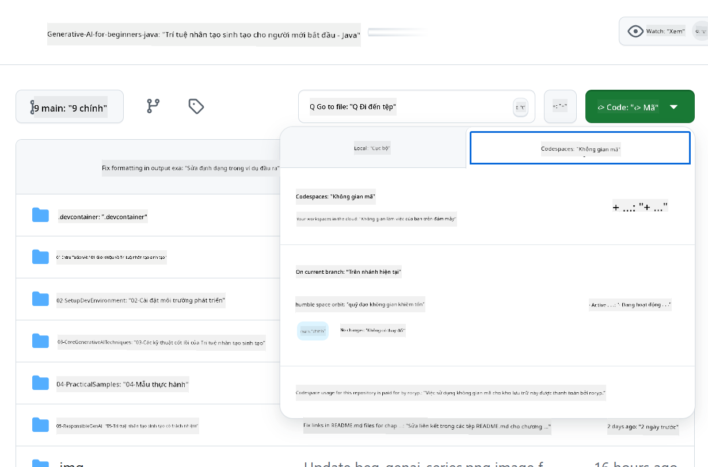

<!--
CO_OP_TRANSLATOR_METADATA:
{
  "original_hash": "bfdb4b4eadbee3a59ef742439f58326a",
  "translation_date": "2025-07-27T13:18:18+00:00",
  "source_file": "02-SetupDevEnvironment/getting-started-azure-openai.md",
  "language_code": "vi"
}
-->
# Thiết Lập Môi Trường Phát Triển cho Azure OpenAI

> **Bắt Đầu Nhanh**: Hướng dẫn này dành cho thiết lập Azure OpenAI. Để bắt đầu ngay với các mô hình miễn phí, hãy sử dụng [GitHub Models với Codespaces](./README.md#quick-start-cloud).

Hướng dẫn này sẽ giúp bạn thiết lập các mô hình Azure AI Foundry cho ứng dụng Java AI trong khóa học này.

## Mục Lục

- [Tổng Quan Thiết Lập Nhanh](../../../02-SetupDevEnvironment)
- [Bước 1: Tạo Tài Nguyên Azure AI Foundry](../../../02-SetupDevEnvironment)
  - [Tạo Hub và Dự Án](../../../02-SetupDevEnvironment)
  - [Triển Khai Mô Hình GPT-4o-mini](../../../02-SetupDevEnvironment)
- [Bước 2: Tạo Codespace của Bạn](../../../02-SetupDevEnvironment)
- [Bước 3: Cấu Hình Môi Trường của Bạn](../../../02-SetupDevEnvironment)
- [Bước 4: Kiểm Tra Thiết Lập của Bạn](../../../02-SetupDevEnvironment)
- [Tiếp Theo Là Gì?](../../../02-SetupDevEnvironment)
- [Tài Nguyên](../../../02-SetupDevEnvironment)
- [Tài Nguyên Bổ Sung](../../../02-SetupDevEnvironment)

## Tổng Quan Thiết Lập Nhanh

1. Tạo tài nguyên Azure AI Foundry (Hub, Dự Án, Mô Hình)
2. Tạo Codespace với container phát triển Java
3. Cấu hình tệp .env với thông tin đăng nhập Azure OpenAI
4. Kiểm tra thiết lập của bạn với dự án mẫu

## Bước 1: Tạo Tài Nguyên Azure AI Foundry

### Tạo Hub và Dự Án

1. Truy cập [Azure AI Foundry Portal](https://ai.azure.com/) và đăng nhập
2. Nhấp vào **+ Create** → **New hub** (hoặc điều hướng đến **Management** → **All hubs** → **+ New hub**)
3. Cấu hình hub của bạn:
   - **Tên Hub**: ví dụ, "MyAIHub"
   - **Subscription**: Chọn gói Azure của bạn
   - **Nhóm Tài Nguyên**: Tạo mới hoặc chọn nhóm hiện có
   - **Vị trí**: Chọn vị trí gần bạn nhất
   - **Tài khoản lưu trữ**: Sử dụng mặc định hoặc cấu hình tùy chỉnh
   - **Key vault**: Sử dụng mặc định hoặc cấu hình tùy chỉnh
   - Nhấp vào **Next** → **Review + create** → **Create**
4. Sau khi tạo, nhấp vào **+ New project** (hoặc **Create project** từ trang tổng quan của hub)
   - **Tên Dự Án**: ví dụ, "GenAIJava"
   - Nhấp vào **Create**

### Triển Khai Mô Hình GPT-4o-mini

1. Trong dự án của bạn, điều hướng đến **Model catalog** và tìm kiếm **gpt-4o-mini**
   - *Lựa chọn khác: Điều hướng đến **Deployments** → **+ Create deployment***
2. Nhấp vào **Deploy** trên thẻ mô hình gpt-4o-mini
3. Cấu hình triển khai:
   - **Tên Triển Khai**: "gpt-4o-mini"
   - **Phiên bản Mô Hình**: Sử dụng phiên bản mới nhất
   - **Loại Triển Khai**: Standard
4. Nhấp vào **Deploy**
5. Sau khi triển khai, điều hướng đến tab **Deployments** và sao chép các giá trị sau:
   - **Tên Triển Khai** (ví dụ, "gpt-4o-mini")
   - **Target URI** (ví dụ, `https://your-hub-name.openai.azure.com/`) 
      > **Quan Trọng**: Chỉ sao chép URL cơ bản (ví dụ, `https://myhub.openai.azure.com/`) không phải toàn bộ đường dẫn endpoint.
   - **Key** (từ phần Keys and Endpoint)

> **Vẫn gặp khó khăn?** Truy cập tài liệu chính thức [Azure AI Foundry Documentation](https://learn.microsoft.com/azure/ai-foundry/how-to/create-projects?tabs=ai-foundry&pivots=hub-project)

## Bước 2: Tạo Codespace của Bạn

1. Fork repository này vào tài khoản GitHub của bạn
   > **Lưu ý**: Nếu bạn muốn chỉnh sửa cấu hình cơ bản, hãy xem [Dev Container Configuration](../../../.devcontainer/devcontainer.json)
2. Trong repo đã fork, nhấp vào **Code** → tab **Codespaces**
3. Nhấp vào **...** → **New with options...**

4. Chọn **Cấu hình container phát triển**: 
   - **Môi Trường Phát Triển Generative AI Java**
5. Nhấp vào **Create codespace**

## Bước 3: Cấu Hình Môi Trường của Bạn

Khi Codespace của bạn đã sẵn sàng, thiết lập thông tin đăng nhập Azure OpenAI:

1. **Điều hướng đến dự án mẫu từ thư mục gốc của repository:**
   ```bash
   cd 02-SetupDevEnvironment/examples/basic-chat-azure
   ```

2. **Tạo tệp .env của bạn:**
   ```bash
   cp .env.example .env
   ```

3. **Chỉnh sửa tệp .env với thông tin đăng nhập Azure OpenAI của bạn:**
   ```bash
   # Your Azure OpenAI API key (from Azure AI Foundry portal)
   AZURE_AI_KEY=your-actual-api-key-here
   
   # Your Azure OpenAI endpoint URL (e.g., https://myhub.openai.azure.com/)
   AZURE_AI_ENDPOINT=https://your-hub-name.openai.azure.com/
   ```

   > **Lưu Ý Bảo Mật**: 
   > - Không bao giờ commit tệp `.env` vào hệ thống kiểm soát phiên bản
   > - Tệp `.env` đã được thêm vào `.gitignore`
   > - Giữ an toàn cho các khóa API của bạn và xoay vòng chúng thường xuyên

## Bước 4: Kiểm Tra Thiết Lập của Bạn

Chạy ứng dụng mẫu để kiểm tra kết nối Azure OpenAI:

```bash
mvn clean spring-boot:run
```

Bạn sẽ thấy phản hồi từ mô hình GPT-4o-mini!

> **Người Dùng VS Code**: Bạn cũng có thể nhấn `F5` trong VS Code để chạy ứng dụng. Cấu hình khởi chạy đã được thiết lập để tự động tải tệp `.env` của bạn.

> **Ví dụ đầy đủ**: Xem [Ví dụ Azure OpenAI End-to-End](./examples/basic-chat-azure/README.md) để biết hướng dẫn chi tiết và cách khắc phục sự cố.

## Tiếp Theo Là Gì?

**Thiết Lập Hoàn Tất!** Bạn đã có:
- Azure OpenAI với gpt-4o-mini được triển khai
- Cấu hình tệp .env cục bộ
- Môi trường phát triển Java sẵn sàng

**Tiếp tục đến** [Chương 3: Kỹ Thuật Generative AI Cốt Lõi](../03-CoreGenerativeAITechniques/README.md) để bắt đầu xây dựng ứng dụng AI!

## Tài Nguyên

- [Tài liệu Azure AI Foundry](https://learn.microsoft.com/azure/ai-services/)
- [Tài liệu Spring AI Azure OpenAI](https://docs.spring.io/spring-ai/reference/api/clients/azure-openai-chat.html)
- [Azure OpenAI Java SDK](https://learn.microsoft.com/java/api/overview/azure/ai-openai-readme)

## Tài Nguyên Bổ Sung

- [Tải VS Code](https://code.visualstudio.com/Download)
- [Tải Docker Desktop](https://www.docker.com/products/docker-desktop)
- [Cấu hình Dev Container](../../../.devcontainer/devcontainer.json)

**Tuyên bố miễn trừ trách nhiệm**:  
Tài liệu này đã được dịch bằng dịch vụ dịch thuật AI [Co-op Translator](https://github.com/Azure/co-op-translator). Mặc dù chúng tôi cố gắng đảm bảo độ chính xác, xin lưu ý rằng các bản dịch tự động có thể chứa lỗi hoặc không chính xác. Tài liệu gốc bằng ngôn ngữ bản địa nên được coi là nguồn thông tin chính thức. Đối với các thông tin quan trọng, nên sử dụng dịch vụ dịch thuật chuyên nghiệp từ con người. Chúng tôi không chịu trách nhiệm về bất kỳ sự hiểu lầm hoặc diễn giải sai nào phát sinh từ việc sử dụng bản dịch này.