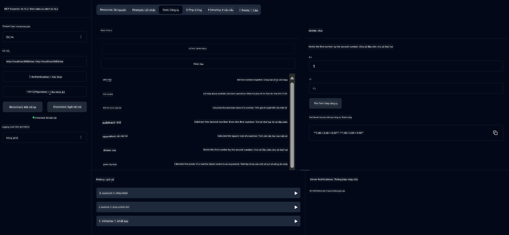

<!--
CO_OP_TRANSLATOR_METADATA:
{
  "original_hash": "7bf9a4a832911269a8bd0decb97ff36c",
  "translation_date": "2025-07-21T19:59:48+00:00",
  "source_file": "04-PracticalSamples/mcp/calculator/README.md",
  "language_code": "vi"
}
-->
# Dịch vụ Máy tính Cơ bản MCP

>**Note**: Chương này bao gồm một [**Hướng dẫn**](./TUTORIAL.md) giúp bạn chạy các mẫu hoàn chỉnh.

Chào mừng bạn đến với trải nghiệm thực hành đầu tiên về **Giao thức Ngữ cảnh Mô hình (MCP)**! Trong các chương trước, bạn đã tìm hiểu về các nguyên lý cơ bản của AI tạo sinh và thiết lập môi trường phát triển. Bây giờ là lúc xây dựng một ứng dụng thực tế.

Dịch vụ máy tính này minh họa cách các mô hình AI có thể tương tác an toàn với các công cụ bên ngoài bằng MCP. Thay vì dựa vào khả năng tính toán đôi khi không chính xác của mô hình AI, chúng tôi sẽ hướng dẫn cách xây dựng một hệ thống mạnh mẽ, nơi AI có thể gọi các dịch vụ chuyên biệt để thực hiện các phép tính chính xác.

## Mục lục

- [Những gì bạn sẽ học](../../../../../04-PracticalSamples/mcp/calculator)
- [Yêu cầu trước](../../../../../04-PracticalSamples/mcp/calculator)
- [Các khái niệm chính](../../../../../04-PracticalSamples/mcp/calculator)
- [Bắt đầu nhanh](../../../../../04-PracticalSamples/mcp/calculator)
- [Các phép toán máy tính có sẵn](../../../../../04-PracticalSamples/mcp/calculator)
- [Các ứng dụng thử nghiệm](../../../../../04-PracticalSamples/mcp/calculator)
  - [1. Ứng dụng MCP trực tiếp (SDKClient)](../../../../../04-PracticalSamples/mcp/calculator)
  - [2. Ứng dụng hỗ trợ AI (LangChain4jClient)](../../../../../04-PracticalSamples/mcp/calculator)
- [MCP Inspector (Giao diện Web)](../../../../../04-PracticalSamples/mcp/calculator)
  - [Hướng dẫn từng bước](../../../../../04-PracticalSamples/mcp/calculator)

## Những gì bạn sẽ học

Khi làm việc qua ví dụ này, bạn sẽ hiểu:
- Cách tạo các dịch vụ tương thích MCP bằng Spring Boot
- Sự khác biệt giữa giao tiếp giao thức trực tiếp và tương tác hỗ trợ AI
- Cách các mô hình AI quyết định khi nào và cách sử dụng các công cụ bên ngoài
- Các thực hành tốt nhất để xây dựng ứng dụng AI tích hợp công cụ

Hoàn hảo cho người mới bắt đầu học các khái niệm MCP và sẵn sàng xây dựng tích hợp công cụ AI đầu tiên!

## Yêu cầu trước

- Java 21+
- Maven 3.6+
- **GitHub Token**: Cần thiết cho ứng dụng hỗ trợ AI. Nếu bạn chưa thiết lập, hãy xem [Chương 2: Thiết lập môi trường phát triển](../../../02-SetupDevEnvironment/README.md) để biết hướng dẫn.

## Các khái niệm chính

**Giao thức Ngữ cảnh Mô hình (MCP)** là một cách tiêu chuẩn hóa để các ứng dụng AI kết nối an toàn với các công cụ bên ngoài. Hãy nghĩ về nó như một "cây cầu" cho phép các mô hình AI sử dụng các dịch vụ bên ngoài như máy tính của chúng ta. Thay vì để mô hình AI tự thực hiện phép toán (có thể không chính xác), nó có thể gọi dịch vụ máy tính của chúng ta để nhận kết quả chính xác. MCP đảm bảo giao tiếp này diễn ra an toàn và nhất quán.

**Sự kiện do máy chủ gửi (SSE)** cho phép giao tiếp thời gian thực giữa máy chủ và ứng dụng khách. Không giống như các yêu cầu HTTP truyền thống, nơi bạn yêu cầu và chờ phản hồi, SSE cho phép máy chủ liên tục gửi cập nhật đến ứng dụng khách. Điều này rất phù hợp cho các ứng dụng AI, nơi phản hồi có thể được truyền trực tiếp hoặc mất thời gian để xử lý.

**Công cụ AI & Gọi hàm** cho phép các mô hình AI tự động chọn và sử dụng các hàm bên ngoài (như các phép toán máy tính) dựa trên yêu cầu của người dùng. Khi bạn hỏi "15 + 27 bằng bao nhiêu?", mô hình AI hiểu rằng bạn muốn thực hiện phép cộng, tự động gọi công cụ `add` với các tham số đúng (15, 27), và trả về kết quả bằng ngôn ngữ tự nhiên. AI hoạt động như một điều phối viên thông minh, biết khi nào và cách sử dụng từng công cụ.

## Bắt đầu nhanh

### 1. Điều hướng đến thư mục ứng dụng máy tính
```bash
cd Generative-AI-for-beginners-java/04-PracticalSamples/mcp/calculator
```

### 2. Xây dựng & Chạy
```bash
mvn clean install -DskipTests
java -jar target/calculator-server-0.0.1-SNAPSHOT.jar
```

### 2. Kiểm tra với các ứng dụng
- **SDKClient**: Giao tiếp giao thức MCP trực tiếp
- **LangChain4jClient**: Tương tác ngôn ngữ tự nhiên hỗ trợ AI (cần GitHub token)

## Các phép toán máy tính có sẵn

- `add(a, b)`, `subtract(a, b)`, `multiply(a, b)`, `divide(a, b)`
- `power(base, exponent)`, `squareRoot(number)`, `absolute(number)`
- `modulus(a, b)`, `help()`

## Các ứng dụng thử nghiệm

### 1. Ứng dụng MCP trực tiếp (SDKClient)
Kiểm tra giao tiếp giao thức MCP thô. Chạy với:
```bash
mvn test-compile exec:java -Dexec.mainClass="com.microsoft.mcp.sample.client.SDKClient" -Dexec.classpathScope=test
```

### 2. Ứng dụng hỗ trợ AI (LangChain4jClient)
Minh họa tương tác ngôn ngữ tự nhiên với GitHub Models. Cần GitHub token (xem [Yêu cầu trước](../../../../../04-PracticalSamples/mcp/calculator)).

**Chạy:**
```bash
mvn test-compile exec:java -Dexec.mainClass="com.microsoft.mcp.sample.client.LangChain4jClient" -Dexec.classpathScope=test
```

## MCP Inspector (Giao diện Web)

MCP Inspector cung cấp một giao diện web trực quan để kiểm tra dịch vụ MCP của bạn mà không cần viết mã. Hoàn hảo cho người mới bắt đầu để hiểu cách MCP hoạt động!

### Hướng dẫn từng bước:

1. **Khởi động máy chủ máy tính** (nếu chưa chạy):
   ```bash
   java -jar target/calculator-server-0.0.1-SNAPSHOT.jar
   ```

2. **Cài đặt và chạy MCP Inspector** trong một terminal mới:
   ```bash
   npx @modelcontextprotocol/inspector
   ```

3. **Mở giao diện web**:
   - Tìm thông báo như "Inspector running at http://localhost:6274"
   - Mở URL đó trong trình duyệt web của bạn

4. **Kết nối với dịch vụ máy tính của bạn**:
   - Trong giao diện web, đặt loại giao thức thành "SSE"
   - Đặt URL thành: `http://localhost:8080/sse`
   - Nhấn nút "Connect"

5. **Khám phá các công cụ có sẵn**:
   - Nhấn "List Tools" để xem tất cả các phép toán máy tính
   - Bạn sẽ thấy các hàm như `add`, `subtract`, `multiply`, v.v.

6. **Kiểm tra một phép toán máy tính**:
   - Chọn một công cụ (ví dụ: "add")
   - Nhập các tham số (ví dụ: `a: 15`, `b: 27`)
   - Nhấn "Run Tool"
   - Xem kết quả trả về từ dịch vụ MCP của bạn!

Cách tiếp cận trực quan này giúp bạn hiểu chính xác cách giao tiếp MCP hoạt động trước khi xây dựng các ứng dụng của riêng mình.



---
**Tham khảo:** [Tài liệu MCP Server Boot Starter](https://docs.spring.io/spring-ai/reference/api/mcp/mcp-server-boot-starter-docs.html)

**Tuyên bố miễn trừ trách nhiệm**:  
Tài liệu này đã được dịch bằng dịch vụ dịch thuật AI [Co-op Translator](https://github.com/Azure/co-op-translator). Mặc dù chúng tôi cố gắng đảm bảo độ chính xác, xin lưu ý rằng các bản dịch tự động có thể chứa lỗi hoặc không chính xác. Tài liệu gốc bằng ngôn ngữ bản địa nên được coi là nguồn thông tin chính thức. Đối với các thông tin quan trọng, khuyến nghị sử dụng dịch vụ dịch thuật chuyên nghiệp bởi con người. Chúng tôi không chịu trách nhiệm cho bất kỳ sự hiểu lầm hoặc diễn giải sai nào phát sinh từ việc sử dụng bản dịch này.