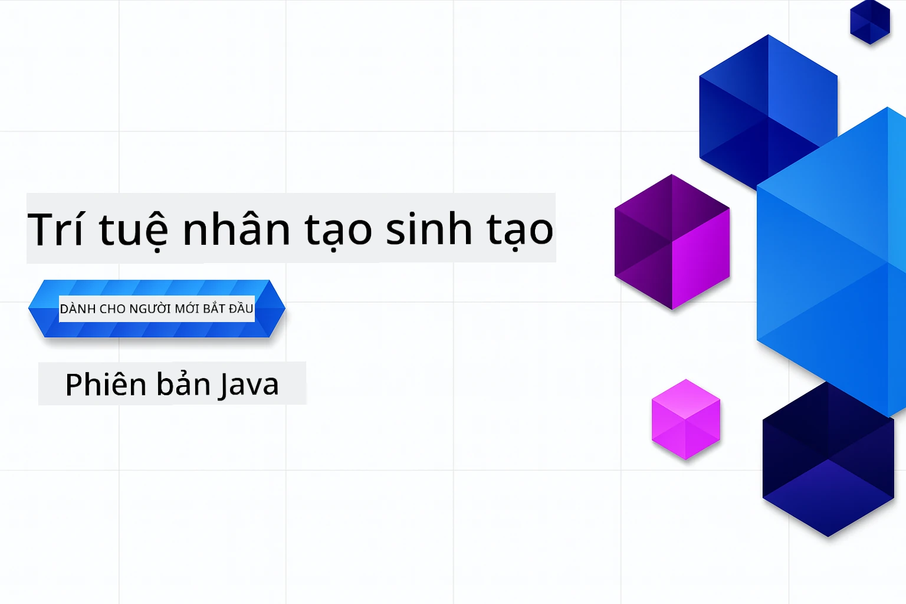

<!--
CO_OP_TRANSLATOR_METADATA:
{
  "original_hash": "459109e7c925f3a7b94440ad61c596a0",
  "translation_date": "2026-01-05T09:34:05+00:00",
  "source_file": "README.md",
  "language_code": "vi"
}
-->
# Generative AI cho Người mới bắt đầu - Phiên bản Java
[](https://discord.gg/nTYy5BXMWG)



**Thời gian cam kết**: Toàn bộ hội thảo có thể hoàn thành trực tuyến mà không cần cài đặt cục bộ. Việc thiết lập môi trường mất 2 phút, khám phá các ví dụ mẫu cần từ 1-3 giờ tùy thuộc vào độ sâu khám phá.

> **Bắt đầu nhanh**

1. Fork kho lưu trữ này vào tài khoản GitHub của bạn
2. Nhấp **Code** → tab **Codespaces** → **...** → **New with options...**
3. Sử dụng mặc định – việc này sẽ chọn container Phát triển được tạo cho khoá học này
4. Nhấp **Create codespace**
5. Chờ khoảng 2 phút để môi trường sẵn sàng
6. Tiếp tục ngay đến [Ví dụ đầu tiên](./02-SetupDevEnvironment/README.md#step-2-create-a-github-personal-access-token)

> **Ưu tiên Clone Cục bộ?**
>
> Kho lưu trữ này bao gồm hơn 50 bản dịch ngôn ngữ, điều này làm tăng kích thước tải xuống đáng kể. Để clone mà không có bản dịch, sử dụng sparse checkout:
> ```bash
> git clone --filter=blob:none --sparse https://github.com/microsoft/Generative-AI-for-beginners-java.git
> cd Generative-AI-for-beginners-java
> git sparse-checkout set --no-cone '/*' '!translations' '!translated_images'
> ```
> Điều này cung cấp cho bạn mọi thứ cần thiết để hoàn thành khoá học với tốc độ tải xuống nhanh hơn nhiều.


## Hỗ trợ Đa Ngôn ngữ

### Hỗ trợ qua GitHub Action (Tự động & Luôn cập nhật)

<!-- CO-OP TRANSLATOR LANGUAGES TABLE START -->
[Tiếng Ả Rập](../ar/README.md) | [Tiếng Bengal](../bn/README.md) | [Tiếng Bungari](../bg/README.md) | [Tiếng Miến Điện (Myanmar)](../my/README.md) | [Tiếng Trung (Giản thể)](../zh/README.md) | [Tiếng Trung (Phồn thể, Hồng Kông)](../hk/README.md) | [Tiếng Trung (Phồn thể, Macao)](../mo/README.md) | [Tiếng Trung (Phồn thể, Đài Loan)](../tw/README.md) | [Tiếng Croatia](../hr/README.md) | [Tiếng Séc](../cs/README.md) | [Tiếng Đan Mạch](../da/README.md) | [Tiếng Hà Lan](../nl/README.md) | [Tiếng Estonia](../et/README.md) | [Tiếng Phần Lan](../fi/README.md) | [Tiếng Pháp](../fr/README.md) | [Tiếng Đức](../de/README.md) | [Tiếng Hy Lạp](../el/README.md) | [Tiếng Hebrew](../he/README.md) | [Tiếng Hindi](../hi/README.md) | [Tiếng Hungary](../hu/README.md) | [Tiếng Indonesia](../id/README.md) | [Tiếng Ý](../it/README.md) | [Tiếng Nhật](../ja/README.md) | [Tiếng Kannada](../kn/README.md) | [Tiếng Hàn](../ko/README.md) | [Tiếng Litva](../lt/README.md) | [Tiếng Mã Lai](../ms/README.md) | [Tiếng Malayalam](../ml/README.md) | [Tiếng Marathi](../mr/README.md) | [Tiếng Nepal](../ne/README.md) | [Tiếng Pidgin Nigeria](../pcm/README.md) | [Tiếng Na Uy](../no/README.md) | [Tiếng Ba Tư (Farsi)](../fa/README.md) | [Tiếng Ba Lan](../pl/README.md) | [Tiếng Bồ Đào Nha (Brazil)](../br/README.md) | [Tiếng Bồ Đào Nha (Bồ Đào Nha)](../pt/README.md) | [Tiếng Punjabi (Gurmukhi)](../pa/README.md) | [Tiếng Romania](../ro/README.md) | [Tiếng Nga](../ru/README.md) | [Tiếng Serbia (Chữ Kirin)](../sr/README.md) | [Tiếng Slovakia](../sk/README.md) | [Tiếng Slovenia](../sl/README.md) | [Tiếng Tây Ban Nha](../es/README.md) | [Tiếng Swahili](../sw/README.md) | [Tiếng Thụy Điển](../sv/README.md) | [Tiếng Tagalog (Philippines)](../tl/README.md) | [Tiếng Tamil](../ta/README.md) | [Tiếng Telugu](../te/README.md) | [Tiếng Thái](../th/README.md) | [Tiếng Thổ Nhĩ Kỳ](../tr/README.md) | [Tiếng Ukraina](../uk/README.md) | [Tiếng Urdu](../ur/README.md) | [Tiếng Việt](./README.md)

> **Ưu tiên Clone Cục bộ?**

> Kho lưu trữ này bao gồm hơn 50 bản dịch ngôn ngữ, điều này làm tăng kích thước tải xuống đáng kể. Để clone mà không có bản dịch, sử dụng sparse checkout:
> ```bash
> git clone --filter=blob:none --sparse https://github.com/microsoft/Generative-AI-for-beginners-java.git
> cd Generative-AI-for-beginners-java
> git sparse-checkout set --no-cone '/*' '!translations' '!translated_images'
> ```
> Điều này cung cấp cho bạn mọi thứ cần thiết để hoàn thành khoá học với tốc độ tải xuống nhanh hơn nhiều.
<!-- CO-OP TRANSLATOR LANGUAGES TABLE END -->

## Cấu trúc khoá học & Lộ trình học

### **Chương 1: Giới thiệu về Generative AI**
- **Khái niệm cốt lõi**: Hiểu về Mô hình Ngôn ngữ lớn, token, embeddings và khả năng AI
- **Hệ sinh thái AI Java**: Tổng quan về Spring AI và OpenAI SDKs
- **Giao thức Ngữ cảnh Mô hình**: Giới thiệu MCP và vai trò của nó trong giao tiếp tác nhân AI
- **Ứng dụng thực tế**: Các kịch bản thực tế bao gồm chatbot và tạo nội dung
- **[→ Bắt đầu Chương 1](./01-IntroToGenAI/README.md)**

### **Chương 2: Thiết lập Môi trường Phát triển**
- **Cấu hình đa nhà cung cấp**: Thiết lập GitHub Models, Azure OpenAI, và tích hợp OpenAI Java SDK
- **Spring Boot + Spring AI**: Thực hành tốt nhất để phát triển ứng dụng AI doanh nghiệp
- **GitHub Models**: Truy cập mô hình AI miễn phí để tạo mẫu và học tập (không cần thẻ tín dụng)
- **Công cụ phát triển**: Cấu hình docker container, VS Code, và GitHub Codespaces
- **[→ Bắt đầu Chương 2](./02-SetupDevEnvironment/README.md)**

### **Chương 3: Kỹ thuật Generative AI cốt lõi**
- **Kỹ thuật Prompt Engineering**: Kỹ thuật để có câu trả lời tối ưu từ mô hình AI
- **Embeddings & các phép toán Vector**: Thực hiện tìm kiếm ngữ nghĩa và đối chiếu tương đồng
- **Tạo sinh bằng truy xuất tăng cường (RAG)**: Kết hợp AI với nguồn dữ liệu riêng của bạn
- **Gọi hàm (Function Calling)**: Mở rộng khả năng AI với công cụ và plugin tùy chỉnh
- **[→ Bắt đầu Chương 3](./03-CoreGenerativeAITechniques/README.md)**

### **Chương 4: Ứng dụng Thực tế & Dự án**
- **Pet Story Generator** (`petstory/`): Tạo nội dung sáng tạo với GitHub Models
- **Foundry Local Demo** (`foundrylocal/`): Tích hợp mô hình AI cục bộ với OpenAI Java SDK
- **MCP Calculator Service** (`calculator/`): Triển khai đơn giản Giao thức Ngữ cảnh Mô hình với Spring AI
- **[→ Bắt đầu Chương 4](./04-PracticalSamples/README.md)**

### **Chương 5: Phát triển AI có trách nhiệm**
- **An toàn GitHub Models**: Thử nghiệm lọc nội dung và các cơ chế an toàn tích hợp sẵn (chặn cứng và từ chối mềm)
- **Demo AI có trách nhiệm**: Ví dụ thực hành cho thấy cách các hệ thống an toàn AI hiện đại hoạt động thực tế
- **Thực hành tốt nhất**: Các hướng dẫn thiết yếu cho phát triển và triển khai AI đạo đức
- **[→ Bắt đầu Chương 5](./05-ResponsibleGenAI/README.md)**

## Tài nguyên Bổ sung

<!-- CO-OP TRANSLATOR OTHER COURSES START -->
### LangChain
[](https://aka.ms/langchain4j-for-beginners)
[](https://aka.ms/langchainjs-for-beginners?WT.mc_id=m365-94501-dwahlin)

---

### Azure / Edge / MCP / Agents
[](https://github.com/microsoft/AZD-for-beginners?WT.mc_id=academic-105485-koreyst)
[](https://github.com/microsoft/edgeai-for-beginners?WT.mc_id=academic-105485-koreyst)
[](https://github.com/microsoft/mcp-for-beginners?WT.mc_id=academic-105485-koreyst)
[](https://github.com/microsoft/ai-agents-for-beginners?WT.mc_id=academic-105485-koreyst)

---
 
### Series Generative AI
[](https://github.com/microsoft/generative-ai-for-beginners?WT.mc_id=academic-105485-koreyst)
[-9333EA?style=for-the-badge&labelColor=E5E7EB&color=9333EA)](https://github.com/microsoft/Generative-AI-for-beginners-dotnet?WT.mc_id=academic-105485-koreyst)
[-C084FC?style=for-the-badge&labelColor=E5E7EB&color=C084FC)](https://github.com/microsoft/generative-ai-for-beginners-java?WT.mc_id=academic-105485-koreyst)
[-E879F9?style=for-the-badge&labelColor=E5E7EB&color=E879F9)](https://github.com/microsoft/generative-ai-with-javascript?WT.mc_id=academic-105485-koreyst)

---
 
### Học tập Cốt lõi
[](https://aka.ms/ml-beginners?WT.mc_id=academic-105485-koreyst)
[](https://aka.ms/datascience-beginners?WT.mc_id=academic-105485-koreyst)
[](https://aka.ms/ai-beginners?WT.mc_id=academic-105485-koreyst)
[](https://github.com/microsoft/Security-101?WT.mc_id=academic-96948-sayoung)
[](https://aka.ms/webdev-beginners?WT.mc_id=academic-105485-koreyst)
[](https://aka.ms/iot-beginners?WT.mc_id=academic-105485-koreyst)
[](https://github.com/microsoft/xr-development-for-beginners?WT.mc_id=academic-105485-koreyst)

---
 
### Chuỗi Copilot
[](https://aka.ms/GitHubCopilotAI?WT.mc_id=academic-105485-koreyst)
[](https://github.com/microsoft/mastering-github-copilot-for-dotnet-csharp-developers?WT.mc_id=academic-105485-koreyst)
[](https://github.com/microsoft/CopilotAdventures?WT.mc_id=academic-105485-koreyst)
<!-- CO-OP TRANSLATOR OTHER COURSES END -->

## Nhận Trợ Giúp

Nếu bạn bị kẹt hoặc có bất kỳ câu hỏi nào về việc xây dựng ứng dụng AI. Hãy tham gia cùng các học viên và nhà phát triển có kinh nghiệm trong các cuộc thảo luận về MCP. Đây là một cộng đồng hỗ trợ, nơi các câu hỏi được chào đón và kiến thức được chia sẻ tự do.

[](https://discord.gg/nTYy5BXMWG)

Nếu bạn có phản hồi về sản phẩm hoặc lỗi trong quá trình xây dựng, hãy truy cập:

[](https://aka.ms/foundry/forum)

---

<!-- CO-OP TRANSLATOR DISCLAIMER START -->
**Tuyên bố miễn trừ trách nhiệm**:  
Tài liệu này đã được dịch bằng dịch vụ dịch thuật AI [Co-op Translator](https://github.com/Azure/co-op-translator). Mặc dù chúng tôi cố gắng đảm bảo độ chính xác, xin lưu ý rằng bản dịch tự động có thể chứa lỗi hoặc sự không chính xác. Tài liệu gốc bằng ngôn ngữ bản địa nên được coi là nguồn chính thức. Đối với thông tin quan trọng, nên sử dụng dịch vụ dịch thuật chuyên nghiệp bởi con người. Chúng tôi không chịu trách nhiệm về bất kỳ sự hiểu lầm hoặc diễn giải sai nào phát sinh từ việc sử dụng bản dịch này.
<!-- CO-OP TRANSLATOR DISCLAIMER END -->