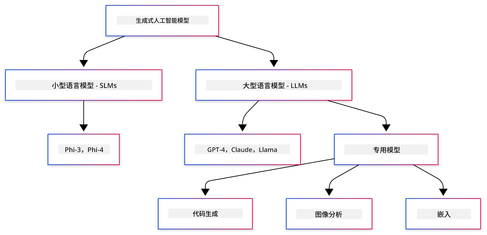
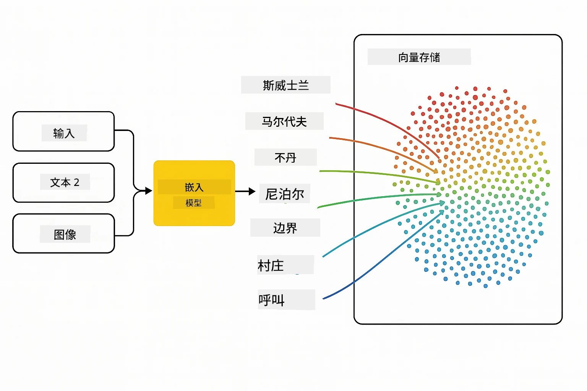
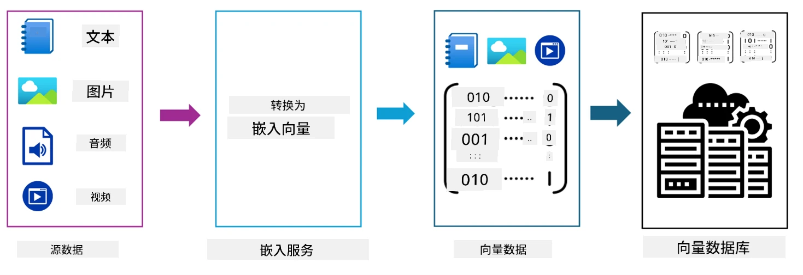
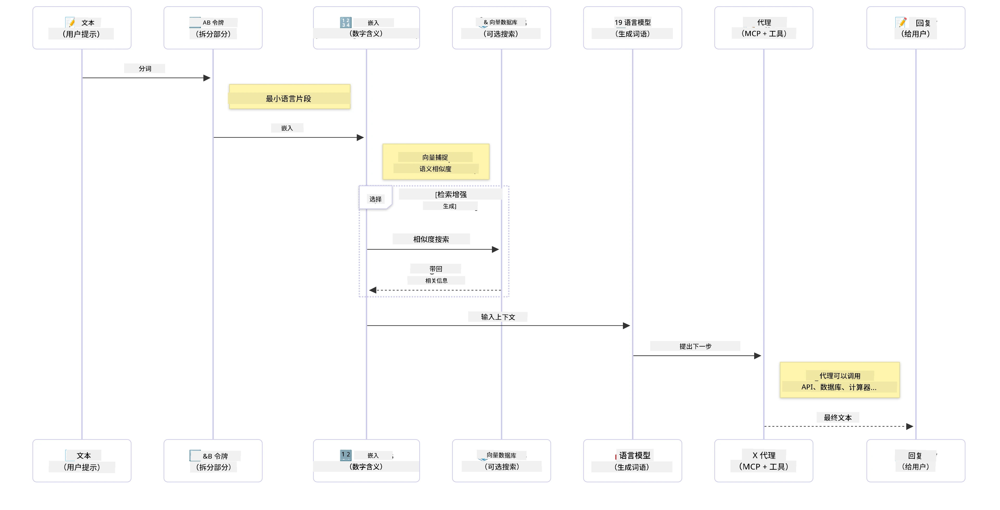

# 生成式人工智能简介 - Java 版

> <strong>视频</strong>: [在 YouTube 上观看本课的概览视频。](https://www.youtube.com/watch?v=XH46tGp_eSw) 您也可以点击上方的缩略图。

## 您将学到的内容

- **生成式 AI 基础**，包括大型语言模型 (LLMs)、提示工程、令牌、嵌入和向量数据库
- **比较 Java AI 开发工具**，包括 Azure OpenAI SDK、Spring AI 和 OpenAI Java SDK
- <strong>了解模型上下文协议</strong>及其在 AI 代理通信中的作用

## 目录

- [简介](#简介)
- [生成式 AI 概念快速回顾](#生成式-ai-概念快速回顾)
- [提示工程复习](#提示工程复习)
- [令牌、嵌入与代理](#令牌、嵌入和代理)
- [Java 的 AI 开发工具和库](#java-的-ai-开发工具和库)
  - [OpenAI Java SDK](#openai-java-sdk)
  - [Spring AI](#spring-ai)
  - [Azure OpenAI Java SDK](#azure-openai-java-sdk)
- [总结](#总结)
- [下一步](#下一步)

## 简介

欢迎来到《生成式人工智能入门 - Java 版》第一章！本基础章节将向您介绍生成式 AI 的核心概念以及如何使用 Java 进行相关开发。您将了解 AI 应用的基本构件，包括大型语言模型（LLMs）、令牌、嵌入和 AI 代理。我们还会介绍本课程中将使用的主要 Java 工具。

### 生成式 AI 概念快速回顾

生成式 AI 是一种基于从数据中学习的模式和关系创建新内容（如文本、图像或代码）的人工智能。生成式 AI 模型能够生成类人响应、理解上下文，有时甚至能创造出看起来像人类的内容。

在开发您的 Java AI 应用时，您将使用<strong>生成式 AI 模型</strong>来生成内容。生成式 AI 模型的部分能力包括：

- <strong>文本生成</strong>：为聊天机器人、内容创作和文本补全生成类人文本。
- <strong>图像生成与分析</strong>：生成逼真图像、增强照片和检测物体。
- <strong>代码生成</strong>：编写代码片段或脚本。

针对不同任务，有专门优化的模型类型。例如，**小型语言模型 (SLMs)** 和 **大型语言模型 (LLMs)** 均可处理文本生成，LLMs 通常在复杂任务中表现更佳。对于图像相关任务，则可使用专业的视觉模型或多模态模型。

当然，这些模型的回答并非总是完美。您也许听说过模型“幻觉”或以权威方式生成错误信息的情况。但您可通过为模型提供清晰的指令和上下文，引导其生成更好的回答。这便是<strong>提示工程</strong>的用武之地。

#### 提示工程复习

提示工程是设计有效输入以引导 AI 模型生成期望输出的实践。它包含：

- <strong>清晰性</strong>：使指令明确且无歧义。
- <strong>上下文</strong>：提供必要的背景信息。
- <strong>限制条件</strong>：说明任何限制或格式要求。

提示工程的一些最佳实践包括提示设计、清晰指令、任务拆分、一示例和少示例学习，以及提示调优。测试不同提示是找到针对具体用例效果最佳方法的关键。

开发应用时，您会使用不同类型的提示：
- <strong>系统提示</strong>：设定模型行为的基础规则和上下文
- <strong>用户提示</strong>：您应用用户的输入数据
- <strong>助理提示</strong>：模型根据系统提示和用户提示生成的回复

> <strong>了解更多</strong>：请参见[生成式 AI 入门课程中的提示工程章节](https://github.com/microsoft/generative-ai-for-beginners/tree/main/04-prompt-engineering-fundamentals)

#### 令牌、嵌入和代理

使用生成式 AI 模型时，您会遇到“<strong>令牌</strong>”、“<strong>嵌入</strong>”、“<strong>代理</strong>”和“**模型上下文协议 (MCP)**”等术语。以下为这些概念的详细介绍：

- <strong>令牌</strong>：令牌是模型中的最小文本单元，可以是单词、字符或子词。令牌用于以模型可理解的格式表示文本数据。例如，句子“The quick brown fox jumped over the lazy dog”可能被分词为["The", " quick", " brown", " fox", " jumped", " over", " the", " lazy", " dog"]或根据分词策略分为["The", " qu", "ick", " br", "own", " fox", " jump", "ed", " over", " the", " la", "zy", " dog"]。

分词是将文本拆解为这些较小单元的过程。这非常关键，因为模型以令牌而非原始文本操作。提示中的令牌数量会影响模型回复的长度和质量，因模型对上下文窗口令牌数有限制（例如 GPT-4o 的总上下文限制为 128K 令牌，包括输入和输出）。

  在 Java 中，您可使用如 OpenAI SDK 之类的库，在向 AI 模型发送请求时自动处理分词。

- <strong>嵌入</strong>：嵌入是令牌的向量表示，捕捉语义含义。它们是数值化的表示（通常是浮点数数组），使模型能够理解词间关系，并生成语境相关的回复。相似词有相近的嵌入，这使模型能理解同义词和语义关系。

  在 Java 中，您可以使用 OpenAI SDK 或其他支持生成嵌入的库来生成嵌入。这些嵌入对语义搜索非常重要，可以基于意义而非精确文本匹配查找相似内容。

- <strong>向量数据库</strong>：向量数据库是针对嵌入优化的专用存储系统。它们支持高效的相似性搜索，并在基于语义相似度（而非精确匹配）从大规模数据集中查找相关信息的增强检索生成（RAG）模式中至关重要。

> <strong>注意</strong>：本课程不涵盖向量数据库，但提及它们非常重要，因为它们在实际应用中使用广泛。

- **代理与 MCP**：代理是能自主与模型、工具和外部系统交互的 AI 组件。模型上下文协议（MCP）为代理安全访问外部数据源和工具提供了标准化方法。更多信息请见我们的 [MCP 入门课程](https://github.com/microsoft/mcp-for-beginners)。

在 Java AI 应用中，您将使用令牌进行文本处理，使用嵌入进行语义搜索和 RAG，使用向量数据库检索数据，使用 MCP 代理构建智能的工具使用系统。

### Java 的 AI 开发工具和库

Java 提供了出色的 AI 开发工具。本课程将重点探讨三大主要库——OpenAI Java SDK、Azure OpenAI SDK 和 Spring AI。

下面的速查表显示了各章节示例所使用的 SDK：

| 章节 | 示例 | SDK |
|---------|--------|-----|
| 02-SetupDevEnvironment | github-models | OpenAI Java SDK |
| 02-SetupDevEnvironment | basic-chat-azure | Spring AI Azure OpenAI |
| 03-CoreGenerativeAITechniques | examples | Azure OpenAI SDK |
| 04-PracticalSamples | petstory | OpenAI Java SDK |
| 04-PracticalSamples | foundrylocal | OpenAI Java SDK |
| 04-PracticalSamples | calculator | Spring AI MCP SDK + LangChain4j |

**SDK 文档链接：**
- [Azure OpenAI Java SDK](https://github.com/Azure/azure-sdk-for-java/tree/azure-ai-openai_1.0.0-beta.16/sdk/openai/azure-ai-openai)
- [Spring AI](https://docs.spring.io/spring-ai/reference/)
- [OpenAI Java SDK](https://github.com/openai/openai-java)
- [LangChain4j](https://docs.langchain4j.dev/)

#### OpenAI Java SDK

OpenAI SDK 是 OpenAI API 的官方 Java 库，提供简单一致的接口来调用 OpenAI 模型，使得将 AI 能力集成到 Java 应用中变得容易。第 2 章的 GitHub 模型示例、第 4 章的 Pet Story 应用及 Foundry Local 示例均展示了使用 OpenAI SDK 的方法。

#### Spring AI

Spring AI 是一个全面框架，将 AI 能力引入 Spring 应用，提供跨不同 AI 提供商的一致抽象层。它与 Spring 生态系统无缝集成，是需要 AI 功能的企业级 Java 应用的理想选择。

Spring AI 的优势在于其与 Spring 生态的紧密结合，使您能够使用熟悉的 Spring 模式（如依赖注入、配置管理和测试框架）构建生产级 AI 应用。您将在第 2 章和第 4 章中使用 Spring AI 来构建利用 OpenAI 和模型上下文协议 (MCP) 的 Spring AI 库的应用。

##### 模型上下文协议 (MCP)

[模型上下文协议 (MCP)](https://modelcontextprotocol.io/) 是一种新兴标准，使 AI 应用能够安全地与外部数据源和工具交互。MCP 为 AI 模型访问上下文信息和执行应用中动作提供标准化方式。

第 4 章中，您将构建一个简单的 MCP 计算器服务，演示如何使用 Spring AI 实现模型上下文协议的基础，展示如何创建基础工具集成和服务架构。

#### Azure OpenAI Java SDK

Azure OpenAI Java 客户端库是 OpenAI REST API 的一种适配，提供更符合 Java 习惯的接口并可与 Azure SDK 生态系统集成。在第 3 章，您将使用 Azure OpenAI SDK 构建应用，包括聊天应用、函数调用和 RAG 模式。

> 注意：Azure OpenAI SDK 在功能上落后于 OpenAI Java SDK，因此未来项目建议考虑使用 OpenAI Java SDK。

## 总结

以上即为基础知识！您现在了解了：

- 生成式 AI 的核心概念——从大型语言模型和提示工程，到令牌、嵌入和向量数据库
- Java AI 开发的工具选择：Azure OpenAI SDK、Spring AI 以及 OpenAI Java SDK
- 模型上下文协议的作用及其如何让 AI 代理使用外部工具

## 下一步

[第 2 章：设置开发环境](../02-SetupDevEnvironment/README.md)

---

<!-- CO-OP TRANSLATOR DISCLAIMER START -->
**免责声明**：  
本文档使用 AI 翻译服务 [Co-op Translator](https://github.com/Azure/co-op-translator) 进行翻译。虽然我们力求准确，但请注意自动翻译可能包含错误或不准确之处。原始文档的本地语言版本应被视为权威来源。对于关键信息，建议使用专业人工翻译。对于因使用此翻译而产生的任何误解或误释，我们概不负责。
<!-- CO-OP TRANSLATOR DISCLAIMER END -->