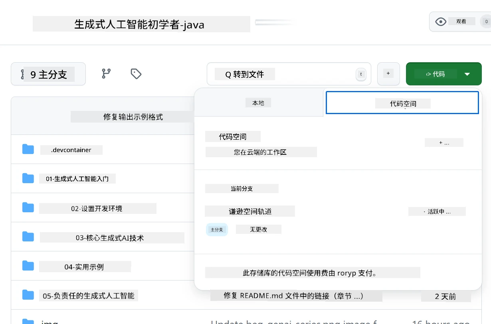

# 为 Azure OpenAI 设置开发环境

> **快速开始**：本指南适用于 Azure OpenAI 的设置。如果您想快速使用免费模型，请参考 [GitHub Models with Codespaces](./README.md#quick-start-cloud)。

本指南将帮助您为本课程中的 Java AI 应用程序设置 Azure AI Foundry 模型。

## 目录

- [快速设置概览](../../../02-SetupDevEnvironment)
- [步骤 1：创建 Azure AI Foundry 资源](../../../02-SetupDevEnvironment)
  - [创建 Hub 和项目](../../../02-SetupDevEnvironment)
  - [部署 GPT-4o-mini 模型](../../../02-SetupDevEnvironment)
- [步骤 2：创建您的 Codespace](../../../02-SetupDevEnvironment)
- [步骤 3：配置您的环境](../../../02-SetupDevEnvironment)
- [步骤 4：测试您的设置](../../../02-SetupDevEnvironment)
- [接下来做什么？](../../../02-SetupDevEnvironment)
- [资源](../../../02-SetupDevEnvironment)
- [附加资源](../../../02-SetupDevEnvironment)

## 快速设置概览

1. 创建 Azure AI Foundry 资源（Hub、项目、模型）
2. 使用 Java 开发容器创建一个 Codespace
3. 使用 Azure OpenAI 凭据配置您的 .env 文件
4. 使用示例项目测试您的设置

## 步骤 1：创建 Azure AI Foundry 资源

### 创建 Hub 和项目

1. 访问 [Azure AI Foundry Portal](https://ai.azure.com/) 并登录
2. 点击 **+ Create** → **New hub**（或导航到 **Management** → **All hubs** → **+ New hub**）
3. 配置您的 Hub：
   - **Hub 名称**：例如 "MyAIHub"
   - **订阅**：选择您的 Azure 订阅
   - **资源组**：新建或选择现有的
   - **位置**：选择离您最近的
   - **存储账户**：使用默认或自定义配置
   - **密钥保管库**：使用默认或自定义配置
   - 点击 **Next** → **Review + create** → **Create**
4. 创建完成后，点击 **+ New project**（或从 Hub 概览中选择 **Create project**）
   - **项目名称**：例如 "GenAIJava"
   - 点击 **Create**

### 部署 GPT-4o-mini 模型

1. 在您的项目中，进入 **Model catalog** 并搜索 **gpt-4o-mini**
   - *替代方法：进入 **Deployments** → **+ Create deployment***
2. 在 gpt-4o-mini 模型卡片上点击 **Deploy**
3. 配置部署：
   - **部署名称**："gpt-4o-mini"
   - **模型版本**：使用最新版本
   - **部署类型**：标准
4. 点击 **Deploy**
5. 部署完成后，进入 **Deployments** 标签页并复制以下值：
   - **部署名称**（例如 "gpt-4o-mini"）
   - **目标 URI**（例如 `https://your-hub-name.openai.azure.com/`）  
      > **重要**：仅复制基础 URL（例如 `https://myhub.openai.azure.com/`），不要包含完整的端点路径。
   - **密钥**（在 Keys and Endpoint 部分中获取）

> **仍有问题？** 请访问官方 [Azure AI Foundry 文档](https://learn.microsoft.com/azure/ai-foundry/how-to/create-projects?tabs=ai-foundry&pivots=hub-project)

## 步骤 2：创建您的 Codespace

1. 将此仓库 Fork 到您的 GitHub 账户
   > **注意**：如果您想编辑基本配置，请查看 [Dev Container Configuration](../../../.devcontainer/devcontainer.json)
2. 在您的 Fork 仓库中，点击 **Code** → **Codespaces** 标签
3. 点击 **...** → **New with options...**  

4. 选择 **Dev container configuration**： 
   - **Generative AI Java Development Environment**
5. 点击 **Create codespace**

## 步骤 3：配置您的环境

当您的 Codespace 准备好后，设置您的 Azure OpenAI 凭据：

1. **从仓库根目录导航到示例项目：**  
   ```bash
   cd 02-SetupDevEnvironment/examples/basic-chat-azure
   ```

2. **创建您的 .env 文件：**  
   ```bash
   cp .env.example .env
   ```

3. **编辑 .env 文件并添加您的 Azure OpenAI 凭据：**  
   ```bash
   # Your Azure OpenAI API key (from Azure AI Foundry portal)
   AZURE_AI_KEY=your-actual-api-key-here
   
   # Your Azure OpenAI endpoint URL (e.g., https://myhub.openai.azure.com/)
   AZURE_AI_ENDPOINT=https://your-hub-name.openai.azure.com/
   ```

   > **安全提示**：  
   > - 切勿将 `.env` 文件提交到版本控制中  
   > - `.env` 文件已包含在 `.gitignore` 中  
   > - 确保您的 API 密钥安全并定期更换

## 步骤 4：测试您的设置

运行示例应用程序以测试您的 Azure OpenAI 连接：

```bash
mvn clean spring-boot:run
```

您应该会看到来自 GPT-4o-mini 模型的响应！

> **VS Code 用户**：您也可以在 VS Code 中按 `F5` 运行应用程序。启动配置已设置为自动加载您的 `.env` 文件。

> **完整示例**：请参阅 [端到端 Azure OpenAI 示例](./examples/basic-chat-azure/README.md) 以获取详细说明和故障排除。

## 接下来做什么？

**设置完成！** 您现在已经完成以下内容：
- 部署了 gpt-4o-mini 的 Azure OpenAI
- 配置了本地 .env 文件
- 准备好了 Java 开发环境

**继续学习** [第 3 章：核心生成式 AI 技术](../03-CoreGenerativeAITechniques/README.md)，开始构建 AI 应用程序！

## 资源

- [Azure AI Foundry 文档](https://learn.microsoft.com/azure/ai-services/)
- [Spring AI Azure OpenAI 文档](https://docs.spring.io/spring-ai/reference/api/clients/azure-openai-chat.html)
- [Azure OpenAI Java SDK](https://learn.microsoft.com/java/api/overview/azure/ai-openai-readme)

## 附加资源

- [下载 VS Code](https://code.visualstudio.com/Download)
- [获取 Docker Desktop](https://www.docker.com/products/docker-desktop)
- [Dev Container Configuration](../../../.devcontainer/devcontainer.json)

**免责声明**：  
本文档使用AI翻译服务[Co-op Translator](https://github.com/Azure/co-op-translator)进行翻译。尽管我们努力确保翻译的准确性，但请注意，自动翻译可能包含错误或不准确之处。原始语言的文档应被视为权威来源。对于重要信息，建议使用专业人工翻译。我们对因使用此翻译而产生的任何误解或误读不承担责任。