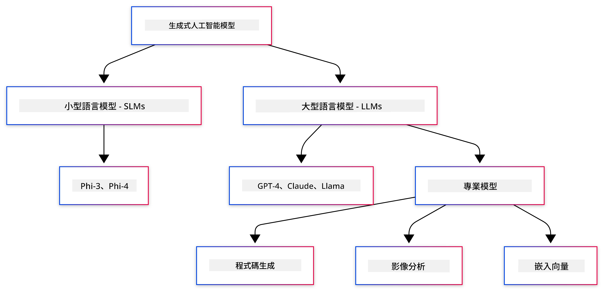
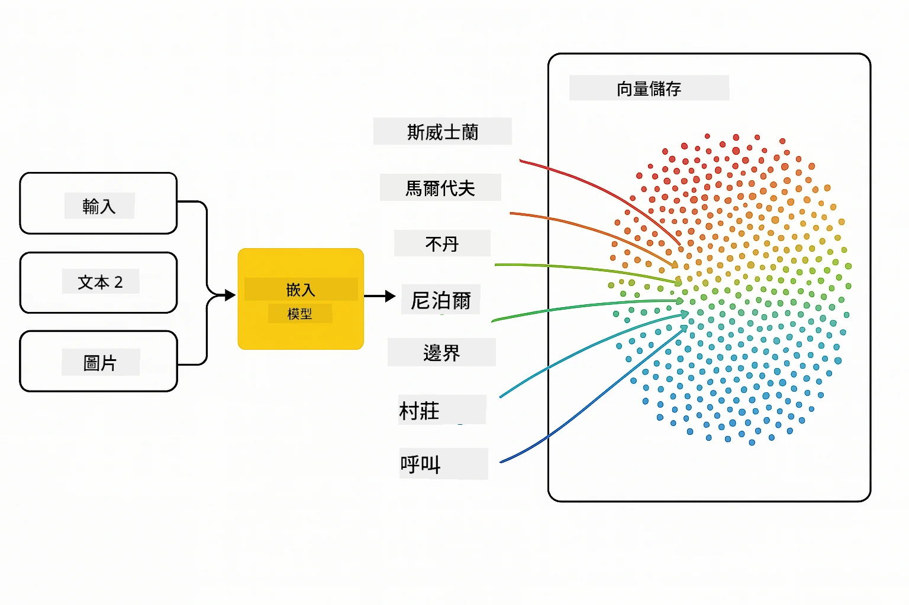
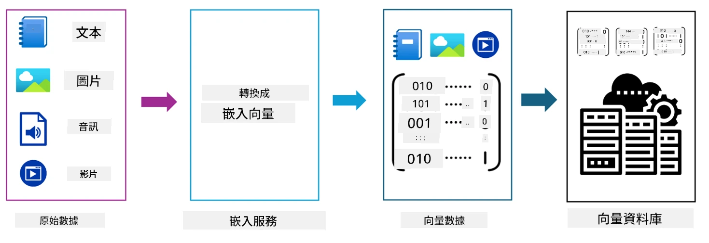
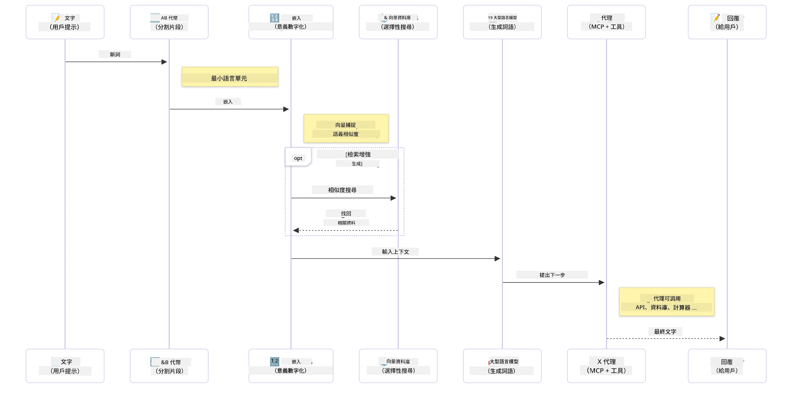

# Generative AI 簡介 - Java 版

> <strong>影片</strong>: [觀看本課程的影片概覽（YouTube）](https://www.youtube.com/watch?v=XH46tGp_eSw) ，你也可以點擊上方縮圖。

## 你將學到的內容

- **Generative AI 基礎知識**，包括大型語言模型（LLMs）、提示工程、tokens、embeddings 和向量資料庫
- **比較 Java AI 開發工具**，包括 Azure OpenAI SDK、Spring AI 及 OpenAI Java SDK
- **探索 Model Context Protocol** 及其在 AI 代理溝通中的角色

## 目錄

- [簡介](#簡介)
- [快速複習 Generative AI 概念](#快速複習-generative-ai-概念)
- [提示工程回顧](#提示工程回顧)
- [Tokens、embeddings 與代理](#tokens、embeddings-與代理)
- [Java 的 AI 開發工具及函式庫](#java-的-ai-開發工具及函式庫)
  - [OpenAI Java SDK](#openai-java-sdk)
  - [Spring AI](#spring-ai)
  - [Azure OpenAI Java SDK](#azure-openai-java-sdk)
- [總結](#總結)
- [下一步](#下一步)

## 簡介

歡迎來到 Generative AI 初學者 - Java 版的第一章！這個基礎課程會帶領你了解 generative AI 的核心概念，以及如何透過 Java 來操作它們。你將學習 AI 應用程式的基本組成部分，包括大型語言模型（LLMs）、tokens、embeddings 與 AI 代理。我們也將探討本課程中主要使用的 Java 工具。

### 快速複習 Generative AI 概念

Generative AI 是一種人工智能，能根據從資料中學習的模式和關聯來創造新的內容，例如文字、圖像或程式碼。Generative AI 模型能生成類似人類的回應、理解上下文，有時甚至能創造看似人類創作的內容。

在開發 Java AI 應用程式時，你會使用 **generative AI 模型** 來創造內容。Generative AI 模型的一些功能包括：

- <strong>文字生成</strong>：為聊天機器人、內容及文字補完撰寫類人文字
- <strong>圖像生成與分析</strong>：製作逼真圖片、增強照片與物件偵測
- <strong>程式碼生成</strong>：撰寫程式碼片段或腳本

有專門針對不同任務優化的模型類型。例如，<strong>小型語言模型（SLMs）</strong>與<strong>大型語言模型（LLMs）</strong>都能處理文字生成，LLMs 通常在複雜任務上表現更佳。處理圖像相關任務時，則會使用專門的視覺模型或多模態模型。

當然，這些模型的回應並非永遠完美。你可能聽過模型「產生幻覺」或以權威方式生成錯誤資訊。但你可以透過提供清晰指令和上下文，幫助模型產生更好的回應。這就是 <strong>提示工程</strong> 的用武之地。

#### 提示工程回顧

提示工程是設計有效輸入來引導 AI 模型產生目標輸出的實務。它包含：

- <strong>清晰度</strong>：讓指令清楚且無歧義
- <strong>上下文</strong>：提供必要的背景資訊
- <strong>限制</strong>：指定任何限制或格式要求

提示工程的一些最佳做法包括提示設計、清晰指令、任務拆解、一例學習與少量示範學習，以及提示調整。測試不同提示對找到最適合特定應用的方案至關重要。

開發應用程式時，你會接觸不同類型的提示：
- <strong>系統提示</strong>：設定模型行為的基礎規則與上下文
- <strong>使用者提示</strong>：來自應用程式使用者的輸入資料
- <strong>助理提示</strong>：模型根據系統和使用者提示產生的回應

> <strong>深入學習</strong>：歡迎參考 [GenAI for Beginners 課程的提示工程章節](https://github.com/microsoft/generative-ai-for-beginners/tree/main/04-prompt-engineering-fundamentals)

#### Tokens、embeddings 與代理

使用 generative AI 模型時，會遇到下列詞彙：**tokens**、**embeddings**、<strong>代理</strong>和<strong>Model Context Protocol (MCP)</strong>。以下為這些概念的詳細說明：

- **Tokens**：tokens 是模型中最小的文字單位，可能是字、字元或子字詞。Tokens 用來表示文本資料成為模型可理解的格式。例如，句子 "The quick brown fox jumped over the lazy dog" 可依不同標記方式被拆解為 ["The", " quick", " brown", " fox", " jumped", " over", " the", " lazy", " dog"] 或 ["The", " qu", "ick", " br", "own", " fox", " jump", "ed", " over", " the", " la", "zy", " dog"]。

標記 (Tokenization) 是將文本拆解成這些更小單位的過程。這是關鍵，因為模型是基於 tokens 運作，而非原始文字。提示中的 token 數量會影響模型回應的長度與品質，因為模型的上下文視窗有 token 限制（例如 GPT-4o 的上下文總長度限制為 128K token，包括輸入與輸出）。

  在 Java 裡，你可使用如 OpenAI SDK 等函式庫來自動處理發送請求時的分詞工作。

- **Embeddings**：embeddings 是 tokens 的向量表示，捕捉語義含義。它們是數值化的表示（通常是浮點數陣列），讓模型能理解單字間的關聯，並產生有上下文關聯的回應。相似的字詞會有相似的 embeddings，使模型能理解同義詞及語意關係。

  在 Java 中，你可以透過 OpenAI SDK 或其他支援產生 embeddings 的函式庫來生成 embeddings。這些 embeddings 對語意搜尋等任務尤其重要，能根據語意而非字詞的完全匹配來找尋相似內容。

- <strong>向量資料庫</strong>：向量資料庫是專門為 embeddings 優化的存儲系統，可高效進行相似度搜尋，且對 Retrieval-Augmented Generation (RAG) 須基於語意相似性從大型資料集中找尋相關資訊的模式至關重要。

> <strong>注意</strong>：本課程不會深入探討向量資料庫，但提及其用途，因它們在現實應用中非常常用。

- **代理與 MCP**：代理是能自治地與模型、工具及外部系統互動的 AI 組件。Model Context Protocol (MCP) 提供代理安全地存取外部資料源與工具的標準化方法。更多資訊請參考我們的 [MCP 初學者課程](https://github.com/microsoft/mcp-for-beginners)。

在 Java AI 應用中，你會用 tokens 進行文本處理、運用 embeddings 進行語意搜尋和 RAG，使用向量資料庫執行資料檢索，並透過代理與 MCP 建構智能且使用工具的系統。

### Java 的 AI 開發工具及函式庫

Java 提供優秀的 AI 開發工具。本課程將介紹三個主要函式庫——OpenAI Java SDK、Azure OpenAI SDK 與 Spring AI。

以下快速參考表顯示各章示範使用的 SDK：

| 章節 | 範例 | SDK |
|---------|--------|-----|
| 02-SetupDevEnvironment | github-models | OpenAI Java SDK |
| 02-SetupDevEnvironment | basic-chat-azure | Spring AI Azure OpenAI |
| 03-CoreGenerativeAITechniques | examples | Azure OpenAI SDK |
| 04-PracticalSamples | petstory | OpenAI Java SDK |
| 04-PracticalSamples | foundrylocal | OpenAI Java SDK |
| 04-PracticalSamples | calculator | Spring AI MCP SDK + LangChain4j |

**SDK 文件連結：**
- [Azure OpenAI Java SDK](https://github.com/Azure/azure-sdk-for-java/tree/azure-ai-openai_1.0.0-beta.16/sdk/openai/azure-ai-openai)
- [Spring AI](https://docs.spring.io/spring-ai/reference/)
- [OpenAI Java SDK](https://github.com/openai/openai-java)
- [LangChain4j](https://docs.langchain4j.dev/)

#### OpenAI Java SDK

OpenAI SDK 是 OpenAI API 的官方 Java 函式庫，提供簡單一致的介面與 OpenAI 模型互動，方便將 AI 能力整合入 Java 應用。第二章的 GitHub Models 範例，以及第四章的 Pet Story 應用和 Foundry Local 範例均展示了 OpenAI SDK 的使用。

#### Spring AI

Spring AI 是一套完整框架，將 AI 能力帶給 Spring 應用，提供跨多個 AI 供應商的一致抽象層。它與 Spring 生態系統緊密整合，是企業級 Java 應用需要 AI 能力的理想選擇。

Spring AI 的優勢在於與 Spring 生態無縫整合，讓你可以利用熟悉的 Spring 模式（如依賴注入、配置管理和測試框架）來輕鬆打造生產等級 AI 應用。你將在第二章與第四章中使用 Spring AI，建構結合 OpenAI 和 Model Context Protocol (MCP) 的應用。

##### Model Context Protocol (MCP)

[Model Context Protocol (MCP)](https://modelcontextprotocol.io/) 是一項新興標準，讓 AI 應用能安全地與外部資料來源和工具交互。MCP 提供標準化方式，使 AI 模型能存取上下文資訊並在應用中執行操作。

第四章中，你將打造一個簡單的 MCP 計算器服務，示範如何用 Spring AI 掌握 MCP 的基本原理，展示建立基本工具整合與服務架構。

#### Azure OpenAI Java SDK

Azure OpenAI Java 用戶端庫是 OpenAI REST API 的改良版本，提供慣用的接口並能與 Azure SDK 生態系統整合。在第三章，你會使用 Azure OpenAI SDK 開發應用，包括聊天應用、函數呼叫及 RAG（檢索增強生成）模式。

> 注意：Azure OpenAI SDK 功能目前落後於 OpenAI Java SDK，未來專案建議使用 OpenAI Java SDK。

## 總結

基礎知識到此結束！你現在了解：

- generative AI 的核心概念——從大型語言模型、提示工程，到 tokens、embeddings 及向量資料庫
- Java AI 開發的工具選項：Azure OpenAI SDK、Spring AI 和 OpenAI Java SDK
- Model Context Protocol 是什麼，以及它如何協助 AI 代理使用外部工具

## 下一步

[第 2 章：設定開發環境](../02-SetupDevEnvironment/README.md)

---

<!-- CO-OP TRANSLATOR DISCLAIMER START -->
**免責聲明**：  
本文件為使用 AI 翻譯服務 [Co-op Translator](https://github.com/Azure/co-op-translator) 進行翻譯。雖然我們致力於確保準確性，但請注意自動翻譯可能包含錯誤或不準確之處。原始文件的原文版本應視為權威來源。對於重要資訊，建議使用專業人工翻譯。我們不對因使用本翻譯而產生的任何誤解或錯誤詮釋承擔責任。
<!-- CO-OP TRANSLATOR DISCLAIMER END -->