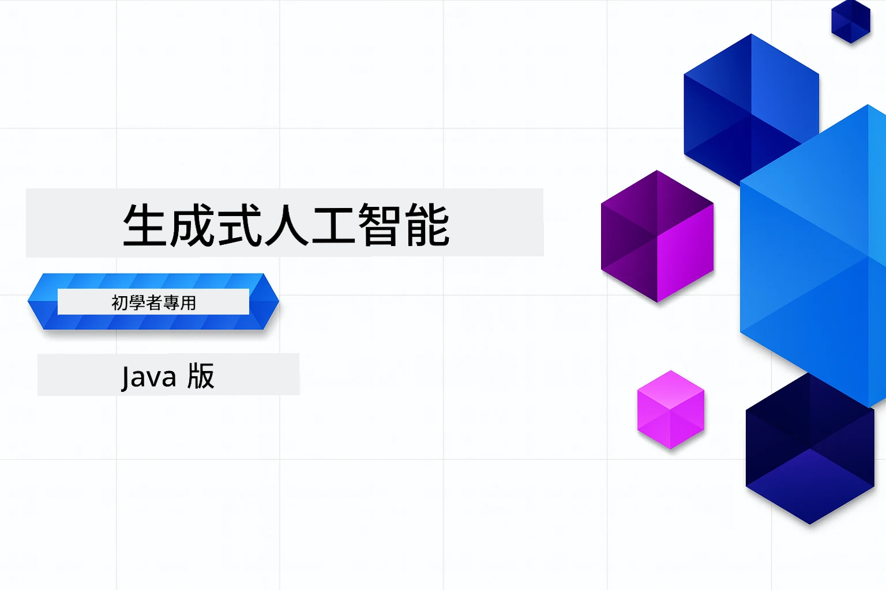

# 新手入門生成式 AI - Java 版本
[](https://discord.gg/nTYy5BXMWG)



<strong>所需時間</strong>：整個工作坊可以在線完成，無需本地設置。環境設置需時 2 分鐘，探索範例視深度而定需 1-3 小時。

> <strong>快速開始</strong> 

1. 將此倉庫 Fork 到你的 GitHub 帳戶
2. 點擊 **Code** → **Codespaces** 頁籤 → **...** → **New with options...**
3. 使用預設設定 – 這將選擇為本課程創建的開發容器
4. 點擊 **Create codespace**
5. 等待約 2 分鐘，環境即準備就緒
6. 直接跳轉至 [第一個範例](./02-SetupDevEnvironment/README.md#step-2-create-a-github-personal-access-token)

## 多語言支援

### 透過 GitHub Action 支持（自動且始終保持最新）

<!-- CO-OP TRANSLATOR LANGUAGES TABLE START -->
[Arabic](../ar/README.md) | [Bengali](../bn/README.md) | [Bulgarian](../bg/README.md) | [Burmese (Myanmar)](../my/README.md) | [Chinese (Simplified)](../zh-CN/README.md) | [Chinese (Traditional, Hong Kong)](./README.md) | [Chinese (Traditional, Macau)](../zh-MO/README.md) | [Chinese (Traditional, Taiwan)](../zh-TW/README.md) | [Croatian](../hr/README.md) | [Czech](../cs/README.md) | [Danish](../da/README.md) | [Dutch](../nl/README.md) | [Estonian](../et/README.md) | [Finnish](../fi/README.md) | [French](../fr/README.md) | [German](../de/README.md) | [Greek](../el/README.md) | [Hebrew](../he/README.md) | [Hindi](../hi/README.md) | [Hungarian](../hu/README.md) | [Indonesian](../id/README.md) | [Italian](../it/README.md) | [Japanese](../ja/README.md) | [Kannada](../kn/README.md) | [Khmer](../km/README.md) | [Korean](../ko/README.md) | [Lithuanian](../lt/README.md) | [Malay](../ms/README.md) | [Malayalam](../ml/README.md) | [Marathi](../mr/README.md) | [Nepali](../ne/README.md) | [Nigerian Pidgin](../pcm/README.md) | [Norwegian](../no/README.md) | [Persian (Farsi)](../fa/README.md) | [Polish](../pl/README.md) | [Portuguese (Brazil)](../pt-BR/README.md) | [Portuguese (Portugal)](../pt-PT/README.md) | [Punjabi (Gurmukhi)](../pa/README.md) | [Romanian](../ro/README.md) | [Russian](../ru/README.md) | [Serbian (Cyrillic)](../sr/README.md) | [Slovak](../sk/README.md) | [Slovenian](../sl/README.md) | [Spanish](../es/README.md) | [Swahili](../sw/README.md) | [Swedish](../sv/README.md) | [Tagalog (Filipino)](../tl/README.md) | [Tamil](../ta/README.md) | [Telugu](../te/README.md) | [Thai](../th/README.md) | [Turkish](../tr/README.md) | [Ukrainian](../uk/README.md) | [Urdu](../ur/README.md) | [Vietnamese](../vi/README.md)

> **想要本地複製？**
>
> 此倉庫包含 50 多種語言的翻譯，會顯著增加下載大小。若想不包含翻譯地複製，請使用稀疏簽出（sparse checkout）：
>
> **Bash / macOS / Linux:**
> ```bash
> git clone --filter=blob:none --sparse https://github.com/microsoft/Generative-AI-for-beginners-java.git
> cd Generative-AI-for-beginners-java
> git sparse-checkout set --no-cone '/*' '!translations' '!translated_images'
> ```
>
> **CMD (Windows):**
> ```cmd
> git clone --filter=blob:none --sparse https://github.com/microsoft/Generative-AI-for-beginners-java.git
> cd Generative-AI-for-beginners-java
> git sparse-checkout set --no-cone "/*" "!translations" "!translated_images"
> ```
>
> 這樣能讓你更快下載，獲得完成課程所需的全部內容。
<!-- CO-OP TRANSLATOR LANGUAGES TABLE END -->

## 課程架構與學習路徑

### **第一章：生成式 AI 簡介**
- <strong>核心概念</strong>：了解大型語言模型、標記、嵌入向量及 AI 功能
- **Java AI 生態系統**：Spring AI 與 OpenAI SDK 概覽
- <strong>模型上下文協議</strong>：認識 MCP 及其在 AI 代理間通訊的角色
- <strong>實際應用</strong>：包含聊天機械人及內容生成的真實場景
- **[→ 開始第一章](./01-IntroToGenAI/README.md)**

### **第二章：開發環境設置**
- <strong>多供應商配置</strong>：設置 GitHub Models、Azure OpenAI 及 OpenAI Java SDK 整合
- **Spring Boot + Spring AI**：企業 AI 應用開發最佳實踐  
- **GitHub Models**：免費 AI 模型訪問，用於原型和學習（無需信用卡）
- <strong>開發工具</strong>：Docker 容器、VS Code 與 GitHub Codespaces 配置
- **[→ 開始第二章](./02-SetupDevEnvironment/README.md)**

### **第三章：核心生成式 AI 技術**
- <strong>提示工程</strong>：達到最佳 AI 模型回答的技術
- <strong>嵌入向量與向量操作</strong>：實現語義搜尋與相似度匹配
- **檢索增強生成 (RAG)**：結合 AI 與你的數據源
- <strong>函數調用</strong>：利用自訂工具和插件擴展 AI 功能
- **[→ 開始第三章](./03-CoreGenerativeAITechniques/README.md)**

### **第四章：實際應用與專案**
- <strong>寵物故事生成器</strong> (`petstory/`)：用 GitHub Models 生成創意內容
- **Foundry 本地示範** (`foundrylocal/`)：本地 AI 模型與 OpenAI Java SDK 整合
- **MCP 計算器服務** (`calculator/`)：採用 Spring AI 的基本模型上下文協議實作
- **[→ 開始第四章](./04-PracticalSamples/README.md)**

### **第五章：負責任 AI 開發**
- **GitHub Models 安全性**：測試內建內容過濾與安全機制（硬性封鎖與軟性拒絕）
- **負責任 AI 示範**：動手範例展示現代 AI 安全系統實作
- <strong>最佳實踐</strong>：倫理 AI 開發與部署的重要指導原則
- **[→ 開始第五章](./05-ResponsibleGenAI/README.md)**

## 其他資源

<!-- CO-OP TRANSLATOR OTHER COURSES START -->
### LangChain
[](https://aka.ms/langchain4j-for-beginners)
[](https://aka.ms/langchainjs-for-beginners?WT.mc_id=m365-94501-dwahlin)
[](https://github.com/microsoft/langchain-for-beginners?WT.mc_id=m365-94501-dwahlin)
---

### Azure / Edge / MCP / Agents
[](https://github.com/microsoft/AZD-for-beginners?WT.mc_id=academic-105485-koreyst)
[](https://github.com/microsoft/edgeai-for-beginners?WT.mc_id=academic-105485-koreyst)
[](https://github.com/microsoft/mcp-for-beginners?WT.mc_id=academic-105485-koreyst)
[](https://github.com/microsoft/ai-agents-for-beginners?WT.mc_id=academic-105485-koreyst)

---
 
### 生成式 AI 系列
[](https://github.com/microsoft/generative-ai-for-beginners?WT.mc_id=academic-105485-koreyst)
[-9333EA?style=for-the-badge&labelColor=E5E7EB&color=9333EA)](https://github.com/microsoft/Generative-AI-for-beginners-dotnet?WT.mc_id=academic-105485-koreyst)
[-C084FC?style=for-the-badge&labelColor=E5E7EB&color=C084FC)](https://github.com/microsoft/generative-ai-for-beginners-java?WT.mc_id=academic-105485-koreyst)
[-E879F9?style=for-the-badge&labelColor=E5E7EB&color=E879F9)](https://github.com/microsoft/generative-ai-with-javascript?WT.mc_id=academic-105485-koreyst)

---
 
### 核心學習
[](https://aka.ms/ml-beginners?WT.mc_id=academic-105485-koreyst)
[](https://aka.ms/datascience-beginners?WT.mc_id=academic-105485-koreyst)
[](https://aka.ms/ai-beginners?WT.mc_id=academic-105485-koreyst)
[](https://github.com/microsoft/Security-101?WT.mc_id=academic-96948-sayoung)

[](https://aka.ms/webdev-beginners?WT.mc_id=academic-105485-koreyst)
[](https://aka.ms/iot-beginners?WT.mc_id=academic-105485-koreyst)
[](https://github.com/microsoft/xr-development-for-beginners?WT.mc_id=academic-105485-koreyst)

---
 
### Copilot 系列
[](https://aka.ms/GitHubCopilotAI?WT.mc_id=academic-105485-koreyst)
[](https://github.com/microsoft/mastering-github-copilot-for-dotnet-csharp-developers?WT.mc_id=academic-105485-koreyst)
[](https://github.com/microsoft/CopilotAdventures?WT.mc_id=academic-105485-koreyst)
<!-- CO-OP TRANSLATOR OTHER COURSES END -->

## 尋求協助

如果你遇到困難或對構建 AI 應用程序有任何疑問，請加入其他學習者和經驗豐富的開發者，參與 MCP 的討論。這是一個支持性的社群，歡迎提問並自由分享知識。

[](https://discord.gg/nTYy5BXMWG)

如果你在開發過程中有產品反饋或錯誤，請訪問：

[](https://aka.ms/foundry/forum)

---

<!-- CO-OP TRANSLATOR DISCLAIMER START -->
**免責聲明**：  
本文件是使用 AI 翻譯服務 [Co-op Translator](https://github.com/Azure/co-op-translator) 進行翻譯。雖然我們力求準確，但請注意，自動翻譯可能包含錯誤或不準確之處。原始文件的母語版本應視為權威來源。對於關鍵資訊，建議使用專業人工翻譯。我們不對因使用此翻譯而產生的任何誤解或誤釋承擔責任。
<!-- CO-OP TRANSLATOR DISCLAIMER END -->