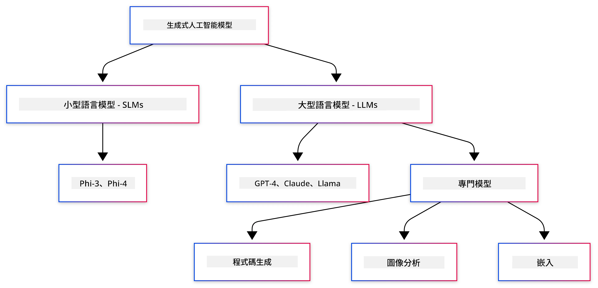
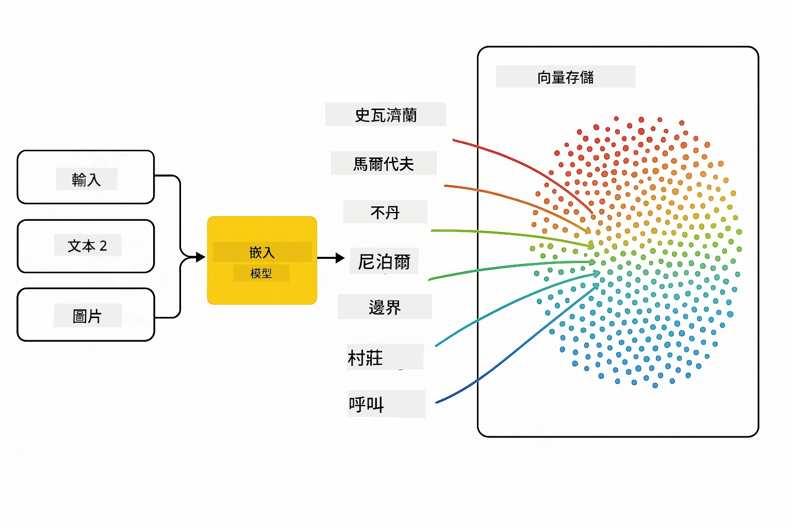
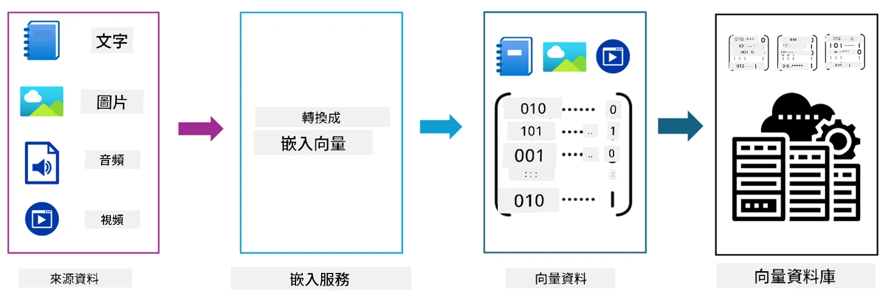
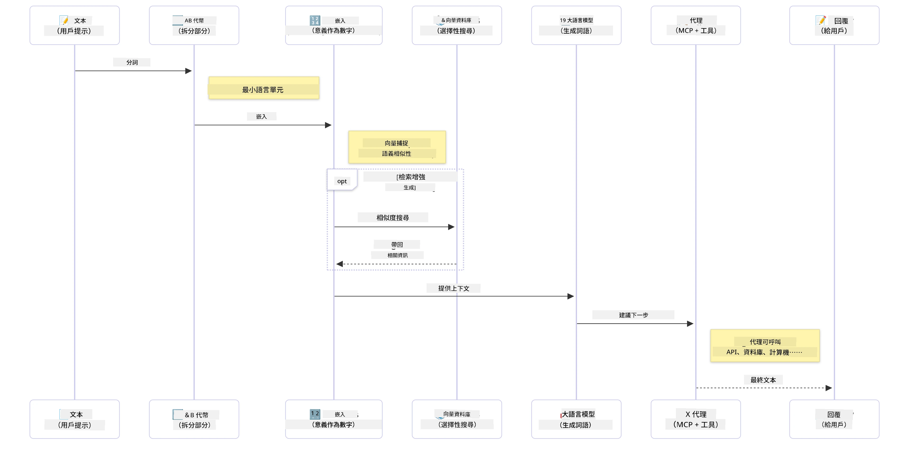

# 生成式人工智能入門 - Java 版本

> <strong>影片</strong>： [觀看本課程的影片概述，於 YouTube。](https://www.youtube.com/watch?v=XH46tGp_eSw) 你也可以點擊上方的縮圖。

## 你將學到什麼

- **生成式 AI 基礎**，包括大型語言模型（LLMs）、提示工程、標記（tokens）、嵌入（embeddings）以及向量資料庫
- **比較 Java AI 開發工具**，涵蓋 Azure OpenAI SDK、Spring AI 和 OpenAI Java SDK
- <strong>探索模型上下文協定（Model Context Protocol）</strong>及其在 AI 代理通訊中的角色

## 目錄

- [導論](#導論)
- [生成式 AI 概念快速複習](#生成式-ai-概念快速複習)
- [提示工程回顧](#提示工程回顧)
- [標記、嵌入與代理](#標記、嵌入與代理)
- [Java 的 AI 開發工具與函式庫](#java-的-ai-開發工具與函式庫)
  - [OpenAI Java SDK](#openai-java-sdk)
  - [Spring AI](#spring-ai)
  - [Azure OpenAI Java SDK](#azure-openai-java-sdk)
- [總結](#總結)
- [後續步驟](#後續步驟)

## 導論

歡迎來到《生成式人工智能初學者指南 - Java 版本》的第一章！本基礎課程將介紹生成式 AI 的核心概念，以及如何使用 Java 操作它們。你將學習 AI 應用程式的基本組成要素，包括大型語言模型（LLMs）、標記、嵌入和 AI 代理。我們也會探索在整個課程中會用到的主要 Java 工具。

### 生成式 AI 概念快速複習

生成式 AI 是一種根據資料中的模式及關係創造新內容的人工智能類型，如文字、圖像或程式碼。生成式 AI 模型能產生類似人類的回應、理解上下文，有時甚至能創造出看似真實的人類內容。

在您開發 Java AI 應用程式時，會使用 **生成式 AI 模型** 來創建內容。生成式 AI 模型的一些能力包括：

- <strong>文字生成</strong>：為聊天機器人、內容創作和文字補全撰寫類人文字。
- <strong>圖像生成與分析</strong>：製造逼真圖像、增強照片及物件檢測。
- <strong>程式碼生成</strong>：撰寫程式碼片段或腳本。

有特定類型的模型針對不同任務進行優化。例如，<strong>小型語言模型（SLMs）</strong>和<strong>大型語言模型（LLMs）</strong>都能進行文字生成，LLMs 通常在複雜任務上表現更優。對於圖像相關任務，則會使用專門的視覺模型或多模態模型。

當然，這些模型的回應並非總是完美無缺。你可能聽過模型「幻覺」的現象，或以權威方式生成不正確資訊。但你可以透過提供清晰的指示和上下文，輔導模型產生更佳的回應。這正是 <strong>提示工程</strong> 的用武之地。

#### 提示工程回顧

提示工程是設計有效輸入以引導 AI 模型產生期望輸出的實務。它包含：

- <strong>明確性</strong>：讓指示清晰且無歧義。
- <strong>上下文</strong>：提供必要的背景資訊。
- <strong>限制</strong>：指定任何限制條件或格式。

提示工程的某些最佳實踐包括提示設計、清晰指令、任務拆解、一次性或少量示範學習以及提示調優。測試不同提示對找出最適合特定使用案例的方法至關重要。

開發應用時，您會接觸不同類型的提示：
- <strong>系統提示</strong>：設定模型行為的基本規則和上下文
- <strong>使用者提示</strong>：來自應用使用者的輸入資料
- <strong>助理提示</strong>：模型基於系統與使用者提示做出的回應

> <strong>進一步學習</strong>：於[生成式 AI 初學者課程的提示工程章節](https://github.com/microsoft/generative-ai-for-beginners/tree/main/04-prompt-engineering-fundamentals)深入了解提示工程。

#### 標記、嵌入與代理

使用生成式 AI 模型時，你會遇到像是 **標記（tokens）**、**嵌入（embeddings）**、**代理（agents）** 和 **模型上下文協定（Model Context Protocol, MCP）** 這些術語。以下是這些概念的詳細概述：

- <strong>標記</strong>：標記是模型中文字的最小單位。它們可以是單詞、字元或子詞。標記用來將文字資料以模型可理解的格式表示。例如，句子 "The quick brown fox jumped over the lazy dog" 可能依標記化策略被切分成 ["The", " quick", " brown", " fox", " jumped", " over", " the", " lazy", " dog"] 或 ["The", " qu", "ick", " br", "own", " fox", " jump", "ed", " over", " the", " la", "zy", " dog"]。

標記化是一種將文字拆分為這些較小單位的過程。此過程非常重要，因為模型是以標記而非原始文字運作。提示中的標記數量會影響模型回應的長度與品質，因模型對其上下文窗口有標記數限制（例如 GPT-4o 包括輸入與輸出總共可達 128K 標記）。

  在 Java 中，你可以使用 OpenAI SDK 等函式庫於向 AI 模型發送請求時自動處理標記化。

- <strong>嵌入</strong>：嵌入是捕捉語義意涵的向量表示。它們是數值形式（通常為浮點數陣列），讓模型能理解詞與詞之間的關係，並生成具上下文相關性的回應。相近詞彙會擁有相近的嵌入，使模型能理解同義詞和語義關係等概念。

  在 Java 中，你可利用 OpenAI SDK 或其他支援嵌入生成的函式庫來產生嵌入。這些嵌入在語義搜尋等任務中至關重要，讓你能基於意義而非字面文字匹配尋找相似內容。

- <strong>向量資料庫</strong>：向量資料庫是專門針對嵌入優化的儲存系統。它們支持高效的相似度搜尋，在檢索擴充生成（Retrieval-Augmented Generation, RAG）模式中尤為重要，可在大量資料中基於語義相似度而非文字精確匹配找到相關資訊。

> <strong>注意</strong>：本課程將不深入涵蓋向量資料庫，但認為值得一提，因為它們在現實應用中非常常見。

- **代理與 MCP**：AI 元件能自主與模型、工具及外部系統互動。模型上下文協定（MCP）提供一種標準化方式，讓代理能安全存取外部資料源與工具。更多內容請參考我們的 [MCP 初學者課程](https://github.com/microsoft/mcp-for-beginners)。

在 Java AI 應用中，你會使用標記進行文字處理，嵌入用於語義搜尋與 RAG，向量資料庫用於資料擷取，代理與 MCP 則用於構建智慧且具工具使用能力的系統。

### Java 的 AI 開發工具與函式庫

Java 提供了極佳的 AI 開發工具。在本課程中，我們將探討三大主要函式庫 - OpenAI Java SDK、Azure OpenAI SDK 與 Spring AI。

以下是一個簡便參考表，顯示各章節示例所使用的 SDK：

| 章節 | 範例 | SDK |
|---------|--------|-----|
| 02-SetupDevEnvironment | github-models | OpenAI Java SDK |
| 02-SetupDevEnvironment | basic-chat-azure | Spring AI Azure OpenAI |
| 03-CoreGenerativeAITechniques | examples | Azure OpenAI SDK |
| 04-PracticalSamples | petstory | OpenAI Java SDK |
| 04-PracticalSamples | foundrylocal | OpenAI Java SDK |
| 04-PracticalSamples | calculator | Spring AI MCP SDK + LangChain4j |

**SDK 文件連結：**
- [Azure OpenAI Java SDK](https://github.com/Azure/azure-sdk-for-java/tree/azure-ai-openai_1.0.0-beta.16/sdk/openai/azure-ai-openai)
- [Spring AI](https://docs.spring.io/spring-ai/reference/)
- [OpenAI Java SDK](https://github.com/openai/openai-java)
- [LangChain4j](https://docs.langchain4j.dev/)

#### OpenAI Java SDK

OpenAI SDK 是 OpenAI API 的官方 Java 函式庫。它提供簡單且一致的介面與 OpenAI 模型互動，方便將 AI 能力整合至 Java 應用程式。第二章的 GitHub 模型範例，第四章的 Pet Story 與 Foundry Local 範例都示範了 OpenAI SDK 的使用方式。

#### Spring AI

Spring AI 是為 Spring 應用程式帶來 AI 能力的全方位框架，提供跨不同 AI 供應商的一致抽象層。它與 Spring 生態系統無縫整合，是需要 AI 能力的企業級 Java 應用的理想選擇。

Spring AI 的強項在於與 Spring 生態系統的整合，讓你輕鬆以熟悉的 Spring 模式如依賴注入、設定管理與測試框架，構建可直接生產環境使用的 AI 應用。在第二章和第四章，你將使用 Spring AI 來建構同時利用 OpenAI 與模型上下文協定（MCP）的應用。

##### 模型上下文協定（MCP）

[模型上下文協定 (MCP)](https://modelcontextprotocol.io/) 是一項新興標準，使 AI 應用能安全地與外部資料源和工具互動。MCP 為 AI 模型存取上下文資訊與執行動作提供標準化方式。

在第四章，你將建置一個簡單的 MCP 計算機服務，演示模型上下文協定與 Spring AI 的基礎，展示如何建立基本工具整合與服務架構。

#### Azure OpenAI Java SDK

Azure OpenAI 的 Java 用戶端函式庫是對 OpenAI REST API 的改編，提供慣用介面並與其他 Azure SDK 生態系整合。在第三章，你將使用 Azure OpenAI SDK 建構應用，包括聊天應用、函式調用和檢索擴充生成（RAG）模式。

> 注意：Azure OpenAI SDK 在功能上落後於 OpenAI Java SDK，未來專案可考慮使用 OpenAI Java SDK。

## 總結

基礎部分到此結束！你現在了解了：

- 生成式 AI 的核心概念——從大型語言模型和提示工程，到標記、嵌入與向量資料庫
- Java AI 開發的可用工具：Azure OpenAI SDK、Spring AI 和 OpenAI Java SDK
- 什麼是模型上下文協定，以及它如何讓 AI 代理與外部工具協作

## 後續步驟

[第二章：設定開發環境](../02-SetupDevEnvironment/README.md)

---

<!-- CO-OP TRANSLATOR DISCLAIMER START -->
**免責聲明**：  
本文件已使用人工智能翻譯服務 [Co-op Translator](https://github.com/Azure/co-op-translator) 進行翻譯。儘管我們力求準確，但請注意自動翻譯可能包含錯誤或不準確之處。原始文件的母語版本應視為權威資料來源。對於關鍵資訊，建議使用專業人工翻譯。我們對因使用本翻譯而產生的任何誤解或誤譯不承擔任何責任。
<!-- CO-OP TRANSLATOR DISCLAIMER END -->