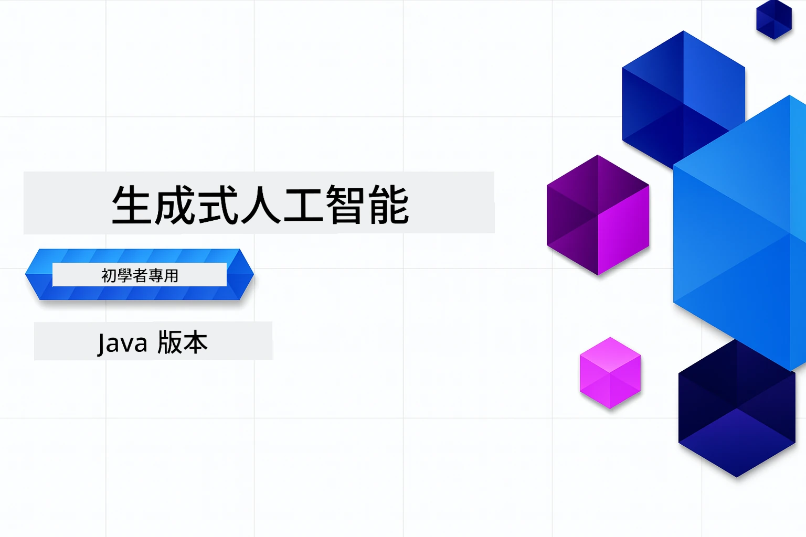

# 給初學者的生成式 AI - Java 版本
[](https://discord.gg/nTYy5BXMWG)



**時間投入**：整個工作坊可在線完成，無需本地設置。環境設置需 2 分鐘，探索範例視探索深度需 1-3 小時。

> **快速開始**

1. 將本倉庫 Fork 至您的 GitHub 帳戶
2. 點擊 **Code** → **Codespaces** 分頁 → **...** → **New with options...**
3. 使用預設值 – 這將選擇為本課程創建的開發容器
4. 點擊 **Create codespace**
5. 等待約 2 分鐘，環境即準備就緒
6. 直接跳至 [第一個範例](./02-SetupDevEnvironment/README.md#step-2-create-a-github-personal-access-token)

> **想要本地 Clone？**
>
> 本倉庫包含超過 50 種語言的翻譯，這會顯著增加下載大小。若想克隆無翻譯版本，請使用稀疏檢出：
> ```bash
> git clone --filter=blob:none --sparse https://github.com/microsoft/Generative-AI-for-beginners-java.git
> cd Generative-AI-for-beginners-java
> git sparse-checkout set --no-cone '/*' '!translations' '!translated_images'
> ```
> 這樣能更快下載完成課程所需所有內容。

## 多語言支援

### 透過 GitHub Action 支援（自動且常保最新）

<!-- CO-OP TRANSLATOR LANGUAGES TABLE START -->
[阿拉伯文](../ar/README.md) | [孟加拉文](../bn/README.md) | [保加利亞文](../bg/README.md) | [緬甸語 (緬甸)](../my/README.md) | [中文 (簡體)](../zh-CN/README.md) | [中文 (繁體，香港)](../zh-HK/README.md) | [中文 (繁體，澳門)](./README.md) | [中文 (繁體，台灣)](../zh-TW/README.md) | [克羅地亞文](../hr/README.md) | [捷克文](../cs/README.md) | [丹麥文](../da/README.md) | [荷蘭文](../nl/README.md) | [愛沙尼亞文](../et/README.md) | [芬蘭文](../fi/README.md) | [法文](../fr/README.md) | [德文](../de/README.md) | [希臘文](../el/README.md) | [希伯來文](../he/README.md) | [印地文](../hi/README.md) | [匈牙利文](../hu/README.md) | [印尼文](../id/README.md) | [意大利文](../it/README.md) | [日文](../ja/README.md) | [卡納達文](../kn/README.md) | [韓文](../ko/README.md) | [立陶宛文](../lt/README.md) | [馬來文](../ms/README.md) | [馬拉雅拉姆文](../ml/README.md) | [馬拉地文](../mr/README.md) | [尼泊爾文](../ne/README.md) | [奈及利亞洋泾浜語](../pcm/README.md) | [挪威文](../no/README.md) | [波斯文 (法爾西語)](../fa/README.md) | [波蘭文](../pl/README.md) | [葡萄牙文 (巴西)](../pt-BR/README.md) | [葡萄牙文 (葡萄牙)](../pt-PT/README.md) | [旁遮普文 (古魯穆奇)](../pa/README.md) | [羅馬尼亞文](../ro/README.md) | [俄文](../ru/README.md) | [塞爾維亞文 (西里爾字母)](../sr/README.md) | [斯洛伐克文](../sk/README.md) | [斯洛文尼亞文](../sl/README.md) | [西班牙文](../es/README.md) | [斯瓦希里文](../sw/README.md) | [瑞典文](../sv/README.md) | [他加祿文 (菲律賓語)](../tl/README.md) | [泰米爾文](../ta/README.md) | [泰盧固文](../te/README.md) | [泰文](../th/README.md) | [土耳其文](../tr/README.md) | [烏克蘭文](../uk/README.md) | [烏都文](../ur/README.md) | [越南文](../vi/README.md)

## 課程架構與學習路徑

### **第 1 章：生成式 AI 入門**
- **核心概念**：理解大型語言模型、詞元、嵌入向量與 AI 能力
- **Java AI 生態系統**：Spring AI 與 OpenAI SDK 概覽
- **模型上下文協定**：介紹 MCP 及其在 AI 代理人溝通中的角色
- **實務應用**：包括聊天機器人和內容生成的真實案例
- **[→ 開始第 1 章](./01-IntroToGenAI/README.md)**

### **第 2 章：開發環境設置**
- **多供應商配置**：設置 GitHub Models、Azure OpenAI 和 OpenAI Java SDK 結合
- **Spring Boot + Spring AI**：企業級 AI 應用開發的最佳實踐
- **GitHub Models**：免費 AI 模型，適合原型開發與學習（無需信用卡）
- **開發工具**：Docker 容器、VS Code 與 GitHub Codespaces 配置
- **[→ 開始第 2 章](./02-SetupDevEnvironment/README.md)**

### **第 3 章：核心生成式 AI 技術**
- **提示工程**：最佳化 AI 模型回應的技術
- **嵌入向量及向量操作**：實現語義搜索與相似度匹配
- **檢索增強生成 (RAG)**：將 AI 與您自己的資料來源結合
- **函式調用**：使用自訂工具與插件擴展 AI 能力
- **[→ 開始第 3 章](./03-CoreGenerativeAITechniques/README.md)**

### **第 4 章：實務應用與專案**
- **寵物故事產生器** (`petstory/`)：使用 GitHub Models 進行創意內容生成
- **Foundry 本地示範** (`foundrylocal/`)：OpenAI Java SDK 的本地 AI 模型整合
- **MCP 計算服務** (`calculator/`)：採用 Spring AI 的基本模型上下文協定實作
- **[→ 開始第 4 章](./04-PracticalSamples/README.md)**

### **第 5 章：負責任的 AI 開發**
- **GitHub Models 安全性**：測試內建內容過濾及安全機制（硬封鎖及軟拒絕）
- **負責任 AI 示範**：實作範例示範現代 AI 安全系統如何運作
- **最佳實踐**：倫理 AI 開發與部署的基本準則
- **[→ 開始第 5 章](./05-ResponsibleGenAI/README.md)**

## 其他資源

<!-- CO-OP TRANSLATOR OTHER COURSES START -->
### LangChain
[](https://aka.ms/langchain4j-for-beginners)
[](https://aka.ms/langchainjs-for-beginners?WT.mc_id=m365-94501-dwahlin)

---

### Azure / Edge / MCP / Agents
[](https://github.com/microsoft/AZD-for-beginners?WT.mc_id=academic-105485-koreyst)
[](https://github.com/microsoft/edgeai-for-beginners?WT.mc_id=academic-105485-koreyst)
[](https://github.com/microsoft/mcp-for-beginners?WT.mc_id=academic-105485-koreyst)
[](https://github.com/microsoft/ai-agents-for-beginners?WT.mc_id=academic-105485-koreyst)

---

### 生成式 AI 系列
[](https://github.com/microsoft/generative-ai-for-beginners?WT.mc_id=academic-105485-koreyst)
[-9333EA?style=for-the-badge&labelColor=E5E7EB&color=9333EA)](https://github.com/microsoft/Generative-AI-for-beginners-dotnet?WT.mc_id=academic-105485-koreyst)
[-C084FC?style=for-the-badge&labelColor=E5E7EB&color=C084FC)](https://github.com/microsoft/generative-ai-for-beginners-java?WT.mc_id=academic-105485-koreyst)
[-E879F9?style=for-the-badge&labelColor=E5E7EB&color=E879F9)](https://github.com/microsoft/generative-ai-with-javascript?WT.mc_id=academic-105485-koreyst)

---

### 核心學習
[](https://aka.ms/ml-beginners?WT.mc_id=academic-105485-koreyst)
[](https://aka.ms/datascience-beginners?WT.mc_id=academic-105485-koreyst)
[](https://aka.ms/ai-beginners?WT.mc_id=academic-105485-koreyst)
[](https://github.com/microsoft/Security-101?WT.mc_id=academic-96948-sayoung)
[](https://aka.ms/webdev-beginners?WT.mc_id=academic-105485-koreyst)
[](https://aka.ms/iot-beginners?WT.mc_id=academic-105485-koreyst)
[](https://github.com/microsoft/xr-development-for-beginners?WT.mc_id=academic-105485-koreyst)

---
 
### Copilot 系列
[](https://aka.ms/GitHubCopilotAI?WT.mc_id=academic-105485-koreyst)
[](https://github.com/microsoft/mastering-github-copilot-for-dotnet-csharp-developers?WT.mc_id=academic-105485-koreyst)
[](https://github.com/microsoft/CopilotAdventures?WT.mc_id=academic-105485-koreyst)
<!-- CO-OP TRANSLATOR OTHER COURSES END -->

## 獲得協助

如果你遇到困難或對開發 AI 應用程式有任何疑問，歡迎加入學習者及經驗豐富開發者的討論。這是一個互相支持的社群，鼓勵提問並自由分享知識。

[](https://discord.gg/nTYy5BXMWG)

如果你在開發過程中有產品反饋或發現錯誤，請造訪：

[](https://aka.ms/foundry/forum)

---

<!-- CO-OP TRANSLATOR DISCLAIMER START -->
**免責聲明**：  
本文件乃使用人工智能翻譯服務 [Co-op Translator](https://github.com/Azure/co-op-translator) 進行翻譯。雖然我們致力於確保翻譯準確，但請注意，自動翻譯可能包含錯誤或不準確之處。原始文件的母語版本應視為權威來源。對於重要資訊，建議採用專業人工翻譯。我們不對因使用本翻譯所引起的任何誤解或誤譯承擔責任。
<!-- CO-OP TRANSLATOR DISCLAIMER END -->