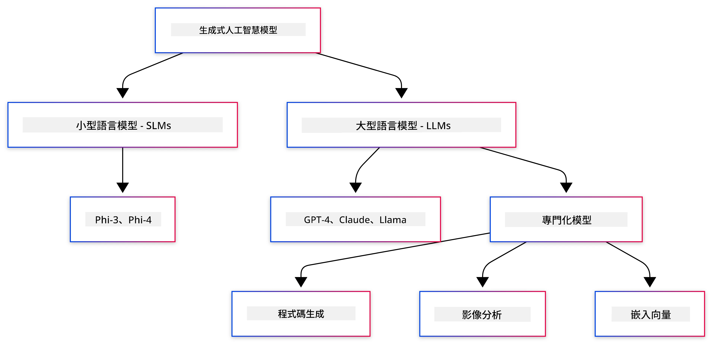
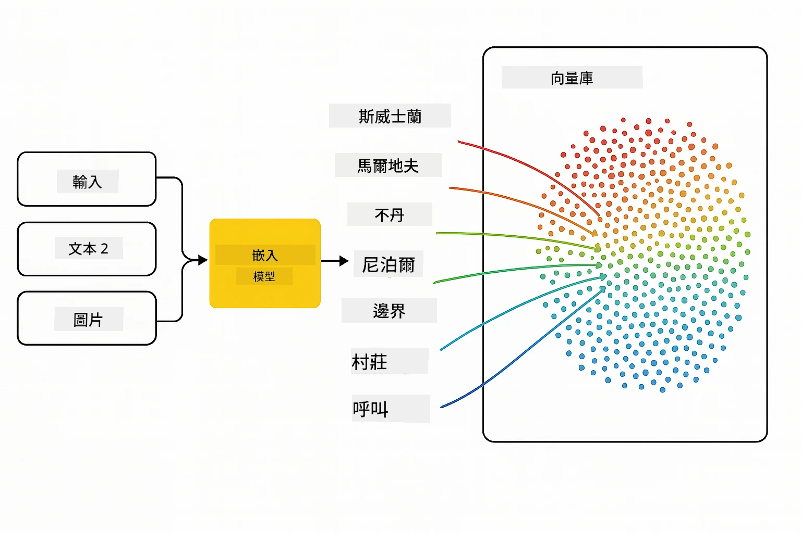
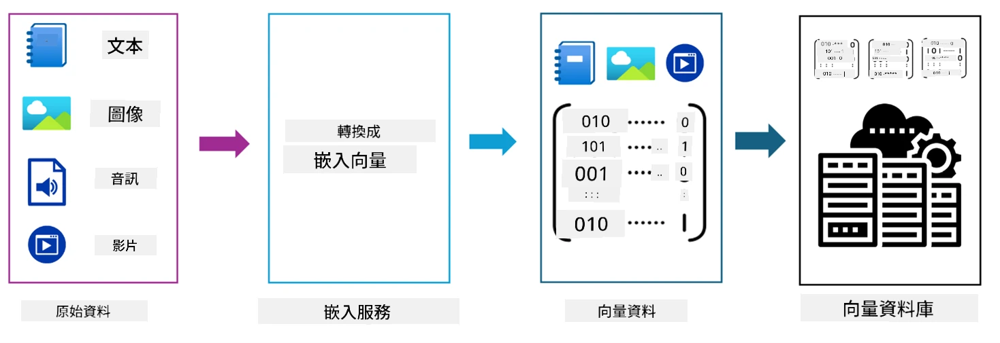
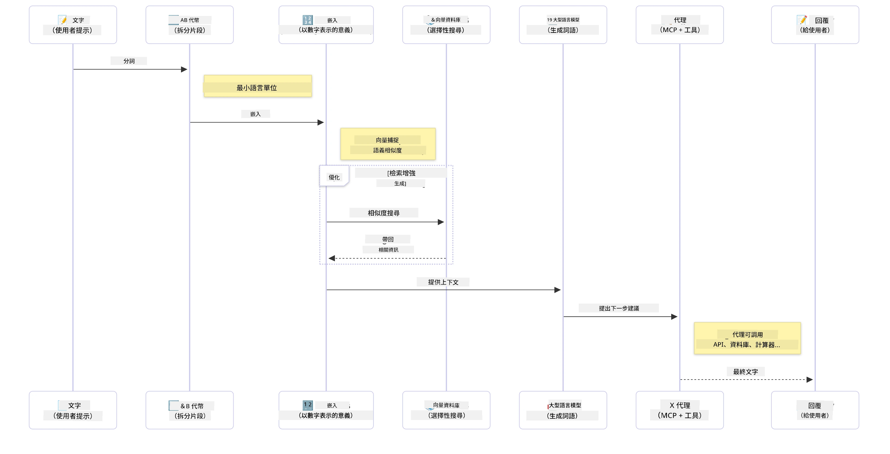

# 生成式 AI 入門 - Java 版

> <strong>影片</strong>： [在 YouTube 上觀看本課程的影片概述。](https://www.youtube.com/watch?v=XH46tGp_eSw) 你也可以點擊上方縮圖。

## 你將學習到

- **生成式 AI 基礎知識**，包括大型語言模型 (LLM)、提示工程、標記、嵌入向量與向量資料庫
- **比較 Java AI 開發工具**，涵蓋 Azure OpenAI SDK、Spring AI 及 OpenAI Java SDK
- **探索模型上下文協議（Model Context Protocol）** 及其在 AI 代理通信中的角色

## 目錄

- [介紹](#介紹)
- [生成式 AI 概念快速回顧](#生成式-ai-概念快速回顧)
- [提示工程回顧](#提示工程回顧)
- [標記、嵌入向量與代理](#標記、嵌入向量與代理)
- [Java 的 AI 開發工具與函式庫](#java-的-ai-開發工具與函式庫)
  - [OpenAI Java SDK](#openai-java-sdk)
  - [Spring AI](#spring-ai)
  - [Azure OpenAI Java SDK](#azure-openai-java-sdk)
- [總結](#總結)
- [後續步驟](#後續步驟)

## 介紹

歡迎來到《生成式 AI 初學者 - Java 版》的第一章！這堂基礎課程將帶你了解生成式 AI 的核心概念，以及如何使用 Java 來操作。你將學習到 AI 應用的基本構建塊，包括大型語言模型（LLM）、標記、嵌入向量與 AI 代理。我們還會探討你在整個課程中會使用到的主要 Java 工具。

### 生成式 AI 概念快速回顧

生成式 AI 是一種基於從資料中學習的模式和關係，用來創造新內容（如文字、圖像或程式碼）的人工智慧。生成式 AI 模型能夠生成人類般的回應、理解上下文，有時甚至創造出似乎是人類所創造的內容。

在開發 Java AI 應用程式時，你將使用<strong>生成式 AI 模型</strong>來創建內容。生成式 AI 模型的部分能力包括：

- <strong>文字生成</strong>：為聊天機器人、內容與文字補完打造人類般的文字。
- <strong>圖像生成與分析</strong>：產生逼真的圖像、增強照片及物件偵測。
- <strong>程式碼生成</strong>：撰寫程式碼片段或腳本。

不同任務有適合的模型類型。例如，<strong>小型語言模型（SLM）</strong>與<strong>大型語言模型（LLM）</strong>都可以處理文字生成，LLM 在較複雜的任務上通常表現較佳。影像相關工作則會使用專門的視覺模型或多模態模型。

當然，這些模型的回應並非永遠完美。你可能聽過模型「幻覺」（hallucination）或權威地輸出錯誤資訊的情況。你可以透過提供明確的指示和上下文，協助模型生成更好的回應。這便是<strong>提示工程</strong>的作用所在。

#### 提示工程回顧

提示工程是設計有效輸入，以引導 AI 模型產生期望輸出的技術。內容涵蓋：

- <strong>清晰性</strong>：使指令清楚且無歧義。
- <strong>上下文</strong>：提供必要的背景資訊。
- <strong>限制條件</strong>：指定任何限制或格式。

提示工程的最佳做法包括提示設計、清楚指令、任務拆解、一次或少量範例教學，以及提示微調。測試不同提示十分重要，以找出最適合你特定用例的設計。

開發應用時，你會接觸不同類型的提示：
- <strong>系統提示</strong>：設定模型行為的基本規則與背景。
- <strong>使用者提示</strong>：來自應用用戶的輸入資料。
- <strong>助理提示</strong>：模型依據系統與使用者提示所產生的回應。

> <strong>深入了解</strong>：請參考[初學者生成式 AI 課程中的提示工程章節](https://github.com/microsoft/generative-ai-for-beginners/tree/main/04-prompt-engineering-fundamentals)。

#### 標記、嵌入向量與代理

使用生成式 AI 模型時，你將遇到 <strong>標記</strong>、<strong>嵌入向量</strong>、<strong>代理</strong>及<strong>模型上下文協議（MCP）</strong>等術語。以下詳述這些概念：

- **標記（Tokens）**：標記是在模型中最小的文字單位，可能是詞語、字元或次詞語。標記用於將文字資料轉換成模型可理解的格式。例如，句子 "The quick brown fox jumped over the lazy dog" 可能被標記成 ["The", " quick", " brown", " fox", " jumped", " over", " the", " lazy", " dog"] 或 ["The", " qu", "ick", " br", "own", " fox", " jump", "ed", " over", " the", " la", "zy", " dog"]，視標記方法而異。

標記過程是將文字拆解成這些較小單位的程序。這很重要，因為模型是對標記而非原始文字操作的。提示中的標記數量影響模型回應的長度與品質，因為模型對於上下文視窗有標記數限制（例如 GPT-4o 的上下文總量限制為 128K 標記，包含輸入與輸出）。

在 Java 中，你可以使用例如 OpenAI SDK 這類函式庫在發送模型請求時自動處理標記化。

- **嵌入向量（Embeddings）**：嵌入向量是捕捉語義意涵的標記向量表示。它們是數值表示（通常是浮點數陣列），使模型能理解詞語之間的關係並生成有意義的回應。相似詞會有相似的嵌入向量，讓模型能理解同義字與語意關係。

在 Java 中，你可以使用 OpenAI SDK 或其它支援嵌入向量生成的函式庫來產生這些向量。嵌入向量對於語意搜尋非常重要，你可藉此找到基於意義而非精確文字匹配的相似內容。

- <strong>向量資料庫</strong>：向量資料庫是專門針對嵌入向量做優化的儲存系統，能有效執行相似度檢索。它們在檢索增強生成（RAG）模式中非常關鍵，協助你從大型資料集以語意相似性找到相關資訊，而非單純文字匹配。

> <strong>注意</strong>：本課程不深入涵蓋向量資料庫，但值得一提的是，它們在實際應用中相當常見。

- **代理與 MCP**：代理是自主操作模型、工具及外部系統的 AI 組件。模型上下文協議（MCP）提供了標準化方式，讓代理能安全地存取外部資料源與工具。詳情請參閱我們的 [初學者 MCP 課程](https://github.com/microsoft/mcp-for-beginners)。

在 Java AI 應用中，你會使用標記來處理文字、嵌入向量用於語意搜尋以及 RAG、向量資料庫進行資料檢索，並利用代理與 MCP 建立具備智慧且能使用工具的系統。

### Java 的 AI 開發工具與函式庫

Java 提供了卓越的 AI 開發工具。本課程將介紹三大主要函式庫：OpenAI Java SDK、Azure OpenAI SDK 與 Spring AI。

以下為快速對照表，展示各章範例所使用的 SDK：

| 章節 | 範例 | SDK |
|---------|--------|-----|
| 02-SetupDevEnvironment | github-models | OpenAI Java SDK |
| 02-SetupDevEnvironment | basic-chat-azure | Spring AI Azure OpenAI |
| 03-CoreGenerativeAITechniques | examples | Azure OpenAI SDK |
| 04-PracticalSamples | petstory | OpenAI Java SDK |
| 04-PracticalSamples | foundrylocal | OpenAI Java SDK |
| 04-PracticalSamples | calculator | Spring AI MCP SDK + LangChain4j |

**SDK 文件連結：**
- [Azure OpenAI Java SDK](https://github.com/Azure/azure-sdk-for-java/tree/azure-ai-openai_1.0.0-beta.16/sdk/openai/azure-ai-openai)
- [Spring AI](https://docs.spring.io/spring-ai/reference/)
- [OpenAI Java SDK](https://github.com/openai/openai-java)
- [LangChain4j](https://docs.langchain4j.dev/)

#### OpenAI Java SDK

OpenAI SDK 是官方的 OpenAI API Java 函式庫。它提供簡潔且一致的介面以連結 OpenAI 模型，幫助你輕鬆將 AI 功能整合進 Java 應用程式。第 2 章的 GitHub Models 範例，第 4 章的寵物故事應用和 Foundry Local 範例皆展示了 OpenAI SDK 的使用方式。

#### Spring AI

Spring AI 是一個完整框架，將 AI 能力整合進 Spring 應用中，提供跨不同 AI 提供者一致的抽象層。它能無縫整合 Spring 生態系統，是企業 Java 應用需要 AI 能力的理想選擇。

Spring AI 的優勢在於與 Spring 生態深度整合，使你能輕鬆採用熟悉的 Spring 模式（如依賴注入、配置管理與測試框架）來打造生產等級的 AI 應用。在第 2 章與第 4 章中，你將利用 Spring AI 建置同時涵蓋 OpenAI 與 MCP 的應用。

##### 模型上下文協議（MCP）

[模型上下文協議（MCP）](https://modelcontextprotocol.io/) 是一項新興標準，使 AI 應用能安全地與外部資料來源及工具互動。MCP 提供了標準化方式，讓 AI 模型能存取上下文資訊並在應用中執行動作。

在第 4 章中，你將製作簡單的 MCP 計算機服務，示範 Model Context Protocol 與 Spring AI 的基礎，展示如何建立基本工具整合與服務架構。

#### Azure OpenAI Java SDK

Azure OpenAI Java 用戶端函式庫是 OpenAI REST API 的調整版本，提供符合慣例的介面，並與 Azure SDK 生態系統做整合。在第 3 章，你將使用 Azure OpenAI SDK 開發應用，包括聊天應用、函式呼叫以及檢索增強生成（RAG）模式。

> 注意：Azure OpenAI SDK 的功能落後於 OpenAI Java SDK，未來專案可考慮使用 OpenAI Java SDK。

## 總結

基礎篇到此結束！你已經了解：

- 生成式 AI 的核心概念 — 包括 LLM、提示工程、標記、嵌入向量與向量資料庫
- Java AI 開發的工具選項：Azure OpenAI SDK、Spring AI 與 OpenAI Java SDK
- 模型上下文協議是什麼，以及它如何使 AI 代理與外部工具協作

## 後續步驟

[第 2 章：設定開發環境](../02-SetupDevEnvironment/README.md)

---

<!-- CO-OP TRANSLATOR DISCLAIMER START -->
**免責聲明**：  
本文件係使用 AI 翻譯服務 [Co-op Translator](https://github.com/Azure/co-op-translator) 翻譯而成。雖然我們力求準確，但請注意自動翻譯可能包含錯誤或不準確之處。原始文件之母語版本應視為權威來源。對於重要資訊，建議採用專業人工翻譯。我們不對因使用本翻譯而產生之任何誤解或誤譯負責。
<!-- CO-OP TRANSLATOR DISCLAIMER END -->