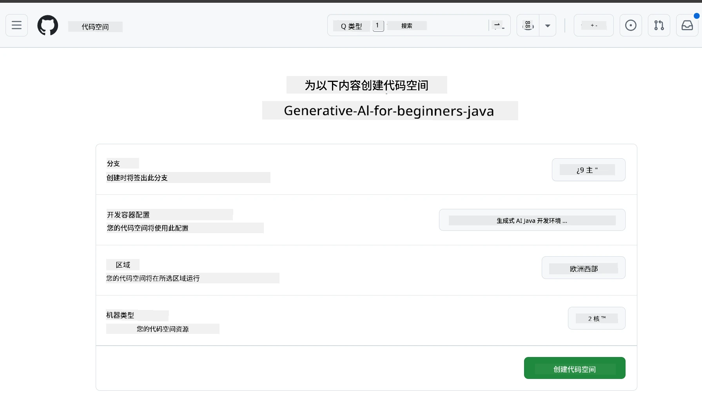
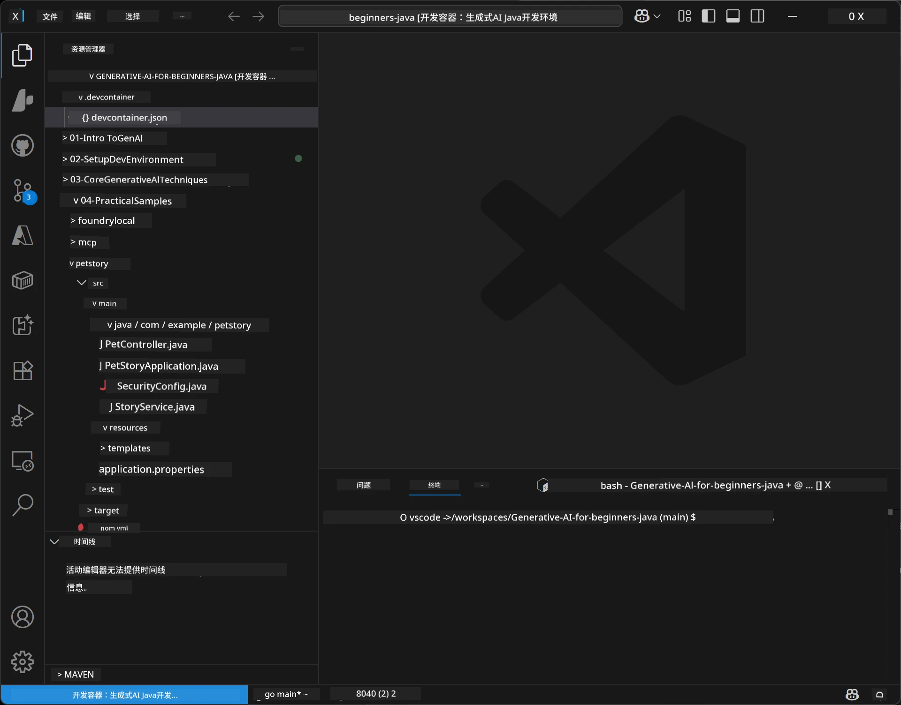
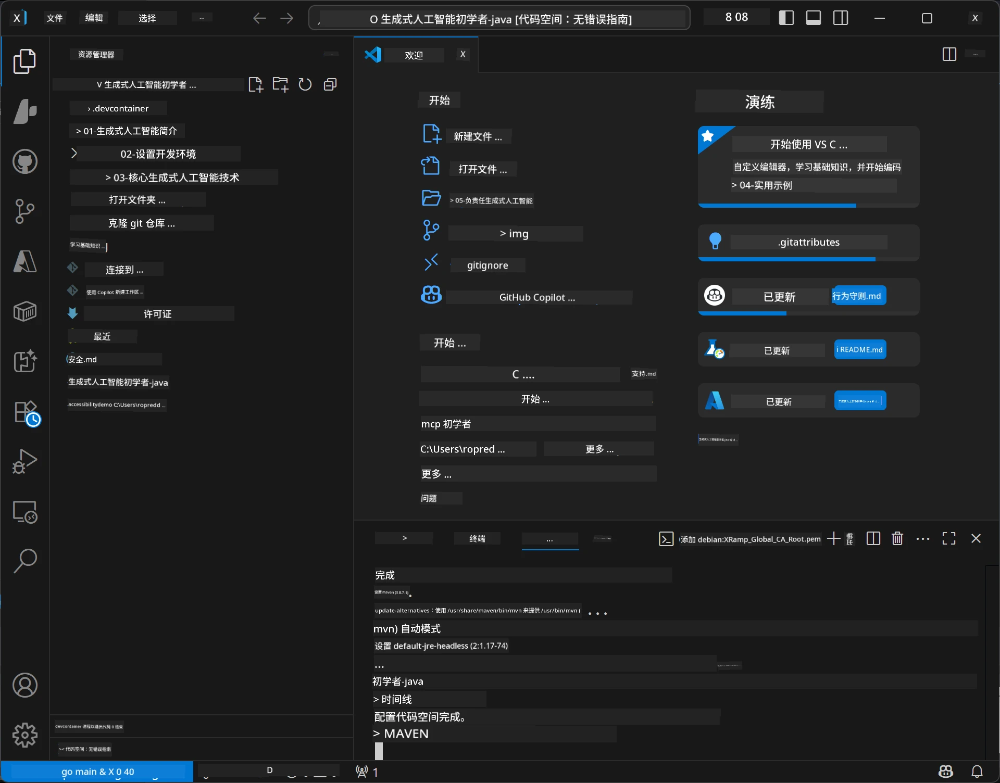

<!--
CO_OP_TRANSLATOR_METADATA:
{
  "original_hash": "96a30d42b9751a3d4e4b20e28d29d459",
  "translation_date": "2026-01-28T04:42:17+00:00",
  "source_file": "02-SetupDevEnvironment/README.md",
  "language_code": "zh"
}
-->
# 为 Java 生成式 AI 设置开发环境

> **快速开始**：2 分钟内在云端编码 - 跳到 [GitHub Codespaces 设置](../../../02-SetupDevEnvironment) - 无需本地安装，且使用 GitHub 模型！

> **对 Azure OpenAI 感兴趣？**，请参见我们的 [Azure OpenAI 设置指南](getting-started-azure-openai.md) ，包含创建新的 Azure OpenAI 资源的步骤。

## 您将学到什么

- 为 AI 应用设置 Java 开发环境
- 选择并配置您喜欢的开发环境（优先云端 Codespaces、本地开发容器或完全本地设置）
- 通过连接 GitHub 模型测试您的设置

## 目录

- [您将学到什么](../../../02-SetupDevEnvironment)
- [介绍](../../../02-SetupDevEnvironment)
- [步骤 1：设置开发环境](../../../02-SetupDevEnvironment)
  - [选项 A：GitHub Codespaces（推荐）](../../../02-SetupDevEnvironment)
  - [选项 B：本地开发容器](../../../02-SetupDevEnvironment)
  - [选项 C：使用您现有的本地安装](../../../02-SetupDevEnvironment)
- [步骤 2：创建 GitHub 个人访问令牌](../../../02-SetupDevEnvironment)
- [步骤 3：测试您的设置](../../../02-SetupDevEnvironment)
- [故障排除](../../../02-SetupDevEnvironment)
- [总结](../../../02-SetupDevEnvironment)
- [下一步](../../../02-SetupDevEnvironment)

## 介绍

本章将指导您完成开发环境的设置。我们将使用 **GitHub 模型** 作为主要示例，因为它免费、仅需 GitHub 账户即可轻松设置、无需信用卡，并可访问多个模型进行实验。

**无需本地设置！**您可以立即使用 GitHub Codespaces 直接在浏览器中开始编写代码，提供完整的开发环境。


我们推荐课程使用[**GitHub 模型**](https://github.com/marketplace?type=models)，因为它：
- **免费**开始使用
- **仅需 GitHub 账户**即可轻松设置
- **无需信用卡**
- 提供多种模型供实验

> **注意**：本培训中使用的 GitHub 模型有以下免费限制：
> - 每分钟 15 次请求（每天 150 次）
> - 每次请求约 8000 字输入，4000 字输出
> - 5 个并发请求
>
> 若用于生产，请使用您的 Azure 账户升级到 Azure AI Foundry 模型。代码无需更改。请参见 [Azure AI Foundry 文档](https://learn.microsoft.com/azure/ai-foundry/foundry-models/how-to/quickstart-github-models)。

## 步骤 1：设置开发环境

<a name="quick-start-cloud"></a>

我们创建了预配置的开发容器，最大限度减少设置时间，并确保您拥有本课程所需的所有工具。请选择您喜欢的开发方式：

### 环境设置选项：

#### 选项 A：GitHub Codespaces（推荐）

**2 分钟内开始编码 - 无需本地设置！**

1. 将此仓库 Fork 到您的 GitHub 账户
   > **注意**：如果您想编辑基本配置，请查看 [开发容器配置](../../../.devcontainer/devcontainer.json)
2. 点击 **Code** → **Codespaces** 标签 → **...** → **New with options...**
3. 使用默认设置 – 这会选择为本课程创建的自定义开发容器配置：**Generative AI Java Development Environment**
4. 点击 **Create codespace**
5. 等待大约 2 分钟环境准备完成
6. 继续到 [步骤 2：创建 GitHub 令牌](../../../02-SetupDevEnvironment)





> **Codespaces 的优势**：
> - 无需本地安装
> - 任何带浏览器的设备都可使用
> - 预配置所有工具和依赖
> - 个人账户每月免费 60 小时
> - 为所有学习者提供一致的环境

#### 选项 B：本地开发容器

**适合喜欢使用 Docker 本地开发的开发者**

1. 将此仓库 Fork 并克隆到您的本地机器
   > **注意**：如果您想编辑基本配置，请查看 [开发容器配置](../../../.devcontainer/devcontainer.json)
2. 安装 [Docker Desktop](https://www.docker.com/products/docker-desktop/) 和 [VS Code](https://code.visualstudio.com/)
3. 在 VS Code 中安装 [开发容器扩展](https://marketplace.visualstudio.com/items?itemName=ms-vscode-remote.remote-containers)
4. 在 VS Code 中打开仓库文件夹
5. 出现提示时，点击 **Reopen in Container**（或使用 `Ctrl+Shift+P` → “Dev Containers: Reopen in Container”）
6. 等待容器构建并启动
7. 继续到 [步骤 2：创建 GitHub 令牌](../../../02-SetupDevEnvironment)




#### 选项 C：使用您现有的本地安装

**适合已有 Java 环境的开发者**

先决条件：
- [Java 21+](https://www.oracle.com/java/technologies/javase/jdk21-archive-downloads.html)
- [Maven 3.9+](https://maven.apache.org/download.cgi)
- [VS Code](https://code.visualstudio.com) 或您喜欢的 IDE

步骤：
1. 克隆此仓库到本地机器
2. 在您的 IDE 中打开项目
3. 继续到 [步骤 2：创建 GitHub 令牌](../../../02-SetupDevEnvironment)

> **专业提示**：如果您的设备配置较低但想在本地用 VS Code，可以使用 GitHub Codespaces！您可以将本地 VS Code 连接到云端 Codespace，兼得两者优势。




## 步骤 2：创建 GitHub 个人访问令牌

1. 访问 [GitHub 设置](https://github.com/settings/profile)，从您的个人资料菜单选择 **Settings**。
2. 在左侧边栏点击 **Developer settings**（通常在底部）。
3. 在 **Personal access tokens** 下，点击 **Fine-grained tokens**（或直接访问此 [链接](https://github.com/settings/personal-access-tokens)）。
4. 点击 **Generate new token**。
5. 在“Token name”中填写描述性名称（例如 `GenAI-Java-Course-Token`）。
6. 设置过期时间（推荐：7 天以符合安全最佳实践）。
7. 在“Resource owner”选择您的用户账户。
8. 在“Repository access”选择您想用 GitHub 模型访问的仓库（或“所有仓库”，如有需要）。
9. 在“Account permissions”中找到 **Models** 并设置为 **只读**。
10. 点击 **Generate token**。
11. **现在复制并保存您的令牌** – 以后不会再次显示！

> **安全提示**：令牌权限应最小化，过期时间应尽可能短。

## 步骤 3：使用 GitHub 模型示例测试您的设置

当您的开发环境准备好后，让我们用位于 [`02-SetupDevEnvironment/examples/github-models`](../../../02-SetupDevEnvironment/examples/github-models) 的示例应用测试 GitHub 模型集成。

1. 打开开发环境的终端。
2. 切换到 GitHub 模型示例目录：
   ```bash
   cd 02-SetupDevEnvironment/examples/github-models
   ```
3. 将您的 GitHub 令牌设置为环境变量：
   ```bash
   # macOS/Linux
   export GITHUB_TOKEN=your_token_here
   
   # Windows（命令提示符）
   set GITHUB_TOKEN=your_token_here
   
   # Windows（PowerShell）
   $env:GITHUB_TOKEN="your_token_here"
   ```

4. 运行应用：
   ```bash
   mvn compile exec:java -Dexec.mainClass="com.example.githubmodels.App"
   ```

您应该看到类似输出：
```text
Using model: gpt-4.1-nano
Sending request to GitHub Models...
Response: Hello World!
```

### 了解示例代码

首先，让我们理解刚刚运行的内容。`examples/github-models` 中的示例使用了 OpenAI Java SDK 连接到 GitHub 模型：

**这段代码做了什么：**
- 使用您的个人访问令牌 **连接** GitHub 模型
- **发送** 一条简单的 “Say Hello World!” 消息到 AI 模型
- **接收** 并显示 AI 的响应
- **验证** 您的设置是否正确

**关键依赖**（在 `pom.xml`）：
```xml
<dependency>
    <groupId>com.openai</groupId>
    <artifactId>openai-java</artifactId>
    <version>2.12.0</version>
</dependency>
```

**主要代码** (`App.java`)：
```java
// 使用 OpenAI Java SDK 连接到 GitHub 模型
OpenAIClient client = OpenAIOkHttpClient.builder()
    .apiKey(pat)
    .baseUrl("https://models.inference.ai.azure.com")
    .build();

// 创建聊天补全请求
ChatCompletionCreateParams params = ChatCompletionCreateParams.builder()
    .model(modelId)
    .addSystemMessage("You are a concise assistant.")
    .addUserMessage("Say Hello World!")
    .build();

// 获取 AI 响应
ChatCompletion response = client.chat().completions().create(params);
System.out.println("Response: " + response.choices().get(0).message().content().orElse("No response content"));
```

## 总结

太好了！您现在已完成所有设置：

- 创建了具有访问 AI 模型权限的 GitHub 个人访问令牌
- 启动并运行了 Java 开发环境（无论是 Codespaces、开发容器还是本地）
- 使用 OpenAI Java SDK 连接到 GitHub 模型，免费进行 AI 开发
- 通过简单示例测试了与 AI 模型的连接

## 下一步

[第 3 章：核心生成式 AI 技术](../03-CoreGenerativeAITechniques/README.md)

## 故障排除

遇到问题？这里是常见问题及解决方案：

- **令牌无效？**  
  - 确认您完全复制了令牌且无多余空格  
  - 确保令牌作为环境变量设置正确  
  - 检查令牌权限是否正确（Models：只读）

- **找不到 Maven？**  
  - 使用开发容器/Codespaces 时，Maven 应已预装  
  - 本地设置需确保安装 Java 21+ 和 Maven 3.9+  
  - 运行 `mvn --version` 验证安装

- **连接问题？**  
  - 检查网络连接  
  - 确认所在网络允许访问 GitHub  
  - 确保没有防火墙阻止 GitHub 模型端点

- **开发容器无法启动？**  
  - 确保 Docker Desktop 正在运行（本地开发时）  
  - 尝试重建容器：`Ctrl+Shift+P` → “Dev Containers: Rebuild Container”

- **应用编译错误？**  
  - 确保位置正确：`02-SetupDevEnvironment/examples/github-models`  
  - 尝试清理并重建：`mvn clean compile`

> **需要帮助？**：依然有问题？请在仓库中提出 issue，我们会协助您解决。

---

<!-- CO-OP TRANSLATOR DISCLAIMER START -->
**免责声明**：  
本文档由 AI 翻译服务 [Co-op Translator](https://github.com/Azure/co-op-translator) 翻译而成。虽然我们力求准确，但请注意自动翻译可能包含错误或不准确之处。原始文档的原语言版本应被视为权威来源。对于重要信息，建议采用专业人工翻译。我们不对因使用此翻译而产生的任何误解或曲解承担责任。
<!-- CO-OP TRANSLATOR DISCLAIMER END -->