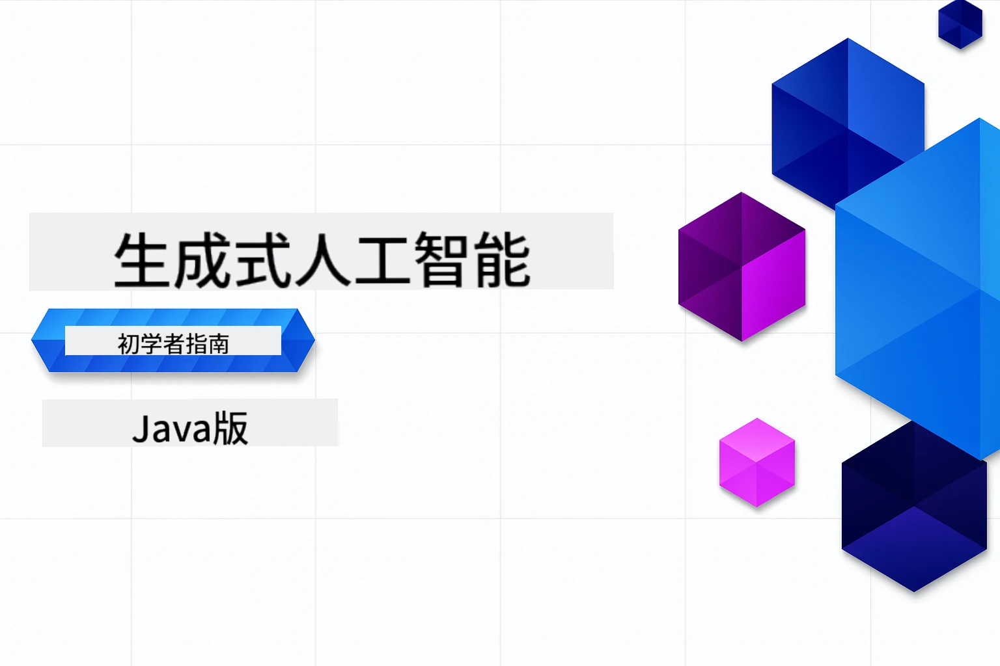

<!--
CO_OP_TRANSLATOR_METADATA:
{
  "original_hash": "459109e7c925f3a7b94440ad61c596a0",
  "translation_date": "2026-01-05T08:55:43+00:00",
  "source_file": "README.md",
  "language_code": "zh"
}
-->
# 生成式人工智能初学者指南 - Java 版
[](https://discord.gg/nTYy5BXMWG)



**时间投入**：整个工作坊可以在线完成，无需本地设置。环境设置需要2分钟，浏览示例根据探索深度需要1-3小时。

> **快速开始**

1. 将此仓库分叉到您的 GitHub 账户
2. 点击 **Code** → **Codespaces** 标签 → **...** → **New with options...**
3. 使用默认设置 – 这将选择为本课程创建的开发容器
4. 点击 **Create codespace**
5. 等待约2分钟，环境即准备就绪
6. 直接跳转到 [第一个示例](./02-SetupDevEnvironment/README.md#step-2-create-a-github-personal-access-token)

> **想要本地克隆？**
>
> 本仓库包括50多种语言的翻译，极大增加了下载大小。若想在不下载翻译的情况下克隆，请使用稀疏检出：
> ```bash
> git clone --filter=blob:none --sparse https://github.com/microsoft/Generative-AI-for-beginners-java.git
> cd Generative-AI-for-beginners-java
> git sparse-checkout set --no-cone '/*' '!translations' '!translated_images'
> ```
> 这样您可以用更快的下载速度完整获得完成课程所需要的一切。

## 多语言支持

### 通过 GitHub Action 提供支持（自动且始终保持最新）

<!-- CO-OP TRANSLATOR LANGUAGES TABLE START -->
[阿拉伯语](../ar/README.md) | [孟加拉语](../bn/README.md) | [保加利亚语](../bg/README.md) | [缅甸语 (Myanmar)](../my/README.md) | [中文（简体）](./README.md) | [中文（繁体，香港）](../hk/README.md) | [中文（繁体，澳门）](../mo/README.md) | [中文（繁体，台湾）](../tw/README.md) | [克罗地亚语](../hr/README.md) | [捷克语](../cs/README.md) | [丹麦语](../da/README.md) | [荷兰语](../nl/README.md) | [爱沙尼亚语](../et/README.md) | [芬兰语](../fi/README.md) | [法语](../fr/README.md) | [德语](../de/README.md) | [希腊语](../el/README.md) | [希伯来语](../he/README.md) | [印地语](../hi/README.md) | [匈牙利语](../hu/README.md) | [印尼语](../id/README.md) | [意大利语](../it/README.md) | [日语](../ja/README.md) | [卡纳达语](../kn/README.md) | [韩语](../ko/README.md) | [立陶宛语](../lt/README.md) | [马来语](../ms/README.md) | [马拉雅拉姆语](../ml/README.md) | [马拉地语](../mr/README.md) | [尼泊尔语](../ne/README.md) | [尼日利亚皮钦语](../pcm/README.md) | [挪威语](../no/README.md) | [波斯语 (法尔西)](../fa/README.md) | [波兰语](../pl/README.md) | [葡萄牙语（巴西）](../br/README.md) | [葡萄牙语（葡萄牙）](../pt/README.md) | [旁遮普语 (古鲁穆奇)](../pa/README.md) | [罗马尼亚语](../ro/README.md) | [俄语](../ru/README.md) | [塞尔维亚语（西里尔文）](../sr/README.md) | [斯洛伐克语](../sk/README.md) | [斯洛文尼亚语](../sl/README.md) | [西班牙语](../es/README.md) | [斯瓦希里语](../sw/README.md) | [瑞典语](../sv/README.md) | [他加禄语（菲律宾语）](../tl/README.md) | [泰米尔语](../ta/README.md) | [泰卢固语](../te/README.md) | [泰语](../th/README.md) | [土耳其语](../tr/README.md) | [乌克兰语](../uk/README.md) | [乌尔都语](../ur/README.md) | [越南语](../vi/README.md)

> **想要本地克隆？**

> 本仓库包括50多种语言的翻译，极大增加了下载大小。若想在不下载翻译的情况下克隆，请使用稀疏检出：
> ```bash
> git clone --filter=blob:none --sparse https://github.com/microsoft/Generative-AI-for-beginners-java.git
> cd Generative-AI-for-beginners-java
> git sparse-checkout set --no-cone '/*' '!translations' '!translated_images'
> ```
> 这样您可以用更快的下载速度完整获得完成课程所需要的一切。
<!-- CO-OP TRANSLATOR LANGUAGES TABLE END -->

## 课程结构与学习路径

### **第一章：生成式人工智能简介**
- **核心概念**：理解大型语言模型、标记、嵌入向量及 AI 能力
- **Java AI 生态系统**：Spring AI 和 OpenAI SDK 概述
- **模型上下文协议**：介绍 MCP 及其在 AI 代理通信中的作用
- **实际应用**：包括聊天机器人和内容生成的真实场景
- **[→ 开始第一章](./01-IntroToGenAI/README.md)**

### **第二章：开发环境设置**
- **多服务商配置**：设置 GitHub 模型、Azure OpenAI 和 OpenAI Java SDK 集成
- **Spring Boot + Spring AI**：企业级 AI 应用开发最佳实践
- **GitHub 模型**：免费 AI 模型访问，用于原型开发和学习（无信用卡要求）
- **开发工具**：Docker 容器、VS Code 和 GitHub Codespaces 配置
- **[→ 开始第二章](./02-SetupDevEnvironment/README.md)**

### **第三章：核心生成式 AI 技术**
- **提示工程**：优化 AI 模型响应的技巧
- **嵌入向量与向量操作**：实现语义搜索和相似度匹配
- **检索增强生成 (RAG)**：将 AI 与您的数据源结合
- **函数调用**：使用自定义工具和插件扩展 AI 能力
- **[→ 开始第三章](./03-CoreGenerativeAITechniques/README.md)**

### **第四章：实际应用与项目**
- **宠物故事生成器** (`petstory/`)：使用 GitHub 模型进行创意内容生成
- **Foundry 本地演示** (`foundrylocal/`)：使用 OpenAI Java SDK 的本地 AI 模型集成
- **MCP 计算服务** (`calculator/`)：用 Spring AI 实现基础模型上下文协议
- **[→ 开始第四章](./04-PracticalSamples/README.md)**

### **第五章：负责任的 AI 开发**
- **GitHub 模型安全**：测试内置内容过滤和安全机制（硬阻止和软拒绝）
- **负责任 AI 演示**：实操示例展示现代 AI 安全系统的工作方式
- **最佳实践**：道德 AI 开发与部署的基本指导
- **[→ 开始第五章](./05-ResponsibleGenAI/README.md)**

## 额外资源

<!-- CO-OP TRANSLATOR OTHER COURSES START -->
### LangChain
[](https://aka.ms/langchain4j-for-beginners)
[](https://aka.ms/langchainjs-for-beginners?WT.mc_id=m365-94501-dwahlin)

---

### Azure / Edge / MCP / Agents
[](https://github.com/microsoft/AZD-for-beginners?WT.mc_id=academic-105485-koreyst)
[](https://github.com/microsoft/edgeai-for-beginners?WT.mc_id=academic-105485-koreyst)
[](https://github.com/microsoft/mcp-for-beginners?WT.mc_id=academic-105485-koreyst)
[](https://github.com/microsoft/ai-agents-for-beginners?WT.mc_id=academic-105485-koreyst)

---
 
### 生成式 AI 系列
[](https://github.com/microsoft/generative-ai-for-beginners?WT.mc_id=academic-105485-koreyst)
[-9333EA?style=for-the-badge&labelColor=E5E7EB&color=9333EA)](https://github.com/microsoft/Generative-AI-for-beginners-dotnet?WT.mc_id=academic-105485-koreyst)
[-C084FC?style=for-the-badge&labelColor=E5E7EB&color=C084FC)](https://github.com/microsoft/generative-ai-for-beginners-java?WT.mc_id=academic-105485-koreyst)
[-E879F9?style=for-the-badge&labelColor=E5E7EB&color=E879F9)](https://github.com/microsoft/generative-ai-with-javascript?WT.mc_id=academic-105485-koreyst)

---
 
### 核心学习
[](https://aka.ms/ml-beginners?WT.mc_id=academic-105485-koreyst)
[](https://aka.ms/datascience-beginners?WT.mc_id=academic-105485-koreyst)
[](https://aka.ms/ai-beginners?WT.mc_id=academic-105485-koreyst)
[](https://github.com/microsoft/Security-101?WT.mc_id=academic-96948-sayoung)
[](https://aka.ms/webdev-beginners?WT.mc_id=academic-105485-koreyst)
[](https://aka.ms/iot-beginners?WT.mc_id=academic-105485-koreyst)
[](https://github.com/microsoft/xr-development-for-beginners?WT.mc_id=academic-105485-koreyst)

---

### Copilot 系列
[](https://aka.ms/GitHubCopilotAI?WT.mc_id=academic-105485-koreyst)
[](https://github.com/microsoft/mastering-github-copilot-for-dotnet-csharp-developers?WT.mc_id=academic-105485-koreyst)
[](https://github.com/microsoft/CopilotAdventures?WT.mc_id=academic-105485-koreyst)
<!-- CO-OP TRANSLATOR OTHER COURSES END -->

## 获取帮助

如果您遇到困难或对构建 AI 应用有任何疑问。加入其他学习者和经验丰富的开发者的讨论，了解 MCP 相关内容。这里是一个支持性的社区，欢迎提问并自由分享知识。

[](https://discord.gg/nTYy5BXMWG)

如果您在构建过程中有产品反馈或遇到错误，请访问：

[](https://aka.ms/foundry/forum)

---

<!-- CO-OP TRANSLATOR DISCLAIMER START -->
**免责声明**：  
本文件由 AI 翻译服务 [Co-op Translator](https://github.com/Azure/co-op-translator) 翻译而成。虽然我们力求准确，但请注意，自动翻译可能包含错误或不准确之处。请以原始语言的原始文档为权威来源。对于重要信息，建议使用专业人工翻译。因使用本翻译而产生的任何误解或误译，我们概不负责。
<!-- CO-OP TRANSLATOR DISCLAIMER END -->